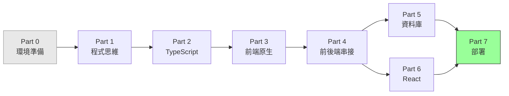
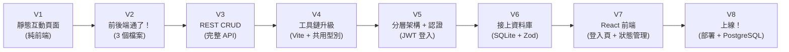
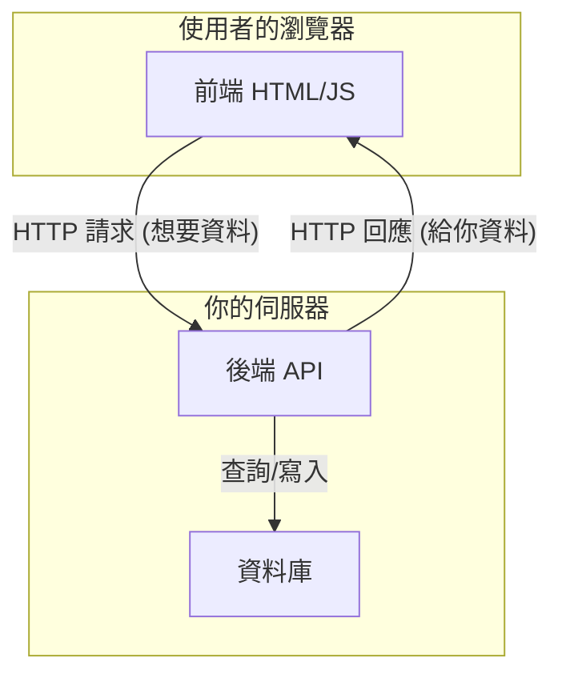
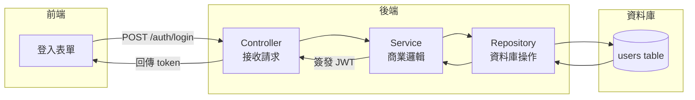
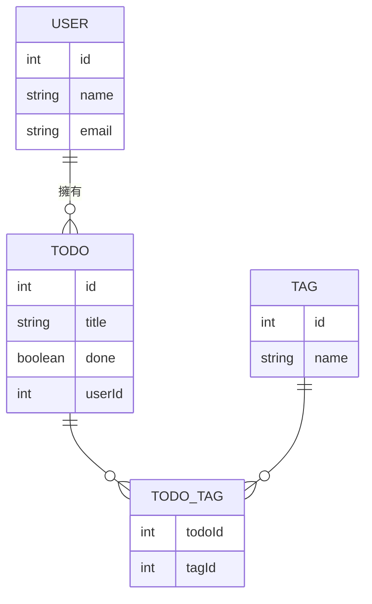
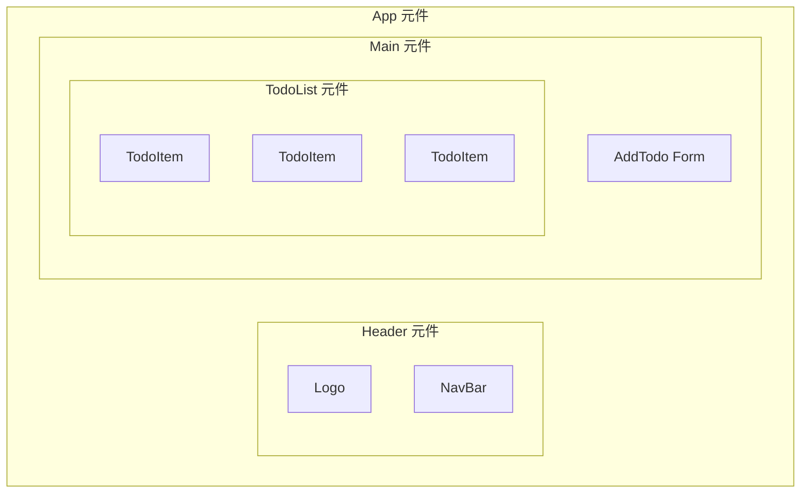
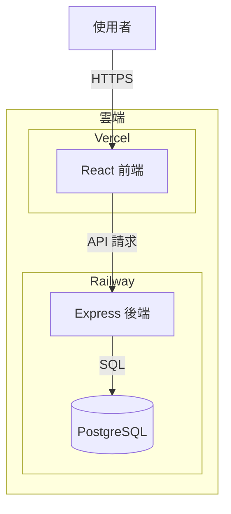

# 全端工程師養成課程大綱

> **核心理念**：這門課的目標不是「學會一門程式語言」，而是建立**程式思維與架構觀**。
> 我們用大量視覺化圖表、流程圖、pseudo code 來解釋抽象概念，讓你在寫第一行程式碼之前就先看懂全局。

---

## 學習路徑總覽



## 漸進式 POC 總覽

> 每完成一個關鍵 Part，就對同一個專案做一次升級。最終 V7 就是你的第一個完整全端作品。



---

## 導讀 — 從小餐車到企業連鎖餐廳

> **在學任何工具之前，先看懂整個世界。**
> 這章沒有程式碼，只有一個故事——一間餐廳從路邊小攤成長為全球連鎖的旅程，對應整個網路工程的演進。

- ⭐ `導讀` 從小餐車到企業連鎖餐廳：靜態網站 → 前後端分離 → 資料庫 → 快取 → 後台系統 → 負載平衡 → CDN → 微服務 → Docker/K8s

> 檔案位置：`lessons/basic/intro/world-view.md`

---

## Part 0 — 環境準備

> **目標**：用最快的速度讓你動起來——裝好工具，執行第一行程式碼，再逐步補齊其他工具。

### 章節列表
- `0-1` 開發環境全景圖：安裝 VS Code + Node.js，執行第一行程式碼
- `0-2` VS Code 設定：讓編輯器變成你的好隊友
- `0-3` Node.js & npm 安裝：JavaScript 的執行環境
- `0-4` Git 是什麼？為什麼每個工程師都需要它
- `0-5` Git 基本操作：`init` / `add` / `commit` / `push`
- `0-6` GitHub 入門：把程式碼放到雲端

### 課外讀物連結
- 想知道 Terminal 是什麼、怎麼用 → **[課外讀物 E-1] Mac Terminal 操作入門**
- 想知道 Homebrew 是什麼 → **[課外讀物 E-1-4] Homebrew：Mac 的套件管理員**
- 想深入了解 Git 的原理與進階操作 → **[課外讀物 E-8] Git 版本控制深入指南**

---

## Part 1 — 程式思維基礎

> **目標**：建立「電腦怎麼思考」的心智模型，理解程式設計的本質。

### 章節列表
- `1-1` 電腦只懂兩件事：**資料** 與 **指令**
- `1-2` 什麼是演算法？用生活例子理解
- `1-3` 程式的三種基本結構：循序、判斷、迴圈
- `1-4` 什麼是「抽象化」？為什麼工程師一直在做這件事
- `1-5` 從需求到程式碼的旅程（需求 → 設計 → 實作）

### 核心視覺化
```
需求（人的語言）
      ↓
流程圖 / Pseudo Code（中間語言）
      ↓
程式碼（電腦語言）
```

---

## Part 2 — TypeScript 核心

> **目標**：用 TypeScript 建立「型別思維」，學會用型別描述現實世界的資料。
> **重點**：不是背語法，而是理解「為什麼需要型別」。

### 章節列表
- `2-1` JavaScript vs TypeScript：為什麼型別很重要
- `2-2` 基本型別：`string` / `number` / `boolean` / `null` / `undefined`
- `2-3` 複合型別：`object` / `array` / `tuple`
- `2-4` 介面（Interface）與型別別名（Type Alias）：描述資料的形狀
- `2-5` 函式：輸入 → 處理 → 輸出 的思維
- `2-6` 泛型（Generics）：讓程式碼可以「留空」
- `2-7` 模組化：為什麼要拆檔案？`import` / `export`
- `2-8` 進階型別工具：`Partial` / `Pick` / `Omit` / `Record` / `ReturnType`
- `2-9` 實戰：CLI 任務清單工具

### 課外讀物連結
- 好奇 npm 生態系怎麼運作 → **[課外讀物 E-2] npm 與套件管理**

---

## Part 3 — 前端原生開發

> **目標**：理解瀏覽器如何運作，學會用 TypeScript 操控畫面，不依賴任何框架。
> **重點**：框架解決了什麼問題？先理解痛點，再學解法。

### 章節列表
- `3-1` 瀏覽器是怎麼運作的？（URL 輸入到畫面出現的旅程）
- `3-2` HTML 的本質：一棵樹（DOM Tree 視覺化）
- `3-3` CSS 最低限度：讓東西看起來不那麼醜
- `3-4` DOM 操作：用 TypeScript 改變畫面
- `3-5` 事件驅動程式設計：「有事發生 → 執行動作」
- `3-6` 非同步思維：`setTimeout` / `Promise` / `async-await`

### 課外讀物連結
- 好奇瀏覽器輸入網址後發生了什麼（DNS / TCP / HTTP）→ **[課外讀物 E-3] 網路通訊基礎**
- 想更深入理解 HTTP 協定 → **[課外讀物 E-3-3] HTTP 協定詳解**

### POC V1 — 靜態互動頁面

> 完成 Part 3 後的第一個里程碑：一個不需要後端的前端小應用。

**專案內容**：用原生 TypeScript + HTML 做一個 Todo App（資料存在 localStorage）
**學到的技術**：DOM 操作、事件處理、TypeScript 型別

```
V1 架構：
┌─────────────────┐
│   瀏覽器         │
│  index.html     │
│  main.ts        │
│  localStorage   │
└─────────────────┘
（還沒有後端）
```

---

## Part 4 — 前後端串接（漸進式 POC）

> **目標**：理解「網路請求」是什麼，從最簡單的 3 個檔案開始，逐步建構完整的前後端架構。
> **重點**：每個子階段都是可以跑起來的完整系統。

### 核心概念：什麼是前後端分離？



### 課外讀物連結
- 想搞清楚 HTTP 方法、狀態碼的完整含義 → **[課外讀物 E-3-3] HTTP 協定詳解**
- 想了解 CORS 為什麼存在 → **[課外讀物 E-3-4] 瀏覽器安全策略與 CORS**

---

### 階段 A — 最簡單的 POC（3 個檔案）

- `4-A-1` HTTP 是什麼？Request / Response 圖解
- `4-A-2` 建立第一個 Express 伺服器（10 行程式碼）
- `4-A-3` 用 `fetch` 從前端呼叫後端

#### POC V2 — 前後端通了！

**專案內容**：同一個 Todo App，但資料改成存在後端記憶體（用一個陣列模擬）
**新增技術**：Express、fetch、JSON

```
V2 架構（3 個核心檔案）：
┌──────────────┐    HTTP     ┌──────────────┐
│  前端         │ ─────────> │  後端         │
│  index.html  │ <───────── │  server.ts   │
│  main.ts     │   JSON      │  (資料在記憶體)│
└──────────────┘             └──────────────┘
```

---

### 階段 B — REST API 設計思維

- `4-B-1` 什麼是 REST？用資源（Resource）思考 API
- `4-B-2` HTTP 動詞：GET / POST / PUT / DELETE 對應 CRUD
- `4-B-3` 狀態碼：200 / 201 / 400 / 404 / 500 的意義
- `4-B-4` 錯誤處理：前後端如何溝通「出錯了」

#### POC V3 — 完整 REST CRUD

**新增技術**：完整的 REST API 設計、錯誤處理、狀態碼

---

### 階段 C — 引入工具鏈

- `4-C-1` 為什麼需要打包工具？（瀏覽器不直接懂 TypeScript）
- `4-C-2` Vite 設定：開發環境 vs 生產環境
- `4-C-3` 環境變數：如何安全地管理設定
- `4-C-4` CORS 是什麼？為什麼前後端分開跑會報錯

#### POC V4 — 工具鏈升級

**新增技術**：Vite、前後端型別共享、環境變數

```
V4 架構：
┌──────────────────┐         ┌──────────────────┐
│  前端 (Vite)      │  HTTP   │  後端 (Express)   │
│  src/            │ ──────> │  src/            │
│  components/     │ <────── │  routes/         │
│  types/ (共用)   │         │  types/ (共用)   │
└──────────────────┘         └──────────────────┘
         共用同一份 TypeScript 型別定義
```

---

### 階段 D — 後端架構 + 認證

> **目標**：學會真實後端的分層設計，並加入每個 app 都需要的登入功能。

- `4-D-1` 後端分層架構：Controller / Service / Repository 各自的職責
- `4-D-2` 認證（Authentication）vs 授權（Authorization）：你是誰？你能做什麼？
- `4-D-3` JWT 原理：token 是什麼，如何證明你是你
- `4-D-4` 完整登入流程：前端表單 → 後端驗證 → 簽發 token
- `4-D-5` Middleware 認證：用一行程式碼保護所有需要登入的 API
- `4-D-6` Refresh Token：為什麼 access token 要短命
- `4-D-7` 角色與權限（RBAC）：後台系統與一般前台如何共用同一組 API

### 課外讀物連結
- 想深入了解 OAuth / 第三方登入（Google、GitHub）→ **[課外讀物 E-10-4] OAuth 2.0 與第三方登入**
- 想了解更多 Web 安全威脅 → **[課外讀物 E-10] Web Security 基礎**



#### POC V5 — 完整架構 + 登入功能

**新增技術**：分層架構、JWT 認證、受保護的 API endpoint
**改變**：後端從單一檔案重構為 Controller/Service/Repository，Todo 需要登入才能操作

```
V5 架構：
┌──────────┐    ┌─────────────────────────┐    ┌───────────┐
│  前端     │    │  後端                    │    │  SQLite   │
│  (Vite)  │ -> │  routes/                │ -> │  users    │
│          │ <- │  controllers/           │ <- │  todos    │
│  JWT     │    │  services/              │    └───────────┘
│  stored  │    │  repositories/          │
│  in      │    │  middleware/auth.ts     │
│  memory  │    └─────────────────────────┘
└──────────┘
```

---

## Part 5 — 資料庫

> **目標**：理解「資料持久化」的本質，從 SQLite 零安裝開始，建立資料庫設計思維。

### 章節列表
- `5-1` 為什麼不能把資料存在變數裡？（記憶體 vs 硬碟）
- `5-2` 什麼是關聯式資料庫？用試算表類比
- `5-3` SQL 基礎思維：`SELECT` / `INSERT` / `UPDATE` / `DELETE`
- `5-4` SQLite 入門：零安裝，直接開始
- `5-5` 資料關聯：一對多 / 多對多（圖解）
- `5-6` ORM 是什麼？為什麼不直接寫 SQL
- `5-7` Prisma 入門：用 TypeScript 操作資料庫
- `5-8` Migration：資料庫版本控制
- `5-9` 進階：切換到 PostgreSQL，理解差異
- `5-10` Zod：API 資料驗證的第一道防線

### 課外讀物連結
- 想知道資料庫索引怎麼運作 → **[課外讀物 E-4] 資料庫進階概念**
- 想了解 SQL vs NoSQL 的差異 → **[課外讀物 E-4-2] SQL vs NoSQL**
- 想了解輸入驗證與 XSS、Injection 攻擊的關係 → **[課外讀物 E-10-2] 常見 Web 攻擊手法**

### 核心視覺化



#### POC V5 — 接上資料庫

**新增技術**：SQLite、Prisma ORM、Migration
**改變**：資料從記憶體陣列改成真實資料庫，重啟程式資料也不會消失

```
V5 架構：
┌──────────┐    ┌──────────┐    ┌──────────────┐
│  前端     │ -> │  後端     │ -> │  SQLite DB   │
│  (Vite)  │ <- │ (Express)│ <- │  todos.db    │
└──────────┘    └──────────┘    └──────────────┘
                      │
                  Prisma ORM
```

---

## Part 6 — 前端框架（React）

> **目標**：理解「為什麼需要框架」，用 React 解決 Part 3 原生開發的痛點。
> **重點**：元件化思維 + 狀態管理的本質。

### 章節列表
- `6-1` 回顧痛點：原生 DOM 操作在複雜專案的問題
- `6-2` React 的核心思想：`UI = f(state)`
- `6-3` 元件（Component）：可重用的 UI 積木
- `6-4` Props vs State：資料從哪來？誰管它？
- `6-5` useEffect：跟外部世界溝通
- `6-6` 路由（React Router）：多頁面應用
- `6-7` 與後端 API 整合：從 fetch 到更好的方式
- `6-8` 表單處理：React Hook Form + Zod 的組合
- `6-9` 狀態管理：什麼時候 useState 不夠用？Context vs Zustand

### 核心視覺化



#### POC V6 — React 前端

**新增技術**：React、元件化、hooks
**改變**：把 Part 3-4 的原生 TypeScript 前端，重寫成 React 元件

---

## Part 7 — 部署與工程實務

> **目標**：讓你的作品可以讓全世界看到，理解從本機到雲端的完整流程。

### 章節列表
- `7-1` 從本機到雲端：一個請求的完整旅程
- `7-2` 環境的概念：開發 / 測試 / 生產
- `7-3` Docker 基礎：把應用程式打包成貨櫃
- `7-4` 快速部署：Vercel（前端）+ Railway（後端 + DB）
- `7-5` CI/CD 概念：程式碼推上去就自動部署
- `7-6` 環境變數與 Secrets 管理
- `7-7` 結構化日誌：用 log 讀懂線上發生了什麼事
- `7-8` 錯誤追蹤：用 Sentry 接住你沒想到的 bug
- `7-9` 基本效能監控：你的服務還活著嗎、夠不夠快？

### 課外讀物連結
- 想深入了解 DNS 與網域設定 → **[課外讀物 E-3-2] DNS：網址背後的電話簿**
- 想了解 HTTPS / TLS 怎麼運作 → **[課外讀物 E-3-5] HTTPS 與憑證**
- 想了解前端效能優化技巧 → **[課外讀物 E-11-1] 前端效能優化**
- 想了解後端快取與 Redis → **[課外讀物 E-11-3] Redis 與快取策略**
- 想了解快取的多個層次如何協作 → **[課外讀物 E-11-8] 多層次快取全景：瀏覽器到資料庫**

#### POC V7 — 上線！（最終版）

**新增技術**：Docker、Vercel、Railway、PostgreSQL
**改變**：從本機跑的專案，變成可以分享 URL 給任何人的真實網站



---

## 課外讀物

> **課外讀物（E 系列）是所有課程共用的延伸知識庫**，不屬於 basic 一本書。完整目錄（E-1 ~ E-14）請見：
>
> **→ [課外讀物總目錄](../../課外讀物/課程大綱.md)**
>
> 主線課程中標記 **[課外讀物 E-X]** 的地方，表示那裡有延伸知識可以探索；不看不影響繼續學習。下面是 basic 主線與課外讀物的對照建議。

---

### basic 主線課程 ↔ 課外讀物對照

| 課外讀物 | 主線對應 | 建議閱讀時機 |
|---------|---------|------------|
| E-6-2 命名的藝術 | Part 2 TypeScript 核心 | 開始寫第一個變數前 |
| E-6-4 TypeScript 最佳實踐 | Part 2-1 | 學完基本型別後 |
| E-6-6 常見反模式 | Part 3 前端開發 | 寫完第一個頁面後 |
| E-6-7 前端 Clean Code | Part 6 React | 開始學元件前 |
| E-6-8 後端 Clean Code | Part 4-B REST API | 設計第一個 API 後 |
| E-7-1 SOLID 總覽 | Part 2-5 函式設計 | 學完函式後 |
| E-7-2 SRP | Part 2-5 / Part 6-3 | 函式設計 & React 元件 |
| E-7-5 ISP | Part 2-4 介面 | 學完 TypeScript 介面後 |
| E-7-6 DIP | Part 4-D 完整架構 | 理解模組化後端後 |
| E-8-5 Commit 訊息規範 | Part 0-5 Git 基本操作 | 開始用 Git 後 |
| E-8-7 Git Flow | Part 4-D 完整架構 | 開始多人協作前 |
| E-9-3 單元測試入門 | Part 2-9 CLI 小專案 | 寫完第一個完整函式後 |
| E-9-8 後端 API 測試 | Part 4-B REST API | 設計完 CRUD API 後 |
| E-10-2 XSS / Injection | Part 5-10 Zod 驗證 | 學完資料驗證後 |
| E-10-5 OAuth | Part 4-D 認證 | 學完 JWT 後 |
| E-10-6 密碼儲存 | Part 4-D-4 登入流程 | 實作登入前 |
| E-11-1 前端效能 | Part 6 React | 完成 React 前端後 |
| E-11-3 Redis | Part 7 部署 | 部署完成後 |
| E-11-8 多層次快取全景 | 導讀 / Part 7 部署 | 完成 Part 7 後 |
| E-12-2 MVC | Part 4-D-1 分層架構 | 學後端分層時 |
| E-12-3 Repository 模式 | Part 4-D-1 分層架構 | 學後端分層時 |

> 想把部署、規模化的概念落地到 AWS 真實服務（VPC / EC2 / EKS / Terraform...）→ 參見獨立的 **AWS 課程**：`lessons/aws/課程大綱.md`

---

## 課程統計

| Part | 主題 | 章節數 |
|------|------|--------|
| 0 | 環境準備 | 6 |
| 1 | 程式思維基礎 | 5 |
| 2 | TypeScript 核心 | 9 |
| 3 | 前端原生開發 | 6 |
| 4 | 前後端串接（A/B/C/D） | 20 |
| 5 | 資料庫 | 10 |
| 6 | React | 9 |
| 7 | 部署與工程實務 | 9 |
| **basic 合計** | | **74** |

> **課外讀物（E 系列，約 100+ 章）是所有課程共用的**，不計入 basic 統計——完整目錄與統計見 [課外讀物總目錄](../../課外讀物/課程大綱.md)。
> AWS 雲端基礎建設（原 E-14，共 44 章）已獨立成 **AWS 課程**，見 `lessons/aws/課程大綱.md`。

---

## POC 版本對照表

| 版本 | 解鎖時機 | 技術 | 特色 |
|------|---------|------|------|
| V1 | Part 3 完成後 | HTML + TypeScript | 純前端，資料存 localStorage |
| V2 | Part 4-A 完成後 | Express + fetch | 前後端通了，資料在記憶體 |
| V3 | Part 4-B 完成後 | REST API + CRUD | 完整 API 設計 |
| V4 | Part 4-C 完成後 | Vite + 共用型別 | 工具鏈完整，前後端型別安全 |
| V5 | Part 4-D 完成後 | 分層架構 + JWT 認證 | 後端有結構，Todo 需要登入才能操作 |
| V6 | Part 5 完成後 | SQLite + Prisma + Zod | 真實資料庫，API 有驗證 |
| V7 | Part 6 完成後 | React + 登入頁 + 狀態管理 | 完整前端，有登入流程 |
| V8 | Part 7 完成後 | Docker + Vercel + Railway + PostgreSQL | 部署上線，全世界可以看到 |
