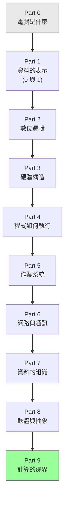

# 計算機概論課程大綱

> **核心理念**：你每天用電腦、寫程式，但「電腦裡面到底發生什麼事」常常是個黑盒子。
> 這門課把這個黑盒子打開——從「0 和 1」開始，一路講到 CPU 怎麼算、作業系統怎麼管、程式怎麼被執行、網路怎麼通。學完，你對「電腦」會有一套完整、貫通的底層直覺，寫程式時知道「為什麼」，而不只是「照著做」。

---

## 這門課的定位

| | 說明 |
|---|------|
| **適合對象** | 想搞懂「電腦底層怎麼運作」的人——不管你是初學程式、想補基礎，還是工作幾年但底層一直似懂非懂。**零基礎也能讀。** |
| **目標** | 學完能建立**完整的計算機科學底層直覺**：資料怎麼表示、硬體怎麼算、程式怎麼被執行、作業系統怎麼管理一切、網路怎麼通——並知道這些和你寫的程式有什麼關係。 |
| **建議（非必須）** | 完全不用先備知識。如果你同時在學 **basic 課程**，這門課會幫你補上「為什麼」的那一塊。 |
| **這門課 vs 其他書** | 其他書教你「**怎麼做**」（寫程式、架伺服器、上雲）；這門課教你「**底層為什麼**」。它是所有書的**地基**——懂了它，其他書會學得更踏實。 |

> 通用知識（終端機、網路細節、Git、安全）在頂層 `課外讀物/`（E-1、E-3、E-8、E-10），本課會在需要時交叉引用，不重複造輪子。
> 這門課**概念為主、圖解為輔**，程式碼不多——重點是「看懂原理」。標 🎈 的是**趣味章節**（輕鬆讀，建立興趣）。

> **本課的深度設計**：這是一門**完整的計算機概論**——資料表示、數位邏輯、硬體、程式執行、作業系統、網路、計算理論都涵蓋。即使部分主題（網路、資料庫、安全）在別處有更深的專章，這裡仍給出「自成一體」的概論，再引導你去深入。

---

## 學習路徑總覽

> 一條由下往上的脈絡：**從最底層的「0 和 1」開始，一層一層往上蓋——硬體 → 程式執行 → 作業系統 → 網路 → 軟體抽象 → 計算的極限。** 每一層都建立在前一層之上。

---

## Part 0 — 開始之前：電腦到底是什麼

### 章節列表

- `cs-0-1` 計算機概論在學什麼？這門課的地圖
- `cs-0-2` 電腦的本質：一台「會照指令處理資訊」的機器
- `cs-0-3` 🎈 電腦發展簡史：從算盤、真空管到 AI
- `cs-0-4` 電腦的五大單元：輸入、輸出、記憶、控制、算術邏輯

---

## Part 1 — 資料的表示：一切都是 0 和 1

> 電腦裡沒有文字、沒有圖片、沒有聲音——只有 0 和 1。這個 Part 講「萬物如何被編碼成 0 和 1」。

### 章節列表

- `cs-1-1` 為什麼是二進位？電腦只懂「開」與「關」
- `cs-1-2` 數字系統：二進位、八進位、十六進位與互相換算
- `cs-1-3` 負數怎麼存：補數（two's complement）的巧思
- `cs-1-4` 小數怎麼存：浮點數與它的精度陷阱（為什麼 `0.1 + 0.2 ≠ 0.3`）
- `cs-1-5` 文字怎麼存：從 ASCII 到 Unicode、UTF-8
- `cs-1-6` 圖片、聲音、影片怎麼變成 0 和 1
- `cs-1-7` 資料量單位：bit / byte / KB / MB / GB，與「1KB 到底是 1000 還 1024」

---

## Part 2 — 數位邏輯：電路如何「思考」

> 從「0 和 1」到「會運算的電路」之間，靠的是邏輯閘。這個 Part 揭開「電怎麼會算數」的祕密。

### 章節列表

- `cs-2-1` 邏輯閘：AND / OR / NOT，最小的「思考」單位
- `cs-2-2` 布林代數：用數學描述邏輯
- `cs-2-3` 從邏輯閘到加法器：電腦怎麼做「1 + 1」
- `cs-2-4` 正反器與記憶：電路怎麼「記住」一個位元
- `cs-2-5` 🎈 電晶體與摩爾定律：為什麼電腦越來越快

---

## Part 3 — 電腦的構造：硬體

> 把零件組起來，就成了一台電腦。這個 Part 介紹現代電腦的藍圖與各個零件。

### 章節列表

- `cs-3-1` 馮紐曼架構：現代電腦的共同藍圖
- `cs-3-2` CPU 構造：控制單元、ALU、暫存器
- `cs-3-3` 指令週期：取指 → 解碼 → 執行（fetch-decode-execute）
- `cs-3-4` 記憶體階層：暫存器 → 快取 → RAM → 硬碟（越近越快、越貴、越小）
- `cs-3-5` 主記憶體 RAM：位址、揮發性
- `cs-3-6` 儲存裝置：HDD vs SSD，持久儲存的原理
- `cs-3-7` 匯流排與 I/O：各零件之間怎麼溝通

---

## Part 4 — 電腦如何執行你的程式

> 你寫的 TypeScript / C#，CPU 根本看不懂。這個 Part 講「程式碼到底怎麼變成 CPU 執行的動作」。

### 章節列表

- `cs-4-1` 機器碼與組合語言：CPU 真正讀的東西
- `cs-4-2` 從原始碼到執行：編譯（compile）vs 直譯（interpret）
- `cs-4-3` 編譯器在做什麼：詞法 → 語法 → 語意 → 產生程式碼
- `cs-4-4` 虛擬機與位元組碼：Java / .NET 怎麼「一次編譯、到處執行」
- `cs-4-5` 連結與載入：函式庫怎麼被組進你的程式

---

## Part 5 — 作業系統：管理一切的大管家

> 你的程式不是直接跑在硬體上，而是跑在「作業系統」之上。這個 Part 講這位大管家怎麼管理 CPU、記憶體、檔案。

### 章節列表

- `cs-5-1` 作業系統是什麼？為什麼非有它不可
- `cs-5-2` 行程（Process）與執行緒（Thread）：程式「跑起來」的樣子
- `cs-5-3` CPU 排程：單核心怎麼「假裝同時」跑很多程式
- `cs-5-4` 記憶體管理與虛擬記憶體：每個程式都以為自己獨佔記憶體
- `cs-5-5` 並行的麻煩：競爭條件、死結、互斥鎖（呼應 dsa 與 sre）
- `cs-5-6` 檔案系統：資料在磁碟上怎麼被組織
- `cs-5-7` I/O 與中斷：硬體怎麼「通知」CPU

---

## Part 6 — 網路與通訊

> 電腦連起來才有今天的世界。這個 Part 給網路的「自成一體概論」，更深的細節引導到課外讀物 E-3。

### 章節列表

- `cs-6-1` 網路是什麼：把電腦連起來交換資料
- `cs-6-2` 分層的智慧：OSI 七層與 TCP/IP 模型
- `cs-6-3` IP、封包與路由：資料怎麼找到對方（簡介，深入見 E-3）
- `cs-6-4` 從網址到網頁：一次請求的完整旅程（呼應課外讀物 E-3-1）

---

## Part 7 — 資料的組織：結構、演算法、資料庫初探

> 有了資料，怎麼「有效率地存與找」？這個 Part 是橋樑——建立直覺，再引導到專門的書。

### 章節列表

- `cs-7-1` 演算法是什麼？好壞怎麼衡量（Big-O 直覺，橋接 dsa 課程）
- `cs-7-2` 資料結構初探：為什麼資料要有「結構」（橋接 dsa 課程）
- `cs-7-3` 資料庫概念：為什麼需要、關聯式模型是什麼（引導 basic Part 5、E-4）

---

## Part 8 — 軟體與抽象

> 計算機科學最強大的武器是「抽象」——把複雜藏起來，露出簡單的介面。這個 Part 講貫穿一切的抽象觀。

### 章節列表

- `cs-8-1` 抽象（Abstraction）：計算機科學最重要的一個觀念
- `cs-8-2` 軟體的層次：應用程式 → 系統軟體 → 韌體 → 硬體
- `cs-8-3` 程式設計典範簡介：命令式、物件導向、函式式（呼應 basic）

---

## Part 9 — 計算的邊界與未來

> 電腦不是萬能的——有些問題算不出來，有些算得出來但太慢。這個 Part 帶你看計算的極限與前沿。

### 章節列表

- `cs-9-1` 計算理論初探：哪些問題電腦「算得出來」（可計算性、圖靈機）
- `cs-9-2` 🎈 P vs NP：有些問題「算得出來但慢到天荒地老」
- `cs-9-3` 加密與資安基礎：對稱/非對稱加密、雜湊（引導課外讀物 E-10）
- `cs-9-4` 人工智慧與機器學習：電腦怎麼「學」（概念）
- `cs-9-5` 🎈 電腦的未來：量子計算簡介

---

## 與其他課程 / 課外讀物的對照

| 計概章節 | 對應的課程 / 課外讀物 | 關係 |
|---------|---------------------|------|
| `cs-1-x` 資料表示 | basic Part 2（型別） | 計概講底層，basic 講怎麼用 |
| `cs-5-x` 作業系統 | infra（行程、記憶體、檔案） | 計概講原理，infra 講實際操作 |
| `cs-6-x` 網路 | 課外讀物 E-3 | 計概是概論，E-3 是深入 |
| `cs-7-1/2` 演算法、資料結構 | **dsa 課程** | 計概建立直覺，dsa 是完整深入版 |
| `cs-7-3` 資料庫 | basic Part 5、課外讀物 E-4 | 計概是概念，那裡是實作與進階 |
| `cs-9-3` 加密資安 | 課外讀物 E-10 | 計概是概念，E-10 是 Web 安全實務 |

> 想把「演算法、資料結構」學到能解題 → 接 **dsa 課程（資料結構與演算法）**
> 想把底層知識用在實際開發 → 接 **basic 課程**
> 想了解作業系統的實際操作 → 接 **infra 課程**

---

## 課程統計

| Part | 主題 | 章節數 | 標記 |
|------|------|--------|:---:|
| 0 | 電腦是什麼 | 4 | 1 🎈 |
| 1 | 資料的表示 | 7 | |
| 2 | 數位邏輯 | 5 | 1 🎈 |
| 3 | 硬體構造 | 7 | |
| 4 | 程式如何執行 | 5 | |
| 5 | 作業系統 | 7 | |
| 6 | 網路與通訊 | 4 | |
| 7 | 資料的組織 | 3 | |
| 8 | 軟體與抽象 | 3 | |
| 9 | 計算的邊界與未來 | 5 | 2 🎈 |
| **合計** | | **50** | **5 🎈** |
