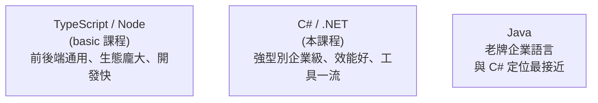

# [csharp-0-1] 為什麼選 C# / .NET 做後端？

> **本章目標**：理解 C# 和 .NET 是什麼、適合做什麼，以及為什麼它在企業、金融、遊戲後端這麼受歡迎——幫你判斷「值不值得學」。

## 你會學到

- C# 和 .NET 的關係
- C# / .NET 的四大優勢
- 它和你可能學過的語言（TypeScript、Java）怎麼比
- 什麼情境特別適合選它

## 概念說明

### C# 與 .NET 是什麼

先分清兩個名字（[csharp-0-2] 會深入）：

```
C#（讀作 "C sharp"）：一種程式語言（微軟設計，2000 年問世）
.NET（讀作 "dot net"）：一個「執行 C# 程式的平台與生態系」
   包含：執行環境、龐大的標準函式庫、開發工具
→ 你用「C# 語言」寫程式，跑在「.NET 平台」上。
  就像「TypeScript 語言」跑在「Node.js 平台」上的關係。
```

### 為什麼選它做後端？四大優勢

**① 強型別、編譯式——少出錯、跑得快**

C# 是**強型別**語言（呼應 [課外讀物 E-6-4](../../../課外讀物/E-6-best-practices/E-6-4-typescript-best-practices.md) 的型別好處），而且是**編譯式**（**cs 課程 Part 4-2**）。這代表很多錯誤在「編譯時」就被抓出來（而非上線才爆），且執行效能好。如果你學過 TypeScript，會覺得 C# 很親切——兩者都靠型別保護你。

**② 跨平台——哪裡都能跑**

早年 .NET 只能在 Windows 跑，但現代的 **.NET（從 .NET Core 起）完全跨平台**——Windows / Mac / Linux（含你的 WSL）都能開發與部署。所以它早就不是「只能在微軟生態」的語言了。

**③ 企業級生態——成熟、穩、好招人**

C# / .NET 在**企業、金融、政府、遊戲**領域有龐大的應用基礎：

```
企業後端：大量公司用 ASP.NET Core 做內部系統、API
金融業：穩定、強型別、有完整工具鏈，金融最愛
遊戲：Unity 遊戲引擎就是用 C# 寫腳本
→ 學會 C#，就業市場（尤其大企業、金融）機會很多。
```

**④ 微軟與社群長期投入——工具一流**

.NET 由微軟主導且**開源**，有一流的開發工具（Visual Studio、VS Code、Rider）、完整文件、活躍社群。開發體驗非常成熟順手。

### 和其他語言比



- **vs TypeScript（你在 basic 學的）**：兩者都強型別、語法相似。TS 在「前端 + 全端 JS 生態」無敵；C# 在「企業後端、效能、桌面/遊戲」更強。**它們是後端的兩條主流路線**，學 C# 不會浪費 TS 基礎，反而互通。
- **vs Java**：C# 和 Java 定位最接近（都是強型別、企業級、跑在虛擬機/runtime 上）。C# 語法常被認為更現代、更簡潔（[csharp-0-2] 會用 Java 類比講 .NET）。

### 什麼情境特別適合 C#

```
✓ 要進「企業、金融、政府」的後端團隊
✓ 喜歡「強型別、編譯期抓錯」的開發體驗
✓ 要做高效能、需要嚴謹的後端服務
✓ 想做 Unity 遊戲（C# 是它的腳本語言）
→ 這些情境，C# / .NET 是很棒的選擇。
```

## 小練習

1. 用一句話說明 C# 和 .NET 的關係（類比 TypeScript 和 Node.js）。
2. 列出你覺得對你最有吸引力的「C# 兩個優勢」，並說為什麼。
3. 查一查：你知道哪些知名軟體 / 公司 / 遊戲是用 C# 或 Unity 做的？（搜尋「built with .NET」「Unity games」）

## 課外讀物

> 強型別的好處（和 TypeScript 互通）→ [課外讀物 E-6-4：TypeScript 最佳實踐](../../../課外讀物/E-6-best-practices/E-6-4-typescript-best-practices.md)

> 編譯式語言、執行平台的原理 → **cs 課程 Part 4：程式如何執行**

> 下一步：深入認識 .NET 平台 → [csharp-0-2]
