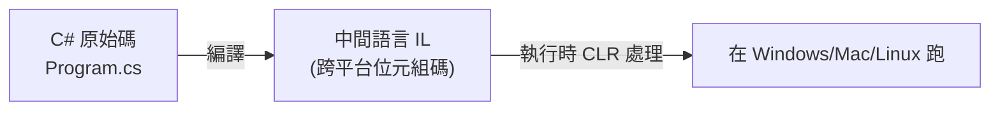

# [csharp-0-2] 認識 .NET：SDK / Runtime / CLR 是什麼，用「Java 類比」快速理解

> **本章目標**：搞懂 .NET 生態裡幾個常聽到卻常搞混的名詞——SDK、Runtime、CLR，以及 C# 程式怎麼被執行。

## 你會學到

- C# 程式從原始碼到執行的流程
- CLR（執行引擎）、Runtime、SDK 各是什麼
- 用「Java / JVM」的類比快速理解
- 「.NET」這個名字到底指什麼

## 概念說明

### C# 程式怎麼跑起來

[csharp-0-1] 說 C# 是編譯式的，但它的編譯方式很特別——和 **cs 課程 Part 4-4** 講的「位元組碼 + 虛擬機」是同一套思路：

```
你的 C# 原始碼
   ↓ 編譯
中間語言（IL，Intermediate Language）← 一種「位元組碼」，跨平台
   ↓ 執行時
CLR 把 IL 即時編譯成「當前機器的機器碼」並執行
```



這張圖在說：C# 不直接編譯成「某台機器的機器碼」，而是先變成**中間語言（IL）**——一種通用的位元組碼。執行時由 **CLR** 把它轉成當前平台的機器碼跑。這就是 C# 能「**一次編譯、到處執行（跨平台）**」的原因（呼應 [csharp-0-1] 的跨平台優勢、cs 課程 Part 4-4）。

### 用 Java 類比最快懂

如果你聽過 Java，這個對照能讓你秒懂：

| .NET 世界 | Java 世界 | 是什麼 |
|----------|----------|--------|
| **CLR**（Common Language Runtime）| JVM | 執行引擎：把位元組碼變機器碼並執行 |
| **IL**（中間語言）| Java 位元組碼 | 編譯後的「中間碼」 |
| **.NET Runtime** | JRE | 「執行」.NET 程式所需的環境 |
| **.NET SDK** | JDK | 「開發」.NET 程式的整套工具（含 Runtime + 編譯器 + CLI）|

**CLR** 就是 .NET 版的 JVM——一個「虛擬機」，負責執行 IL、管理記憶體（含垃圾回收 GC，[csharp-0-1] / cs 課程 Part 5）等。理解了「CLR ≈ JVM」，整個 .NET 的執行模型就清楚了。

### SDK vs Runtime：開發 vs 執行

最常讓新手困惑的是「我該裝 SDK 還是 Runtime？」一句話分清：

```
.NET Runtime：只夠「執行」已寫好的 .NET 程式（給「使用者/伺服器」用）
.NET SDK：開發用的完整工具包——包含 Runtime + 編譯器 + 指令工具(CLI)
   （給「開發者」用，能寫、能編譯、能跑）

→ 你是開發者，要學寫 C#，所以裝「SDK」（它已包含 Runtime）。
  下一章 [csharp-0-3] 就帶你裝 SDK。
```

比喻：Runtime 像「只能播放影片的播放器」；SDK 像「能剪輯、製作、也能播放的整套工作室」。你要創作，當然裝工作室（SDK）。

### 「.NET」這個名字

「.NET」這個詞有點混亂，因為它經歷過演變。現在你只要記住：

```
現代的「.NET」（.NET 5、6、7、8…）= 統一的、跨平台、開源的平台
   （它整合了舊的 .NET Framework 和 .NET Core）
→ 學新東西時，直接用最新的「.NET」即可，別管舊的 .NET Framework
  （那是舊的、只能 Windows 的版本，新專案不用）。
```

當你看到教學講「.NET Core」其實就是現代 .NET 的前身，概念一樣。

## 小練習

1. 用 Java 類比說出：CLR 對應 Java 的什麼？.NET SDK 對應什麼？
2. 用自己的話解釋「為什麼 C# 程式能跨平台」（提示：和 IL、CLR 有關）。
3. 你是開發者，該裝 .NET SDK 還是 Runtime？為什麼？

## 課外讀物

> 「位元組碼 + 虛擬機」的完整原理（含 JVM 對照）→ **cs 課程 Part 4-4：虛擬機與位元組碼**

> 垃圾回收（GC）、記憶體管理 → **cs 課程 Part 5-4**

> 下一步：動手裝好 .NET SDK，跑第一個程式 → [csharp-0-3]
