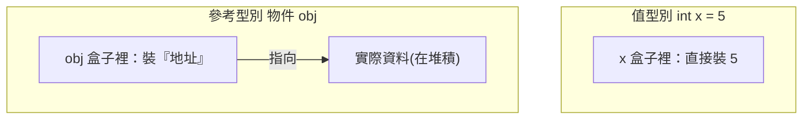

# [csharp-1-2] 變數與型別：值型別 vs 參考型別、`var` 的型別推斷

> **本章目標**：認識 C# 的基本型別，並搞懂一個關鍵又常被忽略的概念——「值型別 vs 參考型別」，它影響變數怎麼被複製與傳遞。

## 你會學到

- C# 常用的基本型別
- `var` 的型別推斷（什麼時候用）
- 值型別 vs 參考型別的根本差別
- 這個差別怎麼影響賦值與傳參

## 概念說明

### 常用基本型別

C# 的常用型別（對照你在 cs 課程 Part 1 學的資料表示）：

```csharp
int count = 10;            // 整數（32 位元）
long bigNumber = 10000L;   // 較大的整數（64 位元）
double price = 19.99;      // 浮點數（小數，cs 課程 Part 1-4）
bool isActive = true;      // 布林（true / false）
char grade = 'A';          // 單一字元（單引號）
string name = "Amy";       // 字串（雙引號）
```

說明：和 cs 課程 Part 1 呼應——`int`/`long` 是不同大小的整數、`double` 是浮點數（記得 0.1+0.2 的精度陷阱 cs Part 1-4）、`char` 單引號、`string` 雙引號。型別寫在變數名前面（C# 風格）。

### var：型別推斷

如果初始值已經能看出型別，可以用 `var` 讓編譯器**自動推斷**（像 TS 不寫型別、rust 的型別推斷）：

```csharp
var count = 10;          // 編譯器推斷成 int
var name = "Amy";        // 推斷成 string
var price = 19.99;       // 推斷成 double
```

⚠️ 重要：`var` **不是「動態型別」**——它仍是強型別！只是「型別由編譯器推斷、你不用手寫」。一旦推斷出來就固定了：

```csharp
var count = 10;          // count 是 int
count = "hello";         // ❌ 還是錯！count 已被推斷成 int
```

慣例：當「右邊已經很明顯看出型別」時用 `var`（少打字、好讀）；當「型別不明顯」或想強調型別時，寫出明確型別。

### 關鍵概念：值型別 vs 參考型別

這是 C# 一個**非常重要、影響深遠**的概念——所有型別分成兩大類：

```
值型別（value type）：變數「直接存值本身」
   例：int, long, double, bool, char, struct
參考型別（reference type）：變數「存的是『指向資料的參考』」，資料在別處（堆積）
   例：string, 陣列, class 物件, List...
```



這張圖在說：值型別的變數「**直接裝著值**」；參考型別的變數「裝的是**指向實際資料的參考（地址）**」，資料本身在堆積上。這呼應 **cs 課程 Part 3-5（位址）、rust 課程 Part 2（堆疊堆積、所有權）**——是同一套記憶體概念。

### 為什麼這個差別重要：複製行為不同

值型別 vs 參考型別，在「賦值/傳參」時行為**完全不同**，這是 bug 的常見來源：

```csharp
// 值型別：複製「值本身」→ 兩個獨立
int a = 5;
int b = a;        // b 拿到 5 的「複本」
b = 99;
Console.WriteLine(a);   // 還是 5（a 不受影響）

// 參考型別：複製「參考」→ 兩個指向「同一份資料」！
int[] arr1 = { 1, 2, 3 };
int[] arr2 = arr1;       // arr2 拿到的是「同一個地址」
arr2[0] = 99;
Console.WriteLine(arr1[0]);   // 99！arr1 也變了（因為是同一份資料）
```

說明：**值型別賦值是「複製值」（各自獨立）；參考型別賦值是「複製參考」（兩個變數指向同一份資料，改一個另一個也變）。** 這個 `arr1` 跟著 `arr2` 變的現象，是新手最常踩的坑——理解「值 vs 參考」就能避開。（學過 rust 所有權的話，這裡的「參考」概念很熟悉；C# 沒有 rust 的所有權限制，但有 GC 幫你管記憶體。）

## 小練習

1. 宣告各種型別的變數（int、double、bool、string）並印出。再用 `var` 改寫，確認推斷正確。
2. 重現「值型別賦值各自獨立」vs「參考型別賦值指向同一份」的兩個例子，親眼看差別。
3. 思考題：`int` 是值型別還參考型別？`string` 呢？陣列呢？（提示：看上面的分類。）

## 課外讀物

> 值/參考、堆疊堆積、記憶體位址的底層 → **cs 課程 Part 3-5**、**rust 課程 [rust-2-1]（堆疊堆積）**

> 浮點數精度陷阱 → **cs 課程 Part 1-4**

> 下一步：流程控制 → [csharp-1-3]
