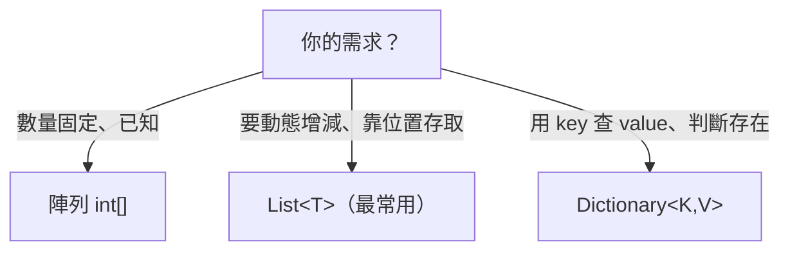

# [csharp-1-5] 集合：陣列、`List`、`Dictionary` 怎麼選

> **本章目標**：學會 C# 三個最常用的集合——陣列、`List`、`Dictionary`，以及「什麼時候用哪個」的判斷。

## 你會學到

- 陣列：固定大小的基礎集合
- `List<T>`：可動態增減的清單（最常用）
- `Dictionary<K,V>`：鍵值對查找
- 怎麼依需求選對集合

## 概念說明

存放「多筆資料」是寫程式的家常便飯。C# 三個最常用的集合，剛好對應你在 **dsa 課程**學的資料結構：

```
陣列 Array      → 固定大小的連續序列（dsa Part 2-1）
List<T>         → 動態陣列，可增減（dsa Part 2-2）
Dictionary<K,V> → 雜湊表，用 key 快速查找（dsa Part 3）
```

`<T>`、`<K,V>` 是**泛型**（[csharp-3-1] 會深入）——表示「裝什麼型別的集合」，例如 `List<int>` 是「裝 int 的清單」。

## 程式碼範例

### 陣列：固定大小

```csharp
int[] numbers = { 10, 20, 30 };       // 宣告並初始化
Console.WriteLine(numbers[0]);         // 10（用索引取，O(1)）
Console.WriteLine(numbers.Length);     // 3（長度）

numbers[1] = 99;                       // 可以改值
// numbers[3] = 40;                    // ❌ 越界！陣列大小固定
```

說明：陣列大小**固定**（建立時就定死），用 `[索引]` 取值（O(1)，呼應 dsa Part 2-1）。適合「數量固定、已知」的情況。

### List<T>：可動態增減（最常用）

實務上更常用 **`List<T>`**——它能動態增減（就是 dsa Part 2-2 的動態陣列）：

```csharp
using System.Collections.Generic;     // List/Dictionary 在這個命名空間

List<string> fruits = new List<string>();
fruits.Add("蘋果");                    // 加到尾端
fruits.Add("香蕉");
fruits.Add("橘子");

Console.WriteLine(fruits[0]);          // 蘋果（也用索引取）
Console.WriteLine(fruits.Count);       // 3（注意 List 用 Count，陣列用 Length）

fruits.Remove("香蕉");                 // 移除
foreach (var fruit in fruits)          // 走訪（csharp-1-3）
{
    Console.WriteLine(fruit);
}
```

說明：`List<T>` 用 `.Add()` 增、`.Remove()` 刪、`.Count` 取數量。它是 C# 最常用的集合——**不確定數量、需要增減時，用 `List`**。（背後是動態陣列的攤銷 O(1)，dsa Part 2-2。）

### Dictionary<K,V>：鍵值對查找

當你要「**用一個 key 快速查 value**」，用 **`Dictionary`**（就是 dsa Part 3 的雜湊表）：

```csharp
Dictionary<string, int> stock = new Dictionary<string, int>();
stock["蘋果"] = 50;                    // 設定 key → value
stock["香蕉"] = 30;

Console.WriteLine(stock["蘋果"]);       // 50（用 key 查，平均 O(1)）

if (stock.ContainsKey("橘子"))          // 安全地檢查 key 在不在
{
    Console.WriteLine(stock["橘子"]);
}
else
{
    Console.WriteLine("沒有橘子");
}

// 走訪鍵值對
foreach (var item in stock)
{
    Console.WriteLine($"{item.Key}: {item.Value}");
}
```

說明：`Dictionary` 用 `[key]` 存取、`.ContainsKey()` 安全檢查（直接取不存在的 key 會出錯）。它的查找是平均 O(1)（雜湊表，dsa Part 3-1）——**要用 key 快速查找時的首選**。

### 怎麼選



這張圖是選擇關鍵（呼應 dsa Part 7-1 的決策圖）：**固定數量用陣列、動態清單用 `List`、key-value 查找用 `Dictionary`**。實務上 `List` 和 `Dictionary` 涵蓋了絕大多數需求。

## 小練習

1. 用 `List<int>` 存五個分數，用 `foreach` 算總分與平均。
2. 用 `Dictionary<string, int>` 存三個國家 → 人口，查一個存在的、用 `ContainsKey` 安全查一個不存在的。
3. 思考題：「一週七天的名稱」「使用者的待辦清單（會增減）」「學號 → 學生資料」各該用哪個集合？為什麼？

## 課外讀物

> 這些集合背後的資料結構 → **dsa 課程 Part 2（陣列、動態陣列）、Part 3（雜湊表）**

> 怎麼選對資料結構 → **dsa 課程 Part 7-1：決策圖**

> 下一步：動手做一個 C# CLI 工具 → [csharp-1-6]
