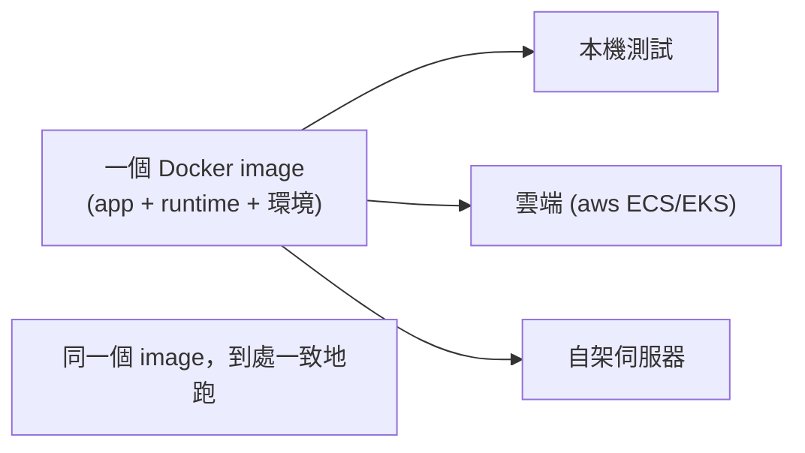

# [csharp-10-2] 🔧 動手做：把 .NET app 容器化成 Docker image

> **本章目標**：學會用 Docker 把你的 .NET 應用「容器化」——打包成一個「到哪都能跑」的 image，這是現代部署的標準做法。

## 你會學到

- 容器化解決什麼問題
- Dockerfile 怎麼寫（多階段建置）
- 建立並執行 Docker image
- 為什麼容器化適合 .NET 部署

## 概念說明

### 容器化：解決「在我電腦能跑」

[csharp-10-1] 的發佈有個煩惱——「目標機器要不要裝 .NET？版本對不對？環境一樣嗎？」這類「**在我電腦能跑，到伺服器卻不行**」的問題。

**Docker 容器化**解決這個——**把「應用 + 它需要的一切環境」打包成一個 image，這個 image 到哪都跑得一樣**（呼應 **infra 課程 Part 5**、aws Part 7）：

```
比喻：Docker image 像「貨櫃」
   把應用、.NET runtime、相依、設定全裝進一個標準貨櫃
   這個貨櫃在「你的電腦、測試機、正式伺服器、雲端」都長一樣、跑一樣
   → 徹底解決「環境不一致」的問題
```

這就是為什麼現代部署幾乎都用容器——**一次打包，到處一致地跑**。

> Docker、容器的完整介紹 → **infra 課程 Part 5：Docker**

## 程式碼範例

### Dockerfile：建置 image 的食譜

**Dockerfile** 是「**怎麼把你的應用打包成 image**」的步驟說明。.NET 推薦用「**多階段建置（multi-stage build）**」——一個階段「建置」、一個階段「執行」，讓最終 image 精簡：

```dockerfile
# === 階段一：建置（用含 SDK 的大映像來編譯）===
FROM mcr.microsoft.com/dotnet/sdk:8.0 AS build
WORKDIR /src
COPY *.csproj ./
RUN dotnet restore                      # 還原相依套件
COPY . ./
RUN dotnet publish -c Release -o /app   # 發佈（csharp-10-1）

# === 階段二：執行（用只含 Runtime 的小映像來跑）===
FROM mcr.microsoft.com/dotnet/aspnet:8.0
WORKDIR /app
COPY --from=build /app ./               # 只把「建置產物」複製過來
EXPOSE 8080
ENTRYPOINT ["dotnet", "MyApi.dll"]      # 容器啟動時執行的指令
```

逐段說明：

- **階段一（build）**：用含「**SDK**」（[csharp-0-2]）的大映像來編譯、發佈你的應用。
- **階段二（執行）**：改用只含「**Runtime**」的小映像，**只把建置好的產物複製過來**。
- **為什麼多階段？** 最終 image 只含「執行需要的東西」（Runtime + 你的 app），不含笨重的 SDK 和原始碼——**image 小很多**（更快傳輸、更省空間、攻擊面更小）。
- `EXPOSE 8080`：宣告容器用 8080 埠。`ENTRYPOINT`：容器啟動時跑的指令。

> 別忘了加 `.dockerignore`（排除 bin/、obj/、機密檔等不該進 image 的東西）。

### 建立並執行 image

```bash
# 建立 image（在 Dockerfile 所在目錄）
docker build -t my-api .

# 執行 container（把容器的 8080 對應到本機的 5000）
docker run -p 5000:8080 \
  -e ASPNETCORE_ENVIRONMENT=Production \
  -e ConnectionStrings__DefaultConnection="..." \
  my-api
```

說明：

- `docker build -t my-api .`：依 Dockerfile 建出一個叫 `my-api` 的 image。
- `docker run -p 5000:8080`：跑容器，把容器的 8080 埠對應到本機 5000。
- **`-e` 傳環境變數**：機密（連線字串等）透過環境變數注入（[csharp-9-3]）——**不寫進 image！** image 應該不含機密，機密在「執行時」注入。

跑起來後，瀏覽器開 `http://localhost:5000/swagger` 就看得到你「在容器裡跑」的 API。

### 為什麼容器化適合 .NET 部署



這張圖在說容器化的核心價值——**同一個 image 在本機、雲端、自架伺服器都一致地跑**。這讓部署可預測、可重複，也是接下來 [csharp-10-3]（雲端）、[csharp-10-4]（CI/CD）的基礎。

## 小練習

1. 為你的 Todo API 寫一個多階段 Dockerfile，`docker build` 建出 image。
2. `docker run` 跑起來（用 `-e` 注入環境變數），開 Swagger 確認在容器裡正常運作。
3. 思考題：為什麼用「多階段建置」？最終 image 不含 SDK 和原始碼有什麼好處？為什麼機密要用 `-e` 注入而非寫進 image？

## 課外讀物

> Docker、容器完整介紹 → **infra 課程 Part 5：Docker**

> 機密用環境變數注入 → [csharp-9-3]；對照其他語言容器化 → **rust 課程 [rust-9-6]**

> 下一步：把容器部署到雲端 → [csharp-10-3]
