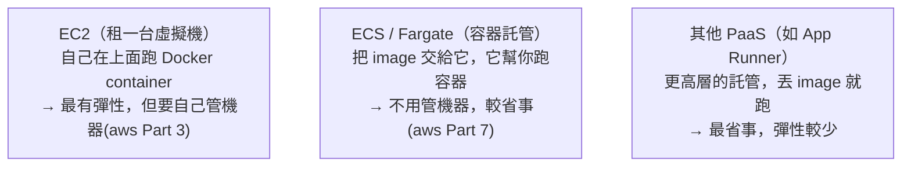

# [csharp-10-3] 部署到雲端

> **本章目標**：認識把 .NET 應用部署到雲端的幾種方式，理解各自的取捨，並知道怎麼接續到 aws 課程深入。

## 你會學到

- 部署到雲端的幾種選項
- 自架 vs 雲端託管的取捨
- 容器化應用怎麼上雲
- 部署後要注意的事

## 概念說明

### 從「本機跑」到「上線給人用」

你已經能把應用容器化（[csharp-10-2]）。最後一步——**部署到「能 24 小時對外服務」的地方**。主要有兩條路（呼應 **infra 課程**自架、**aws 課程**雲端）：

```
自架（self-hosted）：自己租/買一台伺服器來跑
   → 完全掌控，但要自己管 OS、網路、安全、維運（infra 課程的主題）
雲端託管（cloud）：用雲端服務商（AWS 等）的託管服務
   → 省去很多維運，彈性擴展，但有學習曲線和成本（aws 課程的主題）
```

### 雲端部署的選項（以 AWS 為例）

容器化的 .NET 應用，上雲有幾種主流方式（深入見 **aws 課程**）：



這張圖在說選項由「掌控多但麻煩」到「省事但彈性少」：

```
EC2：租一台虛擬機（像遠端的 Linux 電腦），自己裝 Docker 跑容器
   → 接近 infra 課程的自架，但機器在雲上（aws Part 3）
ECS / Fargate：容器託管服務，你給 image，它負責跑、擴展、健康檢查
   → 不用管底層機器，是容器化應用上雲的主流（aws Part 7）
更高層 PaaS：丟 image 進去就自動跑
   → 最省心，但客製彈性較少
```

選哪個看「**你想管多少、需要多少彈性、預算**」——這正是 **aws 課程** 會詳細帶你做的（從開帳號、設安全、到實際部署）。

### 容器化讓上雲變簡單

你在 [csharp-10-2] 做的容器化，讓上雲變單純——**因為 image「到哪都一致」，雲端服務只要「拉你的 image 來跑」即可**：

```
本機建好的 image → 推到「容器登錄庫」（如 AWS ECR、Docker Hub）
   → 雲端服務（ECS 等）從登錄庫拉 image → 跑起來
→ 你本機測過的同一個 image，原封不動在雲端跑。
  「在我電腦能跑」的問題徹底解決（csharp-10-2）。
```

### 部署後要注意的事

應用上線不是結束，而是「可靠營運」的開始（呼應 **sre 課程**）：

```
□ 健康檢查（csharp-9-2）：讓雲端/負載平衡器能監控、自動處理故障
□ 日誌與監控（csharp-9-2）：能看到線上發生什麼、出問題能查（sre 課程）
□ 機密管理（csharp-9-3）：用雲端密鑰服務（AWS Secrets Manager）
□ HTTPS：對外一定要加密（cs 課程 Part 9-3、課外讀物 E-3-2）
□ 擴展：流量大時能加機器（aws 的 auto scaling）
□ 備份、災難復原（infra 課程 Part 8）
→ 「部署上線」只是起點，「跑得可靠」是 sre 課程的主題。
```

## 範例：一個完整的部署路徑

```
你的 C# API 上線的典型路徑：
   1. 本機開發、測試（dotnet test 全綠，csharp-8）
   2. 容器化成 Docker image（csharp-10-2）
   3. 推 image 到容器登錄庫（如 AWS ECR）
   4. 雲端服務（如 ECS/Fargate）拉 image 跑起來
   5. 設定：環境變數注入機密、連上雲端資料庫、設健康檢查
   6. 對外加 HTTPS、設網域
   7. 接上監控告警（sre 課程）
→ 每一步在 aws 課程都有詳細的動手教學。
  本課帶你「做出能部署的 C# 服務」，aws/infra 帶你「實際部署與營運」。
```

## 小練習

1. 比較「自架（infra）」和「雲端託管（aws）」部署的優缺點，各列兩點。
2. 說明「容器化（csharp-10-2）」為什麼讓上雲變簡單（提示：image 一致性）。
3. 思考題：應用部署上線後，為了「可靠營運」還要注意哪些事（列三項）？這對應到哪些課程？

## 課外讀物

> 雲端部署完整教學（EC2、ECS/EKS、安全）→ **aws 課程**（`lessons/aws/課程大綱.md`）

> 自架部署 → **infra 課程**；可靠營運（監控、告警、擴展）→ **sre 課程**

> HTTPS → **cs 課程 Part 9-3**、[課外讀物 E-3-2：HTTPS/TLS](../../../課外讀物/E-3-network/E-3-2-https-tls.md)

> 下一步：CI/CD 自動化部署 → [csharp-10-4]
