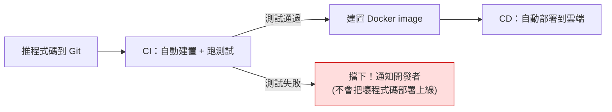

# [csharp-10-4] CI/CD：推上去自動建置部署

> **本章目標**：理解 CI/CD——讓「測試、建置、部署」自動化的流程，告別手動部署的痛苦與風險。

## 你會學到

- CI/CD 是什麼、解決什麼問題
- CI（持續整合）vs CD（持續部署）
- 一個典型的 CI/CD 流程
- 用 GitHub Actions 的概念

## 概念說明

### 手動部署的痛

到目前你都是手動：本機測試、手動 build、手動 docker、手動部署（[csharp-10-1]~[10-3]）。每次發布都要重複這些步驟——**累、慢、容易出錯、容易漏步驟**：

```
手動部署的問題：
   忘了跑測試就部署 → 把 bug 帶上線
   步驟漏一步 → 部署失敗或不一致
   只有「會操作的那個人」能部署 → 風險集中
   發布很痛苦 → 大家不敢頻繁發布 → 累積一堆改動一次上 → 更危險
```

**CI/CD** 把這一切**自動化**——「你推程式碼到 Git，後續測試、建置、部署自動完成」。

### CI 與 CD

```
CI（Continuous Integration，持續整合）：
   每次推程式碼 → 自動「建置 + 跑測試」
   → 確保「新程式碼沒弄壞東西」，問題早發現

CD（Continuous Deployment/Delivery，持續部署/交付）：
   通過 CI 後 → 自動「建置 image + 部署」
   → 讓「上線」變成自動、可重複、低風險的事
```



這張圖在說 CI/CD 的核心流程——**推程式碼 → 自動測試 → 通過才建置部署，沒通過就擋下**。關鍵價值是「**測試是自動的關卡**」（呼應 [csharp-8] 的測試）——**壞掉的程式碼進不了正式環境**，這讓頻繁、安全的發布成為可能。

### CI/CD 的價值

```
✓ 自動跑測試 → 壞程式碼上不了線（品質把關）
✓ 自動化、可重複 → 不會漏步驟、不靠特定某人
✓ 快速回饋 → 推了程式碼幾分鐘就知道有沒有問題
✓ 頻繁小發布 → 每次改動小、風險低、好回溯（呼應 sre 安全部署）
→ CI/CD 是現代軟體工程的標準實踐，讓團隊能「又快又穩」地發布。
```

## 程式碼範例

### GitHub Actions 概念

**GitHub Actions** 是常見的 CI/CD 工具（在 GitHub 上）。你寫一個 YAML 檔描述「推程式碼時要自動做什麼」：

```yaml
# .github/workflows/ci.yml（概念示意）
name: CI/CD

on:
  push:
    branches: [ main ]        # 推到 main 分支時觸發

jobs:
  build-and-test:
    runs-on: ubuntu-latest
    steps:
      - uses: actions/checkout@v4              # 取得程式碼
      - uses: actions/setup-dotnet@v4          # 裝 .NET SDK
        with:
          dotnet-version: '8.0'
      - run: dotnet restore                    # 還原套件
      - run: dotnet build -c Release           # 建置
      - run: dotnet test                       # 🔑 跑測試（csharp-8）！

  deploy:
    needs: build-and-test                      # 等測試通過才執行
    runs-on: ubuntu-latest
    steps:
      - run: echo "建置 Docker image 並部署到雲端..."   # csharp-10-2、10-3
      # 實際會：build image → 推到登錄庫 → 部署到 ECS 等
```

逐項說明：

- `on: push: branches: [main]`：**觸發條件**——推到 main 分支時自動跑。
- `build-and-test`：**CI 階段**——還原、建置、**跑測試**（`dotnet test`）。
- `deploy`：**CD 階段**——`needs: build-and-test` 表示「**測試通過才部署**」。這是關鍵——測試是部署的前置關卡。
- 部署步驟會做 [csharp-10-2] 的容器化 + [csharp-10-3] 的上雲。

說明：你只要把這個檔案放進 repo，之後**每次推程式碼，GitHub 自動跑整個流程**——測試、建置、（通過才）部署。完全不用手動。機密（部署用的雲端金鑰）存在 GitHub Secrets（不寫進 YAML，呼應 [csharp-9-3]）。

### 連接前面所學

```
CI/CD 把你前面學的串成自動化流程：
   csharp-8 的測試 → CI 自動跑（品質關卡）
   csharp-10-1 的發佈 → CI 自動建置
   csharp-10-2 的容器化 → 自動建 image
   csharp-10-3 的雲端部署 → CD 自動部署
   csharp-9-3 的機密 → 存 GitHub Secrets
→ 你手動做過一遍，現在用 CI/CD 自動化它。
  aws 課程 Part 9 有更完整的 CI/CD 實作。
```

## 小練習

1. 用自己的話解釋 CI 和 CD 各自做什麼，以及「測試作為部署前置關卡」為什麼重要。
2. 列出手動部署的三個痛點，說明 CI/CD 怎麼解決它們。
3. 思考題：為什麼 CI/CD 鼓勵「頻繁的小發布」而非「累積一堆改動一次大發布」？（提示：風險、回溯。）

## 課外讀物

> CI/CD 完整實作 → **aws 課程 Part 9（GitHub Actions + AWS）**；安全部署 → **sre 課程 Part 8**

> 測試是 CI 的核心 → [csharp-8]；機密存 Secrets → [csharp-9-3]；Git → [課外讀物 E-8](../../../課外讀物/E-8-git/E-8-1-git-internals.md)

> 下一步：總整理專案——完整的 C# 後端從零到上線 → [csharp-10-5]
