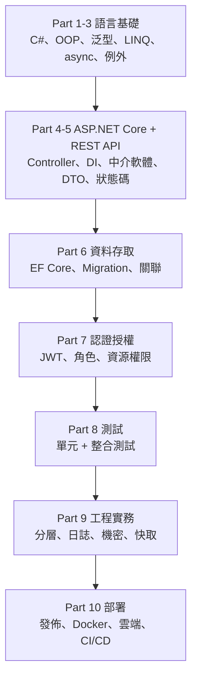

# [csharp-10-5] 🏆 總整理專案：一個完整的 C# 後端服務，從零開發到部署上線

> **本章目標**：整合整門課，規劃並打造一個完整的 C# 後端服務——從零開發、測試、到容器化部署上線。這是你的 C# 畢業專案。

## 你會學到

- 怎麼把整門課的知識整合成一個專案
- 一個正式後端服務的完整面貌
- 從開發到部署的全流程
- 接續其他課程的方向

## 概念說明

### 畢業專案：一個「任務管理 API」

整合整門課，我們規劃一個比 Todo 更完整的服務——**團隊任務管理 API（Task Manager）**，具備正式服務該有的一切：

```
功能：
   使用者：註冊、登入（JWT）
   專案（Project）：每個使用者能建立多個專案
   任務（Task）：每個專案下有多個任務，可指派、標記完成、設優先級
   權限：只能管自己的專案；管理員能管全部
```

這個專案會用上**整門課的每一塊**——這正是「整合」的意義。

### 用整門課的知識規劃



這張圖是你的專案藍圖——**從語言基礎一路用到部署**，每個 Part 都在這個專案裡發揮作用。

## 專案規劃

### 領域模型（Part 2、6）

```csharp
// 三個核心實體，含關聯（csharp-6-5）
public class User
{
    public int Id { get; set; }
    public string Username { get; set; } = "";
    public string PasswordHash { get; set; } = "";    // 雜湊存（csharp-7-4）
    public string Role { get; set; } = "User";
    public List<Project> Projects { get; set; } = new();
}

public class Project
{
    public int Id { get; set; }
    public string Name { get; set; } = "";
    public int OwnerId { get; set; }                  // 屬於哪個 user
    public List<TaskItem> Tasks { get; set; } = new(); // 一對多
}

public class TaskItem
{
    public int Id { get; set; }
    public string Title { get; set; } = "";
    public bool IsDone { get; set; }
    public int Priority { get; set; }
    public int ProjectId { get; set; }                // 屬於哪個 project
}
```

### 分層架構（Part 9）

```
Controller 層：UsersController、ProjectsController、TasksController
   （只管 HTTP：路由、驗證、狀態碼、取 JWT 身分）
Service 層：UserService、ProjectService、TaskService
   （業務規則：權限檢查、流程協調）
Repository 層：IProjectRepository、ITaskRepository...
   （資料存取：EF Core）
→ 各司其職、依賴介面、用 DI 串接（csharp-9-1、4-4）
```

### 完整開發到上線流程

把整門課的流程走一遍：

```
【開發】
1. 規劃領域模型與分層架構（Part 2、9）
2. 建 ASP.NET Core 專案 + EF Core + Migration 建表（Part 4、6）
3. 實作 Repository → Service → Controller 三層（Part 5、9）
4. 加 JWT 認證 + 角色/資源授權（Part 7）
5. 加日誌、健康檢查、機密管理（Part 9）
6. 熱門查詢加快取（Part 9-4）

【品質】
7. 寫單元測試（業務規則）+ 整合測試（API 流程）（Part 8）
8. dotnet test 全綠

【部署】
9. dotnet publish + 寫 Dockerfile 容器化（Part 10-1、10-2）
10. 設 CI/CD：推程式碼 → 自動測試 → 建 image → 部署（Part 10-4）
11. 部署到雲端，設 HTTPS、監控、機密（Part 10-3）

→ 完成！一個正式級的 C# 後端服務，從零到上線。
```

### 驗收清單

```
□ 完整 CRUD（使用者、專案、任務），RESTful + 正確狀態碼
□ JWT 登入，只能管自己的資源，管理員能管全部
□ 資料存進真實資料庫（EF Core + Migration）
□ 分層架構（Controller/Service/Repository）+ DI
□ 日誌、健康檢查、機密走環境變數/密鑰服務
□ 一套測試（單元 + 整合），dotnet test 全綠
□ 容器化（Dockerfile），能 docker run 起來
□ （進階）CI/CD 自動化、部署上雲
```

## 小練習（這就是專案本身）

1. **核心**：實作這個任務管理 API 的核心——使用者註冊登入（JWT）+ 專案/任務的 CRUD + 「只能管自己的」權限，用分層架構，接上資料庫。
2. **品質**：為業務規則寫單元測試、為關鍵端點寫整合測試，確保 `dotnet test` 全綠。
3. **部署**：把它容器化成 Docker image，在本機 `docker run` 跑起來。進階：設一個 GitHub Actions CI 流程（至少自動跑測試）。

## 課外讀物

> 🎓 **恭喜你完成 C# 後端開發課程！** 從語言基礎、OOP、ASP.NET Core、資料庫、認證、測試，到部署上線——你已經能獨立開發一個正式級的 C# 後端服務。

> 把它**自架**部署 → **infra 課程**（Linux、Nginx、Docker、自動化）
> 把它部署到**雲端** → **aws 課程**（EC2、ECS/EKS、CI/CD、IaC）
> 讓它**跑得可靠**（監控、告警、SLO、事故處理）→ **sre 課程**
> 用**快取**進一步優化效能 → **快取課程**
> 對照「另一條後端路線」→ **basic 課程 Part 4（TypeScript/Express）**、**rust 課程 Part 9（Rust/Axum）**

> 底層原理 → **cs 課程（計算機概論）**；演算法 → **dsa 課程**；設計原則 → [課外讀物 E-7 SOLID](../../../課外讀物/E-7-solid/E-7-1-solid-overview.md)、[課外讀物 E-6 Clean Code](../../../課外讀物/E-6-best-practices/E-6-1-what-is-clean-code.md)
