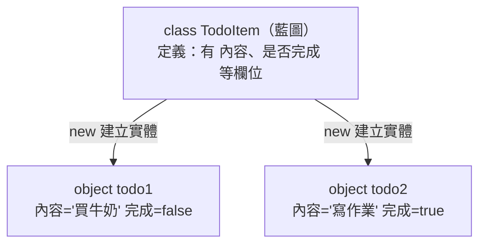

# [csharp-2-1] Class 與物件：C# 的核心思維

> **本章目標**：理解物件導向的核心——class（類別）與 object（物件），學會用 class 把「資料」和「行為」打包成有意義的型別。

## 你會學到

- class 與 object 的關係（藍圖 vs 實體）
- 怎麼定義 class、建立物件
- 欄位（field）與方法
- 建構子（constructor）

## 概念說明

### 為什麼需要 class

[csharp-1-6] 的待辦清單用 `List<string>` 存——但一個待辦其實不只「內容」，還有「是否完成、優先級、截止日」。用 `string` 裝不下這麼多資訊。

**class（類別）** 解決這個——它讓你**定義自己的型別**，把「相關的資料 + 操作這些資料的行為」打包在一起。這是**物件導向程式設計（OOP）** 的核心，而 C# 是徹底的物件導向語言。

### class 是藍圖，object 是實體

關鍵概念——**class 是「藍圖/模板」，object（物件）是「照藍圖造出來的實體」**：

```
class 像「餅乾模具」：定義「餅乾長什麼樣、有什麼特徵」
object 像「用模具壓出來的一個個餅乾」：實際存在的個體

class TodoItem（一份藍圖）
   → 用它可以造出無數個 object：todo1、todo2、todo3...
   每個 object 有自己的資料（todo1 的內容、todo2 的內容...）
```



這張圖在說：一個 class（藍圖）能造出多個 object（實體），每個物件有自己獨立的資料。

## 程式碼範例

### 定義 class

```csharp
class TodoItem
{
    // 欄位（field）：物件的資料
    public string Title;
    public bool IsDone;

    // 方法：物件的行為
    public void MarkDone()
    {
        IsDone = true;          // 直接存取自己的欄位
    }
}
```

說明：

- `class TodoItem { }` 定義一個叫 `TodoItem` 的型別（class 名用 **PascalCase**）。
- **欄位（field）** `Title`、`IsDone`：物件的資料。`public` 表示外界能存取（[csharp-2-2] 會講存取修飾詞）。
- **方法** `MarkDone()`：物件的行為，能存取自己的欄位（`IsDone = true`）。

### 建立並使用物件

用 `new` 關鍵字「照藍圖造一個物件」：

```csharp
TodoItem todo = new TodoItem();   // 建立一個 TodoItem 物件
todo.Title = "買牛奶";             // 設定欄位（用 . 存取）
todo.IsDone = false;

Console.WriteLine(todo.Title);     // 買牛奶
todo.MarkDone();                   // 呼叫方法
Console.WriteLine(todo.IsDone);    // true

// 每個物件獨立
TodoItem todo2 = new TodoItem();
todo2.Title = "寫作業";
// todo 和 todo2 各有各的資料，互不影響
```

說明：`new TodoItem()` 建立物件，用 `.` 存取欄位和方法。每個物件**有自己獨立的資料**（呼應 [csharp-1-2] 參考型別——class 是參考型別）。

### 建構子：建立時就初始化

每次都「先 new 再一個個設欄位」很囉嗦。**建構子（constructor）** 讓你「建立物件時就傳入初始值」：

```csharp
class TodoItem
{
    public string Title;
    public bool IsDone;

    // 建構子：和 class 同名、沒有回傳型別
    public TodoItem(string title)
    {
        Title = title;          // 用傳入的值初始化欄位
        IsDone = false;         // 預設未完成
    }

    public void MarkDone()
    {
        IsDone = true;
    }
}

// 用建構子：建立時直接給值
TodoItem todo = new TodoItem("買牛奶");   // 一行搞定
Console.WriteLine(todo.Title);            // 買牛奶
Console.WriteLine(todo.IsDone);           // false（建構子設的預設）
```

說明：建構子是一個**和 class 同名、沒有回傳型別**的特殊方法，在 `new` 的時候自動執行，用來初始化物件。`new TodoItem("買牛奶")` 就會呼叫它。這讓建立物件更方便、也保證物件一建立就有合理的初始狀態。（對照 rust 的 `new` 關聯函式 [rust-3-2]、其他語言的 constructor。）

## 小練習

1. 定義一個 `Book` class，有欄位 `Title`、`Author`、`Pages`，建立兩本書物件並印出它們的資訊。
2. 給 `Book` 加一個建構子，接收三個參數初始化欄位，用建構子建立物件。
3. 給 `Book` 加一個方法 `IsLong()`，頁數超過 300 回傳 true，測試它。

## 課外讀物

> class 是參考型別 → 複習 [csharp-1-2]；對照 rust 的 struct + new → **rust 課程 [rust-3-1]、[rust-3-2]**

> 物件導向是一種程式設計典範 → **cs 課程 Part 8-3：程式設計典範**

> 下一步：用「封裝」保護物件的資料 → [csharp-2-2]
