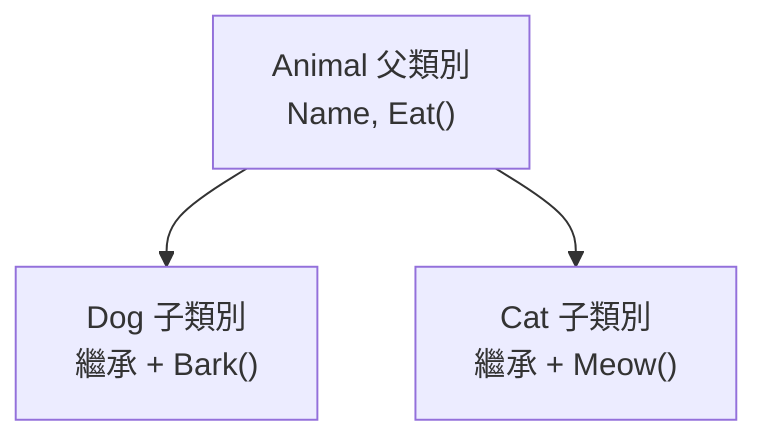
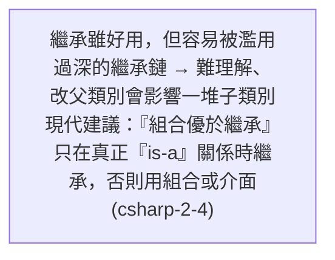

# [csharp-2-3] 繼承與多型（Polymorphism）

> **本章目標**：理解物件導向的另兩根支柱——繼承（重用程式碼）與多型（同一介面、不同行為），以及它們怎麼讓程式更有彈性。

## 你會學到

- 繼承：子類別重用父類別的東西
- 多型：同一個呼叫、不同物件做不同的事
- `virtual` / `override` 怎麼覆寫行為
- 繼承的取捨（別過度用）

## 概念說明

### 繼承：站在父類別的肩膀上

**繼承（inheritance）** 讓一個 class「**繼承另一個 class 的欄位與方法**」，再加上自己的東西。用來表達「**是一種（is-a）**」的關係：

```
動物（父類別）：有「名字」、會「吃」
   狗（子類別）：「是一種」動物 → 繼承名字和吃，再加「汪汪叫」
   貓（子類別）：「是一種」動物 → 繼承名字和吃，再加「喵喵叫」
→ 狗和貓不用重寫「名字、吃」，直接繼承，只加自己特有的。
```



繼承的好處是**重用程式碼**（共同的部分寫一次在父類別）。但要小心別濫用——只在「真的是 is-a 關係」時用（下面會提取捨）。

### 多型：同一呼叫，不同行為

**多型（polymorphism）** 是 OOP 最強大的概念——**「同一個方法呼叫，不同的物件會做出不同的行為」**。

例如所有動物都會「叫」（`MakeSound`），但狗叫汪汪、貓叫喵喵。多型讓你能「**對著一個 Animal 呼叫 `MakeSound()`，它會自動執行『實際物件』對應的版本**」——不管它實際是狗還是貓：

```
你拿一群 Animal（裡面有狗有貓），對每個呼叫 MakeSound()
   → 狗物件自動叫汪汪、貓物件自動叫喵喵
   → 你的程式碼不用寫一堆 if (是狗) ... else if (是貓) ...
```

這帶來巨大的彈性——**新增一種動物（如鴨），完全不用改「讓動物叫」的那段程式碼**（呼應 [課外讀物 E-7-3 開放封閉原則](../../../課外讀物/E-7-solid/E-7-3-ocp.md)）。

## 程式碼範例

### 繼承 + 多型

```csharp
// 父類別
class Animal
{
    public string Name { get; set; }

    public Animal(string name)
    {
        Name = name;
    }

    // virtual：宣告「這個方法可以被子類別覆寫」
    public virtual string MakeSound()
    {
        return "...";          // 預設行為
    }
}

// 子類別：用 : 表示繼承 Animal
class Dog : Animal
{
    public Dog(string name) : base(name) { }    // base(name) 呼叫父類別建構子

    public override string MakeSound()           // override：覆寫父類別的方法
    {
        return "汪汪";
    }
}

class Cat : Animal
{
    public Cat(string name) : base(name) { }

    public override string MakeSound()
    {
        return "喵喵";
    }
}
```

說明：

- `class Dog : Animal`：`: Animal` 表示「Dog 繼承 Animal」。Dog 自動有了 `Name` 屬性。
- `: base(name)`：子類別建構子用 `base(...)` 呼叫父類別的建構子來初始化繼承來的部分。
- **`virtual`**（父類別）：標記「這個方法允許被子類別覆寫」。
- **`override`**（子類別）：覆寫父類別的方法，提供自己的版本。

### 多型的威力

```csharp
// 一個 List 裝不同的動物（它們都「是」Animal）
List<Animal> animals = new List<Animal>
{
    new Dog("小黑"),
    new Cat("咪咪"),
    new Dog("阿旺"),
};

// 對每個動物呼叫 MakeSound()——多型自動執行各自的版本！
foreach (Animal animal in animals)
{
    Console.WriteLine($"{animal.Name} 說：{animal.MakeSound()}");
}
// 小黑 說：汪汪
// 咪咪 說：喵喵
// 阿旺 說：汪汪
```

說明：這就是多型的精髓——**迴圈裡只寫 `animal.MakeSound()`，C# 自動依「物件實際是什麼」執行對應版本**（狗叫汪汪、貓叫喵喵）。你完全不用寫 `if (是狗)`。**未來新增「鴨」class，這段迴圈一個字都不用改**——這就是多型帶來的彈性與「對擴充開放」（[課外讀物 E-7-3](../../../課外讀物/E-7-solid/E-7-3-ocp.md)）。

### 取捨：別過度用繼承



這張圖提醒：繼承容易被濫用成「為了重用程式碼而硬繼承」，造成糾纏的繼承鏈。**現代物件導向建議「組合優於繼承（composition over inheritance）」**——能用「把物件當欄位組裝起來」就別硬繼承。繼承只留給真正的「is-a」關係（狗是動物 ✓；但「訂單有一個客戶」是 has-a，該用組合而非繼承）。下一章的介面常是比繼承更好的選擇。

## 小練習

1. 定義一個 `Shape` 父類別有 `virtual double Area()`，讓 `Circle`、`Rectangle` 繼承並 `override` 各自的面積算法。
2. 用一個 `List<Shape>` 裝不同形狀，用 `foreach` 呼叫 `Area()`，觀察多型自動執行各自版本。
3. 思考題：「狗 is-a 動物」適合繼承。那「汽車 has-a 引擎」呢？該用繼承還是組合？為什麼？

## 課外讀物

> 多型 → 對擴充開放、對修改封閉 → [課外讀物 E-7-3：開放封閉原則](../../../課外讀物/E-7-solid/E-7-3-ocp.md)

> 繼承的替代/取捨（里氏替換）→ [課外讀物 E-7-4：里氏替換原則](../../../課外讀物/E-7-solid/E-7-4-lsp.md)

> 下一步：比繼承更靈活的介面與抽象類別 → [csharp-2-4]
