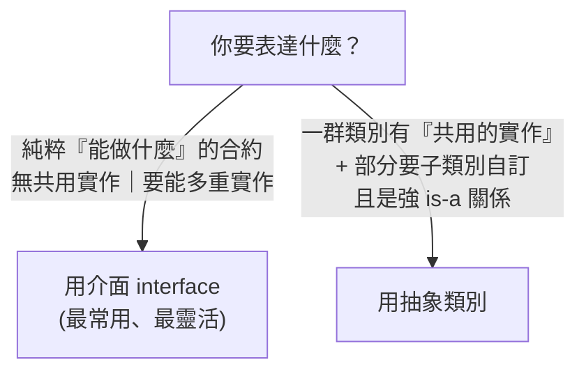

# [csharp-2-4] 介面（Interface）與抽象類別：何時用哪個

> **本章目標**：學會介面——「定義能力合約」的關鍵工具，理解它和抽象類別的差別，以及為什麼介面是寫出彈性、可測試程式的基礎。

## 你會學到

- 介面（interface）：定義「能做什麼」的合約
- 為什麼介面讓程式更有彈性、可測試
- 抽象類別（abstract class）是什麼
- 介面 vs 抽象類別怎麼選

## 概念說明

### 介面：能力的合約

**介面（interface）** 定義「**一組能力（方法/屬性），但不提供實作**」——它是一份「合約」，規定「想當這種東西，就要會做這些事」。任何 class 都能「實作（implement）」一個介面，承諾「我會做合約上的事」。

比喻（呼應 rust 的 trait [rust-5-2]）：

```
介面像「職位的職責清單」：
   「會員資格驗證器」這個介面規定：你要會「Validate(會員) → bool」
   任何 class 只要實作這個方法，就「符合這個介面」
   → 凡是需要「驗證器」的地方，都接受它，不管它內部怎麼驗。
```

C# 慣例：**介面名以 `I` 開頭**（如 `IAnimal`、`IRepository`）——一看 `I` 就知道是介面。

### 為什麼介面這麼重要

介面是「寫出好後端」的關鍵，因為它讓你**依賴「能力」而非「具體實作」**（這正是 [課外讀物 E-7-6 依賴反轉](../../../課外讀物/E-7-solid/E-7-6-dip.md) 的精神）：

```
不用介面：你的程式碼「寫死」依賴某個具體 class
   → 想換實作、想測試（用假的），都得改一堆程式碼
用介面：你的程式碼依賴「介面（能力）」
   → 想換實作？給它另一個實作該介面的 class 就好，不用改
   → 想測試？給它一個「假的（mock）」實作，輕鬆測（csharp-8-2）
```

這就是為什麼 ASP.NET Core 大量用介面 + 依賴注入（[csharp-4-4]）——它讓程式鬆耦合、好替換、好測試。介面是後端架構的基石。

## 程式碼範例

### 定義並實作介面

```csharp
// 介面：定義「能力合約」（只有方法簽名，沒有實作）
interface IAnimal
{
    string Name { get; }
    string MakeSound();          // 只宣告，不實作
}

// class 實作介面：用 : 並承諾實作所有合約方法
class Dog : IAnimal
{
    public string Name { get; }

    public Dog(string name)
    {
        Name = name;
    }

    public string MakeSound()    // 必須實作（介面規定的）
    {
        return "汪汪";
    }
}
```

說明：`interface IAnimal` 定義合約（`MakeSound` 只有簽名）。`class Dog : IAnimal` 表示「Dog 實作 IAnimal」，**必須提供所有合約方法**，否則編譯不過。這個「強制實作」保證了「凡是 IAnimal，一定有 MakeSound」。

### 介面帶來的彈性

```csharp
// 函式依賴「介面」，不依賴具體的 Dog/Cat
void Describe(IAnimal animal)              // 收任何 IAnimal
{
    Console.WriteLine($"{animal.Name}：{animal.MakeSound()}");
}

Describe(new Dog("小黑"));     // OK
Describe(new Cat("咪咪"));     // OK（只要 Cat 也實作 IAnimal）
// 未來有 new Duck("唐老鴨")，只要實作 IAnimal，這個函式照吃不用改
```

說明：`Describe` 只認「IAnimal 這個能力」，不管實際是狗是貓——**這就是介面的彈性**。一個 class 還能**同時實作多個介面**（這是介面勝過繼承的一點——C# 只能繼承一個父類別，但能實作多個介面）。

### 抽象類別：介於 class 和介面之間

**抽象類別（abstract class）** 是「**不能直接建立物件、專門被繼承的 class**」。它和介面的差別在——**抽象類別可以「同時有實作好的方法」和「留給子類別實作的抽象方法」**：

```csharp
abstract class Animal              // abstract：不能 new Animal()
{
    public string Name { get; set; }

    // 一般方法：有實作，子類別共用
    public void Sleep()
    {
        Console.WriteLine($"{Name} 睡著了");
    }

    // 抽象方法：沒實作，強制子類別實作（像介面）
    public abstract string MakeSound();
}

class Dog : Animal
{
    public override string MakeSound() => "汪汪";   // 必須實作抽象方法
    // Sleep() 直接繼承用，不用重寫
}
```

說明：抽象類別 `Animal` 既提供了共用的 `Sleep()`（有實作），又規定子類別必須實作 `MakeSound()`（抽象）。`abstract` class 不能直接 `new`，只能被繼承。

### 介面 vs 抽象類別：怎麼選



| | 介面 | 抽象類別 |
|---|------|------|
| 能有實作好的方法嗎 | 較少（主要是合約）| 可以（共用實作）|
| 一個 class 能用幾個 | 多個 | 只能繼承一個 |
| 表達 | 「能做什麼」（can-do）| 「是一種」（is-a）+ 共用 |

**實務建議：優先用介面**（更靈活、可多重實作、好測試）。只在「一群類別有大量共用實作、且是明確的 is-a 關係」時用抽象類別。後端開發（尤其 [csharp-4-4] 依賴注入、[csharp-9-1] 分層架構）幾乎都圍繞介面。

## 小練習

1. 定義一個介面 `IShape`，規定 `double Area()`。讓 `Circle`、`Rectangle` 各自實作，寫一個 `void PrintArea(IShape shape)` 印出任何形狀的面積。
2. 讓一個 class 同時實作兩個介面（如 `IShape` 和 `IComparable`），體會介面能多重實作。
3. 思考題：「資料庫存取」該定義成「介面 `IUserRepository`」還是「抽象類別」？為什麼（提示：想測試、想換實作）？

## 課外讀物

> 介面 = trait 的概念 → **rust 課程 [rust-5-2]**；介面隔離 → [課外讀物 E-7-5](../../../課外讀物/E-7-solid/E-7-5-isp.md)

> 依賴介面而非具體實作（依賴反轉）→ [課外讀物 E-7-6：依賴反轉原則](../../../課外讀物/E-7-solid/E-7-6-dip.md)

> 下一步：SOLID 原則在 C# 的整體實踐 → [csharp-2-5]
