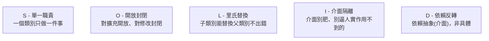

# [csharp-2-5] SOLID 原則在 C# 的實踐

> **本章目標**：認識 SOLID 五大物件導向設計原則，並看它們怎麼在 C# 裡落實——這是寫出「好維護、好擴充」程式的指南針。

## 你會學到

- SOLID 是什麼、為什麼重要
- 五個原則各自的核心
- 它們在 C# 怎麼體現（用前幾章的工具）
- 別教條化——原則是指南不是枷鎖

## 概念說明

### SOLID：物件導向的設計指南

你已經學了 class、封裝、繼承、多型、介面（[csharp-2-1]~[2-4]）。但「**怎麼用這些工具設計出好維護的程式**」需要原則指引——這就是 **SOLID**：五個物件導向設計原則的縮寫，由 Robert C. Martin（Uncle Bob）整理推廣。

C# 是實踐 SOLID 的經典語言（強型別 + 介面 + 物件導向齊全）。這章快速過一遍，每個原則的**完整深入版在課外讀物 E-7**，這裡聚焦「在 C# 怎麼做」。



### S — 單一職責原則（SRP）

**一個 class 應該只有「一個改變的理由」——只做一件事。**

```csharp
// ❌ 違反：一個 class 又管使用者資料、又管寄信、又管存資料庫
class User
{
    public void Save() { /* 存資料庫 */ }
    public void SendEmail() { /* 寄信 */ }
}

// ✅ 遵守：拆開，各司其職
class User { /* 只管使用者資料 */ }
class UserRepository { public void Save(User u) { } }   // 只管存取
class EmailService { public void Send(User u) { } }      // 只管寄信
```

→ [課外讀物 E-7-2：單一職責原則](../../../課外讀物/E-7-solid/E-7-2-srp.md)

### O — 開放封閉原則（OCP）

**對「擴充」開放，對「修改」封閉**——新增功能時，應該「加新程式碼」而非「改舊的」。[csharp-2-3] 的多型就是實踐：新增一種動物，不用改「讓動物叫」的程式碼。

→ [課外讀物 E-7-3：開放封閉原則](../../../課外讀物/E-7-solid/E-7-3-ocp.md)

### L — 里氏替換原則（LSP）

**子類別應該能「替換」父類別而不破壞程式**——子類別不該違反父類別的承諾。例如 `Bird` 有 `Fly()`，但 `Penguin`（企鵝不會飛）繼承它就違反 LSP——代表這個繼承設計有問題（呼應 [csharp-2-3] 的「別亂繼承」）。

→ [課外讀物 E-7-4：里氏替換原則](../../../課外讀物/E-7-solid/E-7-4-lsp.md)

### I — 介面隔離原則（ISP）

**介面要「小而專一」，別逼實作者去實作用不到的方法。** 寧可多個小介面，不要一個大而全的肥介面（[csharp-2-4] 介面的設計重點）。

```csharp
// ❌ 肥介面：逼所有動物都要會游泳、飛、跑
interface IAnimal { void Swim(); void Fly(); void Run(); }
// → 狗被迫實作 Fly()（牠不會飛）！

// ✅ 拆成小介面，各取所需
interface ISwimmer { void Swim(); }
interface IFlyer { void Fly(); }
// → 狗只實作需要的，鴨子可同時實作 ISwimmer + IFlyer
```

→ [課外讀物 E-7-5：介面隔離原則](../../../課外讀物/E-7-solid/E-7-5-isp.md)

### D — 依賴反轉原則（DIP）

**高層模組應該依賴「抽象（介面）」，而非「具體實作」。** 這是 [csharp-2-4] 介面彈性的核心，也是 ASP.NET Core 依賴注入（[csharp-4-4]）的理論基礎：

```csharp
// ❌ 依賴具體：寫死用 SqlUserRepository
class UserService
{
    private SqlUserRepository _repo = new SqlUserRepository();  // 綁死了
}

// ✅ 依賴抽象：依賴 IUserRepository 介面
class UserService
{
    private readonly IUserRepository _repo;
    public UserService(IUserRepository repo)   // 從外面「注入」
    {
        _repo = repo;        // 不在乎實際是哪個實作 → 好換、好測試
    }
}
```

→ [課外讀物 E-7-6：依賴反轉原則](../../../課外讀物/E-7-solid/E-7-6-dip.md)

### 別教條化

```
SOLID 是「指南」不是「枷鎖」：
   它幫你寫出好維護、好擴充、好測試的程式
   但別為了「遵守原則」而過度設計（over-engineering）小程式
→ 理解每個原則「想解決什麼問題」，在適當時機應用。
  簡單的東西保持簡單，複雜成長時用 SOLID 引導重構。
```

這呼應 **dsa 課程 [dsa-0-3]** 的「夠好勝過最佳」——原則要服務於「讓程式更好」這個目的，而非變成形式主義。

## 小練習

1. 用自己的話一句話概括 SOLID 五個原則各是什麼。
2. 找出這個設計違反哪個原則：「一個 `Report` class 同時負責『產生報表內容』和『把報表寄 email』」。怎麼改？
3. 把一個「寫死依賴具體 class」的程式，改成「依賴介面 + 從建構子注入」（DIP），說明改善了什麼。

## 課外讀物

> SOLID 完整深入 → [課外讀物 E-7：SOLID 原則總覽](../../../課外讀物/E-7-solid/E-7-1-solid-overview.md)（每個原則都有專章 E-7-2~E-7-6）

> 違反 SOLID 的反例大賞 → [課外讀物 E-7-8：SOLID 反例](../../../課外讀物/E-7-solid/E-7-8-solid-anti-examples.md)

> 別過度設計（呼應夠好勝過最佳）→ **dsa 課程 [dsa-0-3]**

> 下一步：動手用 OOP 設計一個小領域模型 → [csharp-2-6]
