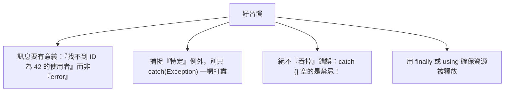

# [csharp-3-5] 例外處理與錯誤設計

> **本章目標**：學會 C# 的例外處理（try/catch）機制，以及「怎麼設計好的錯誤處理」——這對穩健的後端服務至關重要。

## 你會學到

- 例外（exception）是什麼
- try / catch / finally 怎麼用
- 怎麼丟出有意義的例外
- 錯誤處理的好習慣（別吞錯誤）

## 概念說明

### 例外：處理「出錯」的情況

程式執行時會遇到各種「出錯」——檔案不存在、網路斷線、使用者輸入了非數字、除以零。C# 用**例外（exception）** 機制處理這些：當錯誤發生，程式會「**丟出（throw）一個例外**」，正常流程中斷，跳到「**捕捉（catch）**」它的地方處理。

```
比喻：例外像「工廠生產線的緊急停止鈕」
   某一步出大錯 → 按下停止鈕（丟例外）→ 流程中斷
   → 跳到「處理異常的站」（catch）決定怎麼辦
```

注意 C# 用例外的風格，和 **rust 課程的 `Result`（[rust-4-1]）不同**——rust 把錯誤當回傳值，C# 用「丟出/捕捉」例外。兩種哲學各有優劣，但 C# 是例外風格，要學會它。

## 程式碼範例

### try / catch：捕捉並處理

```csharp
try
{
    int[] numbers = { 1, 2, 3 };
    Console.WriteLine(numbers[10]);    // 會丟出 IndexOutOfRangeException
}
catch (IndexOutOfRangeException ex)    // 捕捉「特定類型」的例外
{
    Console.WriteLine($"陣列越界了：{ex.Message}");
}
```

說明：把「可能出錯的程式碼」放進 `try`，用 `catch` 捕捉特定類型的例外。`ex.Message` 是錯誤訊息。**捕捉特定類型**很重要——不同錯誤該有不同處理。

### catch 多種例外、finally

```csharp
try
{
    string input = Console.ReadLine();
    int number = int.Parse(input);     // 輸入非數字會丟 FormatException
    int result = 100 / number;          // number 是 0 會丟 DivideByZeroException
    Console.WriteLine(result);
}
catch (FormatException)
{
    Console.WriteLine("請輸入有效的數字");
}
catch (DivideByZeroException)
{
    Console.WriteLine("不能除以零");
}
catch (Exception ex)                    // 捕捉「其他所有例外」（放最後）
{
    Console.WriteLine($"發生未預期的錯誤：{ex.Message}");
}
finally
{
    Console.WriteLine("不管成功失敗，這裡一定執行");   // 常用來清理資源
}
```

說明：

- 可以用**多個 catch** 處理不同例外類型，各有對應處理。
- `catch (Exception ex)` 捕捉「所有例外」的萬用版——放**最後**（因為它最廣）。
- **`finally`**：不管有沒有出錯，**一定會執行**——常用來「清理資源」（關檔案、關連線）。

### 主動丟出例外

當你的程式碼發現「不該發生的情況」，可以**主動丟出例外**（呼應 [csharp-2-2] 屬性驗證）：

```csharp
void Withdraw(decimal amount)
{
    if (amount <= 0)
        throw new ArgumentException("提款金額必須大於零");   // 丟出有意義的例外

    if (amount > _balance)
        throw new InvalidOperationException("餘額不足");
    _balance -= amount;
}
```

說明：`throw new XxxException("訊息")` 主動丟例外。**選對例外類型 + 寫清楚訊息**很重要——`ArgumentException`（參數錯）、`InvalidOperationException`（操作時機/狀態不對）等都是內建的常用類型，呼叫者能精準捕捉處理。

### 錯誤處理的好習慣



這張圖是錯誤處理的鐵則（呼應 [課外讀物 E-6-8](../../../課外讀物/E-6-best-practices/E-6-8-backend-clean-code.md)、rust [rust-4-3]）：

```
最大的禁忌：「吞掉錯誤」
   catch (Exception) { }    // 😱 出錯了卻什麼都不做、假裝沒事
   → 問題被藏起來，之後在莫名其妙的地方爆炸，超難查
正確：至少記錄下來（log，csharp-9-2）、或往上拋讓能處理的人處理。
```

後端服務尤其重視——錯誤要能被「觀測、追蹤」，才能在線上事故時快速定位（**sre 課程**）。Part 5（[csharp-5-5]）會講「在 Web API 怎麼統一處理例外、回傳合理的錯誤回應」。

## 小練習

1. 寫一段 `try/catch`，把使用者輸入轉成數字並相除，分別捕捉「非數字」和「除以零」兩種例外。
2. 寫一個方法，參數若不合法就 `throw new ArgumentException` 帶清楚訊息，在呼叫處 catch 它。
3. 思考題：為什麼「空的 `catch {}`（吞掉錯誤）」是大忌？它會造成什麼後果？

## 課外讀物

> 錯誤處理設計、別吞錯誤、有意義的訊息 → [課外讀物 E-6-8：後端 Clean Code](../../../課外讀物/E-6-best-practices/E-6-8-backend-clean-code.md)

> 對照 rust 的 Result 風格 → **rust 課程 [rust-4-1]、[rust-4-3]**；Web API 統一錯誤處理 → [csharp-5-5]

> 下一步：現代 C# 的便利特性 → [csharp-3-6]
