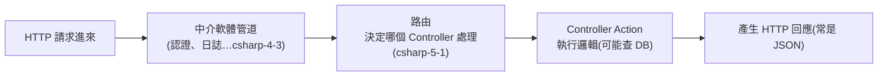

# [csharp-4-1] 什麼是 ASP.NET Core？（對照 basic Part 4 的 Express）

> **本章目標**：認識 ASP.NET Core——用 C# 做 Web 後端的框架，透過和 Express 的對照快速理解它的角色與優勢。

## 你會學到

- ASP.NET Core 是什麼、做什麼
- 後端框架的共同職責（對照 Express）
- ASP.NET Core 的特色與優勢
- 一個 Web 請求在它裡面的旅程

## 概念說明

### Web 後端框架在做什麼

回憶 **cs 課程 Part 6-4** 與 **basic 課程 Part 4**——一個 Web 後端的工作是：「**收到 HTTP 請求 → 處理（可能查資料庫）→ 回傳 HTTP 回應**」。但「解析 HTTP、路由、處理請求」這些底層工作很繁瑣，所以大家用**框架**幫忙。

**ASP.NET Core** 就是微軟的 Web 框架——**用 C# 建構 Web API 與網站的工具**。它和你在 basic 學的 **Express（Node.js）** 是同一類東西，只是語言/生態不同：

```
basic 課程：用 Express（JavaScript/TypeScript）做後端
本課程：    用 ASP.NET Core（C#）做後端
→ 兩條主流路線，核心概念互通（路由、中介軟體、請求/回應）。
  學過 Express 的話，ASP.NET Core 很多概念會很熟悉。
```

### 對照 Express

| 概念 | Express (basic Part 4) | ASP.NET Core (本課) |
|------|----------------------|---------------------|
| 框架語言 | JavaScript / TypeScript | C# |
| 路由 | `app.get('/users', ...)` | Controller + 路由屬性（[csharp-5-1]）|
| 中介軟體 | `app.use(...)` | Middleware 管道（[csharp-4-3]）|
| 處理函式 | route handler | Controller action（[csharp-5-1]）|
| 啟動 | `app.listen(3000)` | `app.Run()` |

看得出核心概念對應——**路由、中介軟體、處理請求**這些都通。差別在 ASP.NET Core 更「結構化」（用 Controller、依賴注入），這在大型專案是優點。

### ASP.NET Core 的特色與優勢

```
跨平台：Windows/Mac/Linux 都能跑（[csharp-0-1]）
高效能：是業界數一數二快的 Web 框架之一
內建依賴注入：鬆耦合、好測試（[csharp-4-4] 核心特性）
完整生態：認證、設定、日誌、ORM…官方都有成熟方案
強型別：編譯期抓錯（C# 的優勢）
→ 特別適合「企業級、需要結構與效能」的後端服務。
```

### 一個請求的旅程（預覽）

在 ASP.NET Core 裡，一個 HTTP 請求大致這樣流動（後面幾章會逐一展開）：



這張圖在說：請求先穿過「中介軟體管道」（一層層處理，如認證），再由「路由」決定交給哪個 Controller，Controller 執行邏輯後產生回應。這條鏈是 Part 4-5 的主線——對照 **cs 課程 Part 6-4** 的「輸入網址到網頁」，這是後端那一端（步驟⑤）的細節。

## 程式碼範例

### 最小的 ASP.NET Core 程式

現代 ASP.NET Core 啟動一個 Web 服務超簡潔（[csharp-4-2] 會詳解）：

```csharp
var builder = WebApplication.CreateBuilder(args);
var app = builder.Build();

// 定義一個路由：GET / 回傳一段文字
app.MapGet("/", () => "你好，這是我的 ASP.NET Core 服務！");

app.Run();      // 啟動伺服器，開始接受請求
```

說明：對照 **rust 課程 [rust-9-2]** 的 Axum、basic 的 Express——概念一樣（定路由、跑起來），只是 C# 的寫法。`app.MapGet("/", ...)` 定義「GET / 由這個函式處理」，`app.Run()` 啟動服務。建立專案用 `dotnet new webapi`（[csharp-4-2]）。

跑起來（`dotnet run`）後，瀏覽器開對應網址就看得到回應——你的第一個 C# Web 服務！

## 小練習

1. 用「對照 Express」的角度，說明 ASP.NET Core 是什麼、做什麼。
2. 對照表裡挑三個概念（路由、中介軟體、處理函式），說出 Express 和 ASP.NET Core 各怎麼稱呼。
3. 用 `dotnet new webapi -o MyApi` 建一個 Web API 專案，`dotnet run` 跑起來，看它預設的回應。

## 課外讀物

> 對照 Express 後端 → **basic 課程 Part 4**；對照 Rust 的 Axum → **rust 課程 [rust-9-1]、[rust-9-2]**

> 一個請求從瀏覽器到後端的全貌 → **cs 課程 Part 6-4**、[課外讀物 E-3-3：HTTP 協定](../../../課外讀物/E-3-network/E-3-3-http-protocol.md)

> 下一步：深入第一個 Web API 專案的結構 → [csharp-4-2]
