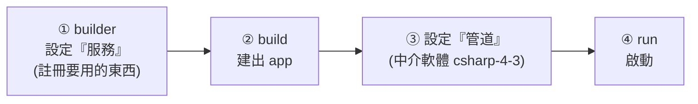

# [csharp-4-2] 第一個 Web API 專案：結構與啟動流程

> **本章目標**：建立一個 ASP.NET Core Web API 專案，看懂它的檔案結構與啟動流程，理解 `Program.cs` 裡每一行在做什麼。

## 你會學到

- 怎麼建立 Web API 專案
- 專案的檔案結構
- `Program.cs` 的啟動流程（builder → build → run）
- Swagger：自動產生 API 文件與測試介面

## 概念說明

### 建立 Web API 專案

用 `dotnet new` 的 `webapi` 範本（[csharp-0-3] 學過 CLI）：

```bash
dotnet new webapi -o MyApi
cd MyApi
dotnet run
```

它建好一個可跑的 Web API。產生的主要結構：

```
MyApi/
├── MyApi.csproj          # 專案設定（依賴、目標框架）
├── Program.cs            # 進入點 + 設定（最重要！）
├── appsettings.json      # 設定檔（連線字串等，csharp-4-5）
├── Controllers/          # 放 Controller（處理請求，csharp-5-1）
└── Properties/launchSettings.json   # 開發時的啟動設定（埠號等）
```

### 啟動流程：builder → build → run

`Program.cs` 是核心，現代 ASP.NET Core 的啟動分三階段：



這張圖在說啟動的四步——先用 `builder` **註冊服務**（你的應用要用哪些東西，如資料庫、認證），`build` 建出 app，再**設定中介軟體管道**（請求怎麼處理），最後 `run` 啟動。看實際的 `Program.cs`：

## 程式碼範例

### Program.cs 逐行解析

```csharp
var builder = WebApplication.CreateBuilder(args);   // ① 建立 builder

// === 註冊「服務」到 DI 容器（csharp-4-4 依賴注入）===
builder.Services.AddControllers();        // 註冊 Controller 功能
builder.Services.AddEndpointsApiExplorer();
builder.Services.AddSwaggerGen();          // 註冊 Swagger（API 文件）

var app = builder.Build();                  // ② 建出 app

// === 設定「中介軟體管道」（csharp-4-3，順序很重要）===
if (app.Environment.IsDevelopment())       // 只在開發環境
{
    app.UseSwagger();                       // 啟用 Swagger
    app.UseSwaggerUI();                     // Swagger 的網頁測試介面
}

app.UseHttpsRedirection();                  // 把 HTTP 導向 HTTPS
app.UseAuthorization();                     // 授權中介軟體（csharp-7）
app.MapControllers();                       // 把請求路由到 Controller

app.Run();                                  // ④ 啟動伺服器
```

逐區說明：

- **① builder + 註冊服務**：`builder.Services.AddXxx()` 是「**註冊你的應用要用的功能/服務**」到「DI 容器」（[csharp-4-4] 依賴注入的核心）。這裡註冊了 Controller、Swagger。
- **② build**：`builder.Build()` 把設定好的東西建成一個 `app`。
- **③ 中介軟體管道**：`app.UseXxx()` 設定「請求要經過哪些處理層」（[csharp-4-3]）。**順序很重要**——請求會依序穿過它們。
- **④ run**：啟動，開始接受請求。

這個「**註冊服務（builder.Services）→ 設定管道（app.Use）→ 啟動**」的結構，是每個 ASP.NET Core 應用的骨架，務必熟悉。

### Swagger：自動 API 文件與測試

範本內建 **Swagger**（OpenAPI）——它**自動幫你的 API 產生「文件 + 可互動的測試介面」**：

```
跑起來後，瀏覽器開 https://localhost:埠/swagger
你會看到：
   - 所有 API 端點的清單與說明（自動產生）
   - 每個端點能直接「填參數、按 Try it out」測試！
→ 不用另外裝 Postman，開發時超方便測 API。
```

Swagger 是 ASP.NET Core 開發的一大便利——你寫好 Controller（[csharp-5-1]），它自動出現在 Swagger 頁面可以測。這也是「活文件」的體現（文件跟著程式碼自動更新，呼應 rust 課程 [rust-7-4]）。

## 小練習

1. 建一個 `webapi` 專案，`dotnet run`，打開 `/swagger` 頁面，看範本附的 `WeatherForecast` 範例端點，按「Try it out」測試它。
2. 打開 `Program.cs`，找出「註冊服務」和「設定中介軟體」分別是哪幾行。
3. 思考題：`Program.cs` 裡 `app.UseAuthorization()` 和 `app.MapControllers()` 的順序能不能對調？為什麼中介軟體「順序很重要」？（提示：[csharp-4-3] 會解釋。）

## 課外讀物

> Swagger = 活文件（對照 rust 的 doc test）→ **rust 課程 [rust-7-4]**

> 下一步：中介軟體管道——請求怎麼一層層被處理 → [csharp-4-3]
