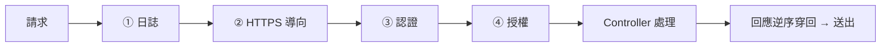

# [csharp-4-3] 中介軟體（Middleware）管道：請求怎麼一層層處理

> **本章目標**：理解 ASP.NET Core 的核心機制——中介軟體管道，知道一個請求怎麼「一層層穿過」各種處理，以及為什麼順序很重要。

## 你會學到

- 中介軟體（middleware）是什麼
- 「管道」：請求一層層穿過的模型
- 為什麼中介軟體的順序很重要
- 常見的內建中介軟體

## 概念說明

### 中介軟體：請求路上的處理關卡

[csharp-4-2] 的 `Program.cs` 有一堆 `app.UseXxx()`——這些都是**中介軟體（middleware）**。中介軟體是「**在『請求進來』到『產生回應』之間，一層層處理請求的元件**」。

比喻最貼切的是「**機場安檢的一道道關卡**」：

```
你（請求）進機場，要依序通過：
   報到櫃台 → 安檢 → 護照查驗 → 登機門
每一關（中介軟體）都做一件事，處理完才放你去下一關
   有的關可能直接擋下你（如安檢沒過 → 不放行）
```

每個中介軟體可以：對請求做點事（檢查、記錄）、決定「放行到下一個」或「直接回應擋下」、也能在回應回來時再處理一次。

### 管道：一層層穿過再回來

中介軟體串成一條「**管道（pipeline）**」。請求**依序穿過**每一層去到底（Controller），回應再**逆序穿回來**：



這張圖在說：請求像穿過一條隧道——依序經過日誌、HTTPS、認證、授權…最後到 Controller 產生回應，回應再逆向穿回去送出。每一層各司其職（這也呼應 **cs 課程 Part 6-2 網路分層**、SRP 單一職責的精神）。

### 為什麼順序超重要

中介軟體**依你在 `Program.cs` 寫的順序執行**——所以**順序會影響行為**，這是新手常踩的坑：

```
正確順序範例：
   UseAuthentication()（先確認「你是誰」）
   → UseAuthorization()（再檢查「你有沒有權限」）
   → 這順序對：要先知道你是誰，才能判斷你能不能做某事

如果順序反了：
   先 UseAuthorization() 卻還不知道「你是誰」→ 邏輯錯誤！
```

所以 [csharp-4-2] 思考題的答案——`UseAuthorization()` 必須在「知道使用者身分之後」、`MapControllers()` 之前。**寫中介軟體時，順序要想清楚**：通常是「日誌 → 例外處理 → HTTPS → 靜態檔 → 認證 → 授權 → 端點」。

## 程式碼範例

### 內建中介軟體

ASP.NET Core 提供大量現成中介軟體，用 `app.UseXxx()` 加入管道：

```csharp
var app = builder.Build();

app.UseExceptionHandler("/error");   // 統一處理例外（csharp-5-5）
app.UseHttpsRedirection();           // HTTP → HTTPS
app.UseStaticFiles();                // 提供靜態檔案（圖片、CSS）
app.UseAuthentication();             // 認證：你是誰（csharp-7）
app.UseAuthorization();              // 授權：你能做什麼（csharp-7）
app.MapControllers();                // 路由到 Controller

app.Run();
```

說明：每行加一個中介軟體到管道，依序執行。常見的有例外處理、HTTPS、靜態檔、認證、授權等——大部分需求都有內建中介軟體。

### 自訂中介軟體

你也能寫自己的中介軟體。最簡單的方式——用 `app.Use`：

```csharp
// 自訂一個「記錄每個請求」的中介軟體
app.Use(async (context, next) =>
{
    Console.WriteLine($"進來請求：{context.Request.Method} {context.Request.Path}");
    await next();        // 放行到下一個中介軟體（不呼叫就會擋住！）
    Console.WriteLine($"回應狀態：{context.Response.StatusCode}");
});
```

說明：

- `context` 是請求/回應的上下文（能讀請求、改回應）。
- **`await next()`**：放行到「下一個中介軟體」——**這是關鍵**！如果不呼叫 `next()`，請求就被擋在這裡、不會繼續（有時這正是你要的，如認證失敗時直接回 401）。
- `next()` 之前的程式碼在「請求進來時」跑，之後的在「回應回來時」跑——這就是「穿過去再穿回來」。

實務上常用自訂中介軟體做：統一日誌、全域例外處理、請求計時等橫切關注點。

## 小練習

1. 用「機場安檢關卡」比喻，解釋中介軟體管道，以及「為什麼順序重要」。
2. 在你的專案加一個自訂中介軟體，印出每個進來的請求方法與路徑，跑跑看。
3. 思考題：認證（你是誰）和授權（你能做什麼）的中介軟體，為什麼認證一定要在授權前面？

## 課外讀物

> 「一層層處理」呼應網路分層 → **cs 課程 Part 6-2**；每層單一職責 → [課外讀物 E-7-2](../../../課外讀物/E-7-solid/E-7-2-srp.md)

> 認證 vs 授權 → [csharp-7-1]、**basic 課程 Part 4-D**

> 下一步：ASP.NET Core 的核心機制——依賴注入 → [csharp-4-4]
