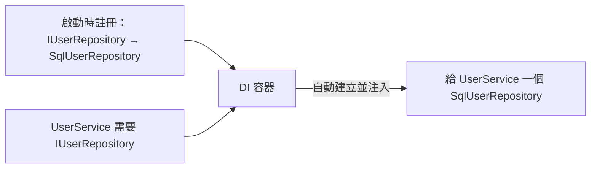

# [csharp-4-4] 依賴注入（Dependency Injection）：ASP.NET Core 的核心機制

> **本章目標**：掌握依賴注入（DI）——ASP.NET Core 最核心的設計，理解它怎麼讓程式鬆耦合、好測試，以及怎麼在專案裡用它。

## 你會學到

- 依賴注入要解決什麼問題
- DI 的核心：依賴從外面「注入」進來
- 怎麼註冊與注入服務
- 服務生命週期（Scoped / Singleton / Transient）

## 概念說明

### 問題：寫死依賴的痛

回憶 [csharp-2-5] 的依賴反轉（DIP）。假設 `UserService` 需要一個「資料庫存取器」。最直覺的寫法是「自己 new 一個」：

```csharp
class UserService
{
    private SqlUserRepository _repo = new SqlUserRepository();  // ❌ 寫死了
}
```

這有什麼問題？

```
① 綁死：UserService 死死依賴「SqlUserRepository 這個具體類別」
   想換成別的（如測試用的假資料庫、換成 MongoRepository）→ 得改 UserService 的程式碼
② 難測試：測 UserService 時，被迫用「真的 SqlUserRepository」（真的連資料庫）
   → 測試慢、脆弱、難隔離
③ 自己管依賴的建立：如果 SqlUserRepository 又需要別的東西，要一路 new 下去 → 惡夢
```

### 解法：依賴注入

**依賴注入（Dependency Injection, DI）** 的核心點子——**不要自己 new 依賴，而是「從外面把依賴傳（注入）進來」**，且依賴用「介面」而非具體類別（[csharp-2-4]、DIP）：

```csharp
class UserService
{
    private readonly IUserRepository _repo;     // 依賴「介面」

    public UserService(IUserRepository repo)    // 從建構子「注入」進來
    {
        _repo = repo;        // 不自己 new，外面給我什麼我用什麼
    }
}
```

比喻：

```
寫死依賴像「自己發電」：每個家電都自帶發電機（自己 new）→ 重複、難換
依賴注入像「插座供電」：家電只要「插上插座」（宣告需要什麼），
   電力公司（DI 容器）負責供電（提供依賴）
   → 換電源（換實作）不用改家電；測試時插「模擬電源」也行
```

### DI 容器：誰來提供依賴

那「誰負責建立並注入這些依賴」？ASP.NET Core 內建一個 **DI 容器**——你**在啟動時「註冊」哪個介面對應哪個實作**，之後容器會在需要時**自動建立並注入**：



這張圖在說：你只要「註冊對應關係」，DI 容器就自動處理「建立依賴、注入到需要的地方」——你完全不用手動 new。這是 ASP.NET Core 鬆耦合、好測試的關鍵。

## 程式碼範例

### 註冊與使用

```csharp
// === Program.cs：註冊服務（告訴 DI 容器對應關係）===
builder.Services.AddScoped<IUserRepository, SqlUserRepository>();
//                          ↑ 介面            ↑ 實際用的實作
builder.Services.AddScoped<UserService>();

// === UserService：宣告它需要什麼（建構子注入）===
class UserService
{
    private readonly IUserRepository _repo;
    public UserService(IUserRepository repo)   // 容器自動注入
    {
        _repo = repo;
    }

    public User? GetUser(int id) => _repo.FindById(id);
}

// === Controller：也靠注入拿到 UserService（csharp-5-1）===
class UsersController : ControllerBase
{
    private readonly UserService _userService;
    public UsersController(UserService userService)  // 自動注入
    {
        _userService = userService;
    }
    // ... 用 _userService 處理請求
}
```

說明：你只在 `Program.cs` 註冊「`IUserRepository` 用 `SqlUserRepository`」，之後 `UserService`、`Controller` 只要在**建構子宣告它需要什麼**，DI 容器就自動一路建立並注入。**整條依賴鏈自動串好**——這就是 DI 的威力。

### 換實作、測試都輕鬆

```csharp
// 想換成記憶體版（如開發初期）？只改註冊那一行：
builder.Services.AddScoped<IUserRepository, InMemoryUserRepository>();
// UserService、Controller 一個字都不用改！（它們只依賴 IUserRepository）

// 測試時：注入一個「假的」repository（csharp-8-2 會用 Moq）
var fakeRepo = new FakeUserRepository();
var service = new UserService(fakeRepo);   // 直接注入假的，不碰真資料庫
```

說明：因為依賴介面 + 從外注入，**換實作只改註冊、測試直接注入假物件**——這就是 [csharp-2-5] DIP 帶來的好處的具體實現。這也是為什麼後端架構（[csharp-9-1] 分層）這麼倚重 DI。

### 服務生命週期

註冊時要選「**這個服務多久建一個新的**」——三種生命週期：

| 生命週期 | 意思 | 常用於 |
|---------|------|--------|
| **Scoped** | 每個 HTTP 請求一個（同請求內共用）| **最常用**：資料庫 context、多數服務 |
| **Singleton** | 整個 app 共用一個 | 無狀態的工具、設定、快取 |
| **Transient** | 每次要用都建新的 | 輕量、無狀態的小服務 |

```
Web 後端最常用 Scoped——「每個請求一個獨立實例」，
   確保不同使用者的請求互不干擾（呼應 cs 課程 Part 5-2 行程隔離的精神）。
資料庫存取（csharp-6 的 DbContext）通常註冊成 Scoped。
```

## 小練習

1. 用「自己發電 vs 插座供電」的比喻，解釋依賴注入解決了什麼問題。
2. 定義一個介面 `IGreeter` 和兩個實作，註冊其中一個，在一個 Controller 注入並使用。試著「只改註冊那行」換成另一個實作。
3. 思考題：為什麼「依賴介面 + 從外注入」讓測試變容易？（提示：測試時能注入什麼？）

## 課外讀物

> DI 的理論基礎——依賴反轉 → [csharp-2-5]、[課外讀物 E-7-6：依賴反轉原則](../../../課外讀物/E-7-solid/E-7-6-dip.md)

> DI 讓單元測試好寫 → [csharp-8-2]、[課外讀物 E-9：測試](../../../課外讀物/E-9-testing/E-9-1-why-test.md)

> 下一步：設定與多環境管理 → [csharp-4-5]
