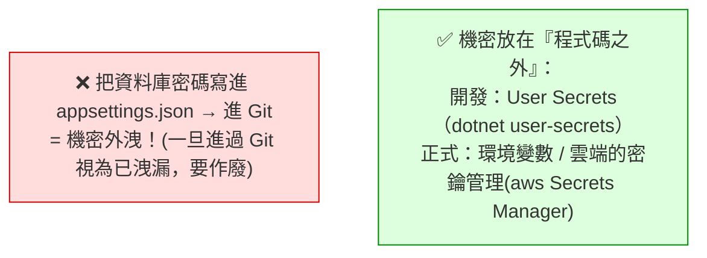

# [csharp-4-5] 設定（Configuration）與多環境（開發 / 正式）

> **本章目標**：學會 ASP.NET Core 的設定系統——怎麼管理連線字串、API 金鑰等設定值，以及怎麼為「開發」和「正式」環境用不同設定。

## 你會學到

- 為什麼設定要和程式碼分開
- `appsettings.json` 與設定的讀取
- 多環境設定（開發 vs 正式）
- 機密（密碼、金鑰）怎麼安全管理

## 概念說明

### 設定為什麼要和程式碼分開

你的應用有很多「設定值」——資料庫連線字串、API 金鑰、功能開關、外部服務網址。一個重要原則：**這些設定不該寫死在程式碼裡**，而要抽出來，理由：

```
① 不同環境值不同：開發用測試資料庫、正式用正式資料庫
   → 設定分開，換環境不用改程式碼、不用重新編譯
② 機密安全：密碼、金鑰寫死在程式碼 + 進 Git = 外洩災難！
   → 機密要特別管理（下面說）
③ 好維護：改個設定不用動程式碼
```

這呼應 **rust 課程 [rust-9-5]** 的「機密走環境變數」、**cs 課程 / sre** 的維運實務。

### 設定的來源（分層覆蓋）

ASP.NET Core 的設定可以來自多個地方，**後面的會覆蓋前面的**：

```
appsettings.json（基礎設定，所有環境共用）
   ← appsettings.{環境}.json 覆蓋（如 appsettings.Production.json）
   ← 環境變數覆蓋
   ← 命令列參數覆蓋（最優先）
```

這個「分層覆蓋」很實用——共用的放 `appsettings.json`，各環境不同的放 `appsettings.{環境}.json`，機密放環境變數。

## 程式碼範例

### appsettings.json

```json
{
  "Logging": {
    "LogLevel": { "Default": "Information" }
  },
  "AllowedHosts": "*",
  "AppSettings": {
    "SiteName": "我的 API",
    "MaxItemsPerPage": 20
  }
}
```

說明：設定用 JSON 寫，可以巢狀分組（如 `AppSettings` 底下放相關設定）。

### 讀取設定

透過依賴注入拿到 `IConfiguration`（[csharp-4-4]）來讀：

```csharp
class MyService
{
    private readonly string _siteName;

    public MyService(IConfiguration config)        // 注入設定
    {
        _siteName = config["AppSettings:SiteName"];   // 用「冒號」存取巢狀值
        int maxItems = config.GetValue<int>("AppSettings:MaxItemsPerPage");
    }
}
```

說明：`config["區段:鍵"]` 用冒號存取巢狀設定。更好的做法是用「**強型別設定（Options 模式）**」——把一整組設定綁到一個 class，更安全好用（這裡先知道基本讀法）。

### 多環境

ASP.NET Core 用環境變數 `ASPNETCORE_ENVIRONMENT` 決定當前環境（`Development` / `Production`），並自動載入對應的 `appsettings.{環境}.json`：

```
appsettings.json                  → 共用基礎
appsettings.Development.json      → 開發環境覆蓋（如：用本機資料庫、詳細日誌）
appsettings.Production.json       → 正式環境覆蓋（如：用正式資料庫、精簡日誌）
```

程式裡能判斷環境（[csharp-4-2] 看過）：

```csharp
if (app.Environment.IsDevelopment())
{
    app.UseSwagger();        // 只在開發環境開 Swagger（正式環境通常關掉）
}
```

說明：這讓「同一份程式碼，在不同環境用不同設定/行為」——換環境不用改程式碼，只換設定檔/環境變數。

### 機密：絕對不能進 Git

最重要的安全鐵則——**密碼、API 金鑰、連線字串裡的帳密，絕對不能寫進 `appsettings.json` 然後進 Git**：



這張圖是安全鐵則（呼應 **rust 課程 [rust-9-5]**、[課外讀物 E-10](../../../課外讀物/E-10-security/E-10-1-web-security-overview.md)、E-8 Git）：

```
開發時：用「User Secrets」——dotnet user-secrets set "Key" "value"
   （存在你電腦本機、不在專案資料夾、不會進 Git）
正式時：用「環境變數」或雲端的密鑰管理服務（aws Secrets Manager）
鐵則：appsettings.json 裡只放「非機密」設定；機密一律走上述管道。
   .gitignore 要排除任何含機密的檔案。
→ 一旦機密進過 Git，就視為已外洩，必須作廢重發。
```

[csharp-9-3] 會更深入講機密管理。現在先牢記：**機密絕不寫死、絕不進 Git**。

## 小練習

1. 在 `appsettings.json` 加一組自訂設定（如 `AppSettings:SiteName`），注入 `IConfiguration` 讀出來印在某個端點。
2. 建一個 `appsettings.Development.json`，覆蓋某個設定值，觀察開發環境用的是覆蓋後的值。
3. 思考題：為什麼資料庫密碼「絕對不能寫進 appsettings.json 並進 Git」？正確該放哪？

## 課外讀物

> 機密管理、別進 Git → **rust 課程 [rust-9-5]**、[課外讀物 E-10：Web Security](../../../課外讀物/E-10-security/E-10-1-web-security-overview.md)、[課外讀物 E-8：Git](../../../課外讀物/E-8-git/E-8-1-git-internals.md)

> 雲端的密鑰管理 → **aws 課程**；機密管理深入 → [csharp-9-3]

> 本 Part 完成！下一步：正式建立 REST API → [csharp-5-1]
