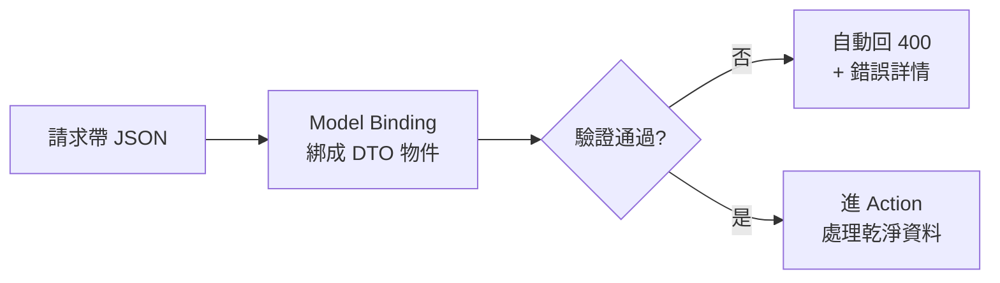

# [csharp-5-2] Model Binding 與資料驗證

> **本章目標**：理解 ASP.NET Core 怎麼自動把請求資料「綁定」成 C# 物件，以及怎麼用資料驗證確保「進來的資料是合法的」。

## 你會學到

- Model Binding：請求資料自動變成物件
- 用 class 接收複雜的請求資料
- 資料驗證：用屬性宣告規則
- 為什麼「永不信任使用者輸入」

## 概念說明

### Model Binding：自動把請求變物件

[csharp-5-1] 看到參數能從網址、body 自動取得——這個機制叫 **Model Binding（模型繫結）**。它**自動把「HTTP 請求裡的資料」對應到「Action 的參數（C# 物件）」**：

```
請求帶來的 JSON：{ "name": "Amy", "age": 28 }
   ↓ Model Binding 自動轉換
C# 物件：CreateUserDto { Name = "Amy", Age = 28 }
→ 你的 Action 直接拿到乾淨的物件，不用手動解析 JSON。
```

這省去大量「手動解析請求」的工作（對比 rust 課程 [rust-9-3] 的 `Json` 提取器——同樣是框架幫你把 JSON 變成型別物件）。

### 用 class 接收複雜資料

當請求資料有多個欄位，用一個 class（或 record，[csharp-3-6]）接收：

```csharp
// 定義一個「接收新增使用者請求」的類別
public class CreateUserDto
{
    public string Name { get; set; }
    public int Age { get; set; }
    public string Email { get; set; }
}

// Action：Model Binding 自動把請求 body 的 JSON 綁成這個物件
[HttpPost]
public IActionResult Create([FromBody] CreateUserDto dto)
{
    // dto.Name、dto.Age、dto.Email 已經自動填好了
    return Ok($"建立使用者：{dto.Name}, {dto.Age} 歲");
}
```

說明：定義一個 class 描述「請求帶什麼資料」，`[FromBody]` 讓 Model Binding 把 JSON 自動綁成它。這種「接收請求用的類別」常叫 **DTO（資料傳輸物件，[csharp-5-4] 詳講）**。

### 資料驗證：別信任使用者輸入

一個資安與穩健性的鐵則——**永遠不要信任使用者送來的資料**（呼應 [課外讀物 E-10](../../../課外讀物/E-10-security/E-10-1-web-security-overview.md)）。使用者可能送來：空的名字、負的年齡、格式錯的 email、惡意的內容。你必須**驗證**。

ASP.NET Core 用「**驗證屬性（Data Annotations）**」——在 DTO 的屬性上宣告規則，框架自動檢查：

```csharp
using System.ComponentModel.DataAnnotations;

public class CreateUserDto
{
    [Required]                              // 必填
    [StringLength(50, MinimumLength = 1)]   // 長度 1~50
    public string Name { get; set; }

    [Range(0, 150)]                         // 範圍 0~150
    public int Age { get; set; }

    [Required]
    [EmailAddress]                          // 必須是 email 格式
    public string Email { get; set; }
}
```

說明：用 `[Required]`、`[StringLength]`、`[Range]`、`[EmailAddress]` 等屬性，**宣告式**地定義驗證規則。常用的還有 `[MaxLength]`、`[RegularExpression]`（正則）等。這種「宣告規則、框架執行」很優雅——你不用在 Action 裡寫一堆 if 檢查。

### 自動驗證 + 回應錯誤

因為 Controller 標了 `[ApiController]`（[csharp-5-1]），ASP.NET Core 會**自動執行驗證**——若資料不合規則，**自動回傳 400 Bad Request + 錯誤詳情**，根本不會進到你的 Action：

```
使用者送來 { "name": "", "age": -5, "email": "壞格式" }
   → 自動驗證失敗 → 自動回傳 400 + 說明哪些欄位錯了
   → 你的 Action 程式碼根本不會執行（資料不合法就被擋在門外）
→ 所以進到 Action 裡的 dto，已經是「通過驗證的合法資料」，你可以放心用。
```

這是 ASP.NET Core 很貼心的設計——**驗證自動化，把不合法的請求擋在門外**，讓你的業務邏輯只處理乾淨資料。



這張圖在說：請求進來 → 綁成物件 → 驗證 → 通過才進 Action、不通過自動回 400。驗證是你的 API「第一道防線」。

## 小練習

1. 定義一個 `CreateProductDto`，有 `Name`（必填、長度限制）、`Price`（範圍 0 以上）、`Email`（聯絡信箱，email 格式），加驗證屬性。
2. 寫一個 POST Action 接收它，用 Swagger 送一筆「不合法」的資料（空名字、負價格），觀察自動回傳 400 + 錯誤訊息。
3. 思考題：為什麼說「永不信任使用者輸入」？如果不驗證，可能發生什麼壞事（提示：資安、髒資料）？

## 課外讀物

> 「永不信任輸入」是資安基礎 → [課外讀物 E-10：Web Security 基礎](../../../課外讀物/E-10-security/E-10-1-web-security-overview.md)

> 對照框架自動綁定 JSON → **rust 課程 [rust-9-3]**

> 下一步：RESTful 設計與 HTTP 狀態碼 → [csharp-5-3]
