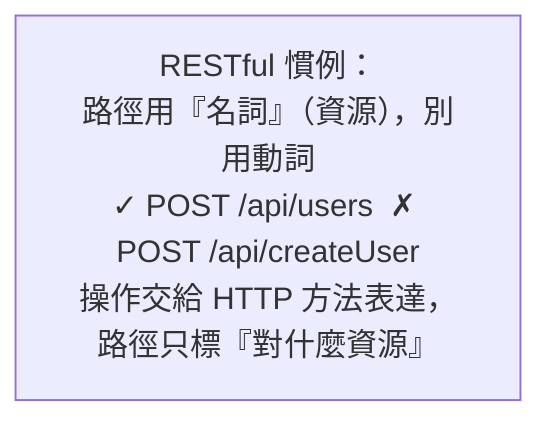

# [csharp-5-3] RESTful 設計與 HTTP 狀態碼

> **本章目標**：理解 RESTful API 的設計慣例，以及怎麼用對 HTTP 狀態碼——讓你的 API 符合業界標準、好懂好用。

## 你會學到

- REST 的核心設計慣例
- 用 HTTP 方法表達操作（GET/POST/PUT/DELETE）
- 常用 HTTP 狀態碼與正確用法
- 好的 API 設計原則

## 概念說明

### REST：用資源與 HTTP 方法表達操作

**REST** 是一套設計 Web API 的慣例（你在 **basic Part 4-B** 學過）。核心思想——**把東西看成「資源（resource）」，用「HTTP 方法」表達對資源的操作**：

```
資源用「名詞」+ 路徑表達：/api/users（使用者們）、/api/users/5（第 5 個使用者）
操作用「HTTP 方法」表達：
   GET    /api/users      → 取得所有使用者（讀）
   GET    /api/users/5    → 取得第 5 個（讀單一）
   POST   /api/users      → 新增使用者（建立）
   PUT    /api/users/5    → 更新第 5 個（修改）
   DELETE /api/users/5    → 刪除第 5 個（刪除）
```



這張圖點出 REST 的關鍵慣例——**路徑用名詞（資源）、操作用 HTTP 方法**。這正是 **dsa 課程沒提但 rust [rust-9-6]、basic Part 4 的 CRUD** 對應的設計，是業界共同語言。

### HTTP 狀態碼：用對的碼回應

HTTP 回應要帶一個**狀態碼**，告訴客戶端「結果如何」（呼應 **rust 課程 [rust-9-5]**、cs Part 6）。用對狀態碼讓 API 的回應「自我說明」：

```
2xx 成功
   200 OK             → 一般成功（GET、PUT 成功）
   201 Created        → 成功建立了新資源（POST 成功）
   204 No Content     → 成功但沒有內容回傳（DELETE 成功）

4xx 客戶端的錯（你送的請求有問題）
   400 Bad Request    → 請求格式/資料錯（如驗證失敗 csharp-5-2）
   401 Unauthorized   → 未認證（你是誰？沒登入）
   403 Forbidden      → 已認證但沒權限（你不能做這件事）
   404 Not Found      → 找不到資源（查不存在的 id）

5xx 伺服器的錯（伺服器自己出包）
   500 Internal Server Error → 伺服器內部錯誤（如未預期的例外）
```

**用對狀態碼很重要**——客戶端（前端、其他服務）靠狀態碼判斷該怎麼反應。回 404 它知道「沒這筆」、回 401 它知道「該去登入」、回 500 它知道「伺服器壞了」。

## 程式碼範例

### 一個 RESTful Controller

```csharp
[ApiController]
[Route("api/products")]
public class ProductsController : ControllerBase
{
    // GET /api/products → 200 OK
    [HttpGet]
    public IActionResult GetAll() => Ok(new[] { "商品A", "商品B" });

    // GET /api/products/5 → 200 或 404
    [HttpGet("{id}")]
    public IActionResult GetById(int id)
    {
        if (id > 100)
            return NotFound();          // 404：找不到
        return Ok($"商品 {id}");         // 200
    }

    // POST /api/products → 201 Created
    [HttpPost]
    public IActionResult Create([FromBody] CreateProductDto dto)
    {
        // (驗證自動做了，csharp-5-2)
        var newId = 1;
        return CreatedAtAction(nameof(GetById), new { id = newId }, dto);  // 201
    }

    // PUT /api/products/5 → 200 或 404
    [HttpPut("{id}")]
    public IActionResult Update(int id, [FromBody] UpdateProductDto dto)
    {
        if (id > 100) return NotFound();
        return Ok();                    // 200（或 204 No Content）
    }

    // DELETE /api/products/5 → 204 No Content
    [HttpDelete("{id}")]
    public IActionResult Delete(int id)
    {
        if (id > 100) return NotFound();
        return NoContent();             // 204：成功，沒內容
    }
}
```

說明：這是一個標準的 RESTful CRUD Controller。注意**每個操作回傳「對的狀態碼」**——`Ok()`→200、`CreatedAtAction()`→201、`NoContent()`→204、`NotFound()`→404。ASP.NET Core 的 `ControllerBase` 提供這些便利方法，讓你輕鬆回傳正確的狀態碼。

### 好的 API 設計原則

```
① 路徑用名詞、複數：/api/users（不是 /api/getUser）
② 用對 HTTP 方法：讀用 GET、建用 POST、改用 PUT、刪用 DELETE
③ 用對狀態碼：成功 2xx、客戶端錯 4xx、伺服器錯 5xx
④ 一致性：整個 API 風格統一（命名、回應格式 csharp-5-5）
⑤ 版本化：大改時用 /api/v1/、/api/v2/ 避免破壞舊客戶端
```

遵守這些慣例，你的 API 就符合業界標準——別人（前端、其他團隊）一看就懂怎麼用。

## 小練習

1. 為一個 `OrdersController` 設計 RESTful 的五個端點（列出、查單一、新增、更新、刪除），寫出每個的「HTTP 方法 + 路徑 + 成功狀態碼」。
2. 判斷該回什麼狀態碼：(a) 查一個不存在的 id；(b) 成功新增一筆；(c) 送來的資料驗證失敗；(d) 成功刪除。
3. 思考題：為什麼路徑該用「名詞」（`/api/users`）而非「動詞」（`/api/getUsers`）？

## 課外讀物

> REST、HTTP 方法、狀態碼 → **basic 課程 Part 4-B**、[課外讀物 E-3-3：HTTP 協定](../../../課外讀物/E-3-network/E-3-3-http-protocol.md)、**cs 課程 Part 6**

> 對照 Rust 做 REST API → **rust 課程 [rust-9-6]**

> 下一步：DTO 與物件映射 → [csharp-5-4]
