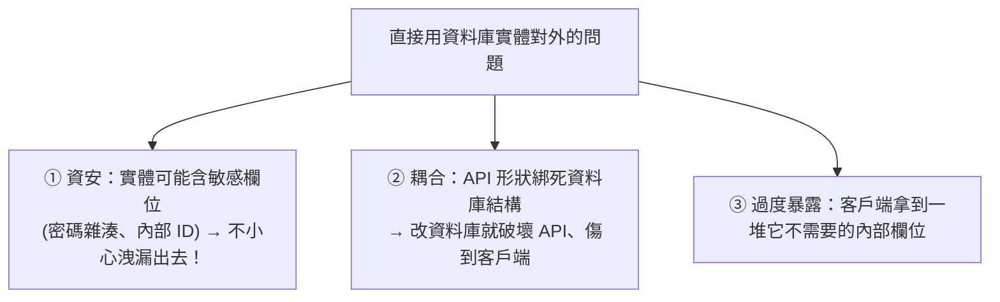

# [csharp-5-4] DTO（資料傳輸物件）與物件映射

> **本章目標**：理解為什麼要用 DTO 把「對外的資料」和「內部的模型」分開，以及怎麼在它們之間映射——這是專業 API 的重要實務。

## 你會學到

- DTO 是什麼、為什麼需要
- 為什麼「別直接把資料庫模型丟出去」
- DTO 與領域模型的映射
- 自動映射工具（AutoMapper）概念

## 概念說明

### DTO：對外的資料形狀

**DTO（Data Transfer Object，資料傳輸物件）** 是「**專門用來『傳輸資料』的簡單物件**」——通常就是一組屬性，沒有業務邏輯。你在 [csharp-5-2] 用的 `CreateUserDto` 就是 DTO。

關鍵問題：為什麼不直接用「領域模型 / 資料庫實體」（[csharp-2-6] 的 class、[csharp-6] 的 Entity）對外，而要另外做 DTO？

### 為什麼別直接把內部模型丟出去

直接把「資料庫實體」當 API 回應/接收，會有幾個問題：



這張圖說明風險——**最嚴重的是資安**：假設 `User` 實體有 `PasswordHash` 欄位，直接把 `User` 當 API 回應丟出去，密碼雜湊就洩漏了！（呼應 [課外讀物 E-10](../../../課外讀物/E-10-security/E-10-1-web-security-overview.md)、cs 課程 Part 9-3 密碼儲存。）

**DTO 解決這些**——它是「**精心挑選、只含『該對外的欄位』的資料形狀**」：

```
內部的 User 實體（資料庫）：Id, Name, Email, PasswordHash, InternalNotes, CreatedAt...
   ↓ 映射成 DTO（只挑該給的）
對外的 UserDto：Id, Name, Email   ← 只有這些，敏感/內部欄位不外洩
```

### DTO 把「對外」和「對內」解耦

用 DTO 的好處（呼應 SOLID 的解耦、[csharp-2-5]）：

```
① 安全：只暴露該暴露的欄位，敏感資料不外洩
② 解耦：API 的形狀（DTO）和資料庫結構（實體）分開
   → 改資料庫不一定要改 API；改 API 不一定動資料庫
③ 量身訂做：不同情境用不同 DTO
   （CreateUserDto 接收、UserDto 回傳、UserListDto 列表用精簡版）
```

通常一個資源會有多個 DTO：接收用的（Create/Update）、回傳用的（Response）——各自只含該情境需要的欄位。

## 程式碼範例

### DTO 與映射

```csharp
// === 內部的領域/資料庫實體（含敏感欄位）===
public class User
{
    public int Id { get; set; }
    public string Name { get; set; }
    public string Email { get; set; }
    public string PasswordHash { get; set; }   // 敏感！絕不能對外
    public DateTime CreatedAt { get; set; }
}

// === 對外回傳的 DTO（只含該給的）===
public record UserDto(int Id, string Name, string Email);   // 用 record 很簡潔（csharp-3-6）

// === 接收新增的 DTO ===
public record CreateUserDto(string Name, string Email, string Password);

// === Controller：在實體和 DTO 之間映射 ===
[HttpGet("{id}")]
public IActionResult GetById(int id)
{
    User user = _service.GetUser(id);    // 從服務拿到「內部實體」

    // 映射：實體 → DTO（只挑該對外的欄位，PasswordHash 不放進去！）
    var dto = new UserDto(user.Id, user.Name, user.Email);

    return Ok(dto);                       // 回傳 DTO，敏感欄位安全
}
```

說明：注意 `User` 有 `PasswordHash`，但回傳的 `UserDto` **只挑了 Id/Name/Email**——手動映射時就把敏感欄位排除了。用 `record`（[csharp-3-6]）定義 DTO 很簡潔。這個「實體 ↔ DTO 映射」是專業 API 的標準做法。

### 自動映射：AutoMapper

手動映射（一個個 `new UserDto(user.Id, ...)`）欄位多時很煩。實務上常用 **AutoMapper** 這類工具（NuGet 套件）**自動映射**：

```csharp
// 概念：設定一次「User → UserDto 怎麼映射」，之後一行搞定
UserDto dto = _mapper.Map<UserDto>(user);   // 自動把對應欄位填好
```

說明：AutoMapper 依「同名欄位」自動映射，省去大量手寫。但它有取捨——方便，但「自動」有時讓人看不清映射細節、且要小心別自動把敏感欄位也映過去。**小專案手動映射其實更清楚可控**；大專案、欄位多時用 AutoMapper 省事。知道有這工具即可。

## 小練習

1. 為一個 `Product` 實體（含 `Id, Name, Price, CostPrice(成本，不該對外), SupplierNotes(內部備註)`）設計一個對外的 `ProductDto`，只含該公開的欄位。
2. 寫一個 Action，把 `Product` 實體手動映射成 `ProductDto` 回傳，確認成本與內部備註沒被洩漏。
3. 思考題：為什麼「直接把資料庫的 User 實體當 API 回應」是危險的？舉一個可能洩漏的欄位。

## 課外讀物

> 別洩漏敏感資料、密碼儲存 → [課外讀物 E-10：Web Security](../../../課外讀物/E-10-security/E-10-1-web-security-overview.md)、**cs 課程 Part 9-3**

> DTO 體現的解耦 → [csharp-2-5] SOLID、[課外讀物 E-7-5](../../../課外讀物/E-7-solid/E-7-5-isp.md)

> 下一步：統一的錯誤處理與回應格式 → [csharp-5-5]
