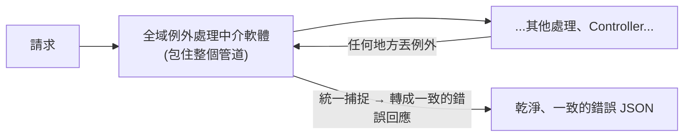

# [csharp-5-5] 統一的錯誤處理與 API 回應格式

> **本章目標**：學會在 Web API 層級「統一處理錯誤」，回傳一致、對客戶端友善的錯誤格式——這是專業 API 的重要一環。

## 你會學到

- 為什麼要「統一」錯誤處理
- 全域例外處理中介軟體
- 一致的錯誤回應格式
- ASP.NET Core 的 ProblemDetails 標準

## 概念說明

### 問題：到處 try/catch 的混亂

[csharp-3-5] 學了例外處理。但如果**每個 Controller 的每個 Action 都自己寫 try/catch**，會很混亂：

```
問題：
   ① 重複：每個 Action 都重複寫類似的 try/catch（違反 DRY）
   ② 不一致：每個地方回傳的錯誤格式可能都不一樣
      → 客戶端要應付五花八門的錯誤格式，很痛苦
   ③ 漏接：難保每個 Action 都記得處理所有例外 → 漏接的例外讓伺服器回醜陋的 500
```

解法是——**集中、統一處理錯誤**，而非散落各處。

### 解法：全域例外處理

用一個**全域的例外處理中介軟體**（呼應 [csharp-4-3] 中介軟體），**在管道最外層攔截所有未處理的例外**，統一轉成乾淨的錯誤回應：



這張圖在說：把整個請求處理「包」在一個例外處理層裡——**不管哪個 Action 丟出例外，都被它捕捉、統一轉成一致的錯誤回應**。這樣 Action 裡就不用到處 try/catch，錯誤格式也保證一致。

### 一致的回應格式

好的 API 應該**所有錯誤都用同一種格式回**，讓客戶端好處理：

```json
{
  "type": "https://...",
  "title": "找不到資源",
  "status": 404,
  "detail": "找不到 ID 為 42 的使用者",
  "traceId": "00-abc123..."
}
```

說明：一致的格式包含「狀態碼、標題、詳細訊息」等。`detail` 要**對人有意義**（「找不到 ID 為 42 的使用者」而非「error」，呼應 [課外讀物 E-6-8](../../../課外讀物/E-6-best-practices/E-6-8-backend-clean-code.md)、rust [rust-4-3]）。`traceId` 能幫忙在日誌裡追蹤這次請求（呼應 sre 觀測、[csharp-9-2]）。

## 程式碼範例

### 全域例外處理

ASP.NET Core 提供幾種做法，最簡單的之一是內建的 `UseExceptionHandler` + ProblemDetails：

```csharp
// === Program.cs ===
builder.Services.AddProblemDetails();      // 啟用 ProblemDetails（標準錯誤格式）

var app = builder.Build();

// 全域例外處理：放在管道「最前面」（才能包住後面所有處理）
app.UseExceptionHandler();        // 攔截未處理的例外，轉成 ProblemDetails

app.UseHttpsRedirection();
app.MapControllers();
app.Run();
```

說明：`UseExceptionHandler()` 攔截任何未處理的例外，自動轉成標準的 **ProblemDetails** 格式（上面那種 JSON）。**放在管道最前面**——這樣它能「包住」後面所有處理（呼應 [csharp-4-3] 中介軟體順序）。

### ProblemDetails：標準錯誤格式

**ProblemDetails** 是一個 HTTP 標準（RFC 7807），定義了「API 錯誤回應該長怎樣」。ASP.NET Core 內建支援——你回傳錯誤時用它，就符合業界標準：

```csharp
// 在 Action 裡回傳標準錯誤
[HttpGet("{id}")]
public IActionResult GetById(int id)
{
    var user = _service.GetUser(id);
    if (user == null)
    {
        // 回傳標準的 ProblemDetails 格式
        return Problem(
            title: "找不到使用者",
            detail: $"找不到 ID 為 {id} 的使用者",
            statusCode: 404
        );
    }
    return Ok(user);
}
```

說明：`Problem(...)` 回傳標準的 ProblemDetails。用標準格式的好處——**所有錯誤格式一致**，客戶端能用同一套邏輯處理；而且符合業界慣例，別人一看就懂。

### 自訂業務例外 + 統一映射

進階做法：定義「業務例外」類別，在全域處理器裡統一映射成狀態碼（讓 Action 只管丟有意義的例外，轉換交給統一處理）：

```csharp
// 自訂業務例外
public class NotFoundException : Exception
{
    public NotFoundException(string message) : base(message) { }
}

// Action 裡只管「丟有意義的例外」，不用 try/catch
[HttpGet("{id}")]
public IActionResult GetById(int id)
{
    var user = _service.GetUser(id)
        ?? throw new NotFoundException($"找不到 ID 為 {id} 的使用者");
    return Ok(user);
}
// → 全域處理器捕捉 NotFoundException → 統一轉成 404 + ProblemDetails
```

說明：這樣 Action 很乾淨（只丟例外，不處理格式），「例外 → HTTP 狀態碼」的映射集中在一處（呼應 rust 課程 [rust-9-5] 把 Result 轉狀態碼的精神）。這是專業後端常見的模式。

## 小練習

1. 在你的專案啟用 `AddProblemDetails()` + `UseExceptionHandler()`，故意在某 Action 丟一個例外，觀察回傳的標準錯誤格式。
2. 寫一個 Action，查不到資料時用 `Problem(...)` 回傳 404 + 有意義的 detail 訊息。
3. 思考題：為什麼「統一錯誤處理」比「每個 Action 各自 try/catch」好？列兩個理由。

## 課外讀物

> 錯誤訊息設計、別吞錯誤 → [課外讀物 E-6-8：後端 Clean Code](../../../課外讀物/E-6-best-practices/E-6-8-backend-clean-code.md)；例外處理 → [csharp-3-5]

> 把錯誤轉成 HTTP 狀態碼（對照 Rust）→ **rust 課程 [rust-9-5]**；錯誤可觀測 → **sre 課程**

> 下一步：動手做一個完整的 CRUD REST API → [csharp-5-6]
