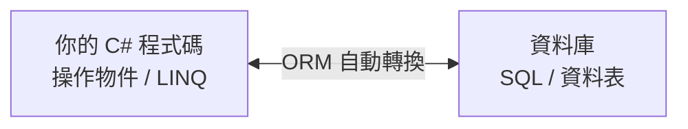

# [csharp-6-1] ORM 是什麼？EF Core 入門

> **本章目標**：理解 ORM 怎麼讓你「用物件操作資料庫、不用手寫 SQL」，並認識 .NET 最主流的 ORM——Entity Framework Core。

## 你會學到

- 為什麼需要 ORM
- ORM 怎麼「物件 ↔ 資料表」對應
- EF Core 是什麼
- ORM 的優點與要注意的坑

## 概念說明

### 問題：物件世界 vs 資料表世界

你的 C# 程式用「**物件**」（[csharp-2] 的 class），資料庫用「**資料表**」（[cs 課程 Part 7-3]）。兩者結構不同：

```
C# 物件：User { Id=1, Name="Amy", Email="amy@..." }
資料庫表：users 表的一列 | id | name | email |
```

要存取資料庫，傳統做法是「**手寫 SQL**」（[cs Part 7-3]、rust [rust-9-4]）——自己寫 `INSERT`、`SELECT`，再手動把查詢結果一欄欄塞進物件。這很繁瑣、易錯、且 SQL 字串散落各處。

### 解法：ORM

**ORM（Object-Relational Mapping，物件關聯映射）** 自動處理「**物件 ↔ 資料表**」的轉換——讓你**用操作物件的方式操作資料庫**，ORM 在背後幫你產生 SQL：

```
你寫：_db.Users.Add(new User { Name = "Amy" })   ← 操作物件
ORM 背後：自動產生並執行 INSERT INTO users (name) VALUES ('Amy')

你寫：_db.Users.Where(u => u.Age > 18).ToList()   ← 用 LINQ
ORM 背後：自動產生 SELECT * FROM users WHERE age > 18
   並把結果自動轉成 List<User> 物件
```



這張圖在說：ORM 是「物件世界」和「資料表世界」之間的翻譯官——你只管操作物件，它負責生 SQL、轉換結果。這呼應 **cs 課程 Part 8-1（抽象）**——ORM 把「SQL 與資料表」的複雜藏起來，給你「操作物件」的簡單介面。

### EF Core：.NET 的主流 ORM

**Entity Framework Core（EF Core）** 是 .NET 官方、最主流的 ORM。它讓你：

```
✓ 用 C# class 定義「資料模型（實體）」（csharp-6-2）
✓ 用 LINQ 查資料庫（csharp-6-4，呼應 csharp-3-2 你已會的 LINQ！）
✓ 用「Migration」用程式碼管理資料庫結構（csharp-6-3）
✓ 支援多種資料庫（PostgreSQL、SQL Server、SQLite、MySQL...）
```

最棒的是——**你已經會 LINQ（[csharp-3-2]）了，EF Core 讓你用同樣的 LINQ 查資料庫**！這就是 ORM 的威力：用熟悉的物件/LINQ 操作，不用切換到 SQL 思維。

### 優點與要注意的坑

```
ORM 優點：
   開發快（不用手寫一堆 SQL）、型別安全（編譯期抓錯）、可換資料庫、程式碼乾淨

要注意的坑：
   ① 效能：ORM 生的 SQL 不一定最優；複雜查詢有時要看它生成的 SQL
   ② N+1 查詢問題：不小心會產生大量查詢（csharp-6-5 會講，呼應課外讀物 E-4-4）
   ③ 不是不用懂 SQL：底層還是 SQL，懂 SQL 才能在出問題時除錯、優化
→ ORM 讓常見操作變簡單，但「懂底層資料庫」依然重要（呼應 cs 課程「懂底層」的精神）。
```

## 程式碼範例

### 安裝 EF Core

EF Core 是 NuGet 套件（[csharp-0-3]）。以 PostgreSQL 為例：

```bash
# 安裝 EF Core + PostgreSQL 提供者 + 工具
dotnet add package Microsoft.EntityFrameworkCore
dotnet add package Npgsql.EntityFrameworkCore.PostgreSQL
dotnet add package Microsoft.EntityFrameworkCore.Design
```

說明：`Microsoft.EntityFrameworkCore` 是核心，`Npgsql...PostgreSQL` 是「PostgreSQL 的提供者」（換資料庫就換這個套件）。**換資料庫只要換提供者，你的程式碼幾乎不用改**——這是 ORM 的「可換資料庫」優勢。

### 預覽：用物件操作資料庫

接下來幾章會詳細建構，先感受一下 EF Core 的樣子：

```csharp
// 新增（背後是 INSERT）
_db.Todos.Add(new TodoItem { Title = "學 EF Core" });
await _db.SaveChangesAsync();          // 真正寫進資料庫（async，csharp-3-4）

// 查詢（背後是 SELECT，用你會的 LINQ！）
var todos = await _db.Todos
    .Where(t => !t.IsDone)             // 篩選未完成
    .OrderBy(t => t.CreatedAt)
    .ToListAsync();

// 更新（背後是 UPDATE）
var todo = await _db.Todos.FindAsync(1);
todo.IsDone = true;
await _db.SaveChangesAsync();
```

說明：看——**全用操作物件 + LINQ 的方式，沒有一句手寫 SQL**！EF Core 在背後生成對應的 SQL。注意這些操作多用 `async`（[csharp-3-4]）——資料庫存取是 I/O，用非同步才能讓伺服器高效。這就是你接下來幾章要建構的能力。

## 小練習

1. 用自己的話解釋 ORM 解決什麼問題（提示：物件世界 vs 資料表世界）。
2. 列出 EF Core 的兩個優點和兩個「要注意的坑」。
3. 思考題：ORM 讓你不用手寫 SQL，但為什麼「懂 SQL/資料庫」還是重要？（提示：效能、除錯。）

## 課外讀物

> 資料庫、SQL、關聯式模型 → **cs 課程 Part 7-3**、[課外讀物 E-4：資料庫進階](../../../課外讀物/E-4-database/E-4-1-what-is-index.md)

> 對照 Rust 的資料庫存取（sqlx）→ **rust 課程 [rust-9-4]**；你會的 LINQ → [csharp-3-2]

> 下一步：用 DbContext 與實體模型 → [csharp-6-2]
