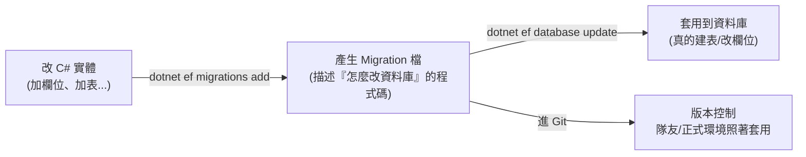

# [csharp-6-3] Migration：用程式碼管理資料庫結構（IaC 的精神）

> **本章目標**：學會用 EF Core 的 Migration——把「資料庫結構的變更」用程式碼管理、版本控制，這是現代資料庫管理的最佳實踐。

## 你會學到

- Migration 解決什麼問題
- 怎麼建立並套用 Migration
- Migration 怎麼版本化資料庫結構
- 這背後的「IaC」精神

## 概念說明

### 問題：資料庫結構怎麼管理

[csharp-6-2] 定義了實體和 DbContext，但**資料庫裡還沒有對應的表**。你可能想「手動去資料庫建表」——但這有問題：

```
手動改資料庫結構的問題：
   ① 沒記錄：誰、何時、改了什麼？無從追蹤
   ② 難同步：你建了表，隊友的資料庫怎麼跟上？正式環境怎麼套用？
   ③ 易出錯：手動下 SQL 建表，容易和程式碼的實體不一致
   ④ 難回復：改錯了想退回上一版？很麻煩
```

**Migration（遷移）** 解決這些——**把「資料庫結構的每次變更」變成「程式碼檔案」，可以版本控制、可重複套用、可回復**。

### Migration：資料庫結構的版本控制

Migration 的核心點子——**你改 C# 實體（[csharp-6-2]），EF Core 自動產生「對應的資料庫變更」成一個 Migration 檔，這個檔案進 Git**：



這張圖在說：改實體 → 產生 Migration（記錄變更）→ 套用到資料庫，且 Migration 檔進 Git。這樣**資料庫結構的演進有完整歷史**，每個人/每個環境都能套用同樣的變更——資料庫結構和程式碼一起被版本控制。

## 程式碼範例

### 安裝 EF Core 工具

```bash
# 安裝 dotnet ef 命令列工具（一次性）
dotnet tool install --global dotnet-ef
```

### 建立第一個 Migration

定義好實體和 DbContext（[csharp-6-2]）後，產生第一個 Migration：

```bash
dotnet ef migrations add InitialCreate
```

說明：`migrations add InitialCreate` 比對「你的實體」和「資料庫目前狀態」，產生一個叫 `InitialCreate` 的 Migration 檔（在 `Migrations/` 資料夾）。打開它會看到「怎麼建立這些表」的 C# 程式碼：

```csharp
// EF Core 自動產生的 Migration（簡化示意）
public partial class InitialCreate : Migration
{
    protected override void Up(MigrationBuilder migrationBuilder)
    {
        // Up：套用此 migration 要做的事（建立 Todos 表）
        migrationBuilder.CreateTable(
            name: "Todos",
            columns: table => new
            {
                Id = table.Column<int>(nullable: false).Annotation("...", true),
                Title = table.Column<string>(maxLength: 100, nullable: false),
                IsDone = table.Column<bool>(nullable: false),
                CreatedAt = table.Column<DateTime>(nullable: false),
            },
            constraints: table => table.PrimaryKey("PK_Todos", x => x.Id));
    }

    protected override void Down(MigrationBuilder migrationBuilder)
    {
        // Down：回復此 migration（刪掉 Todos 表）—— 讓你能退回上一版！
        migrationBuilder.DropTable(name: "Todos");
    }
}
```

說明：每個 Migration 有 **`Up`（套用變更）** 和 **`Down`（回復變更）**——所以能前進也能退回。你不用手寫，EF Core 從實體自動產生。

### 套用 Migration 到資料庫

```bash
dotnet ef database update
```

說明：這會把「還沒套用的 Migration」實際執行到資料庫——真的建立 `Todos` 表。現在資料庫裡有表了，[csharp-6-4] 就能存取資料。

### 後續變更：改實體 → 加 Migration → 更新

之後每次改資料庫結構，都走同一流程：

```bash
# 例：你在 TodoItem 加了一個 Priority 屬性
dotnet ef migrations add AddPriority    # 產生「加 Priority 欄位」的 migration
dotnet ef database update               # 套用
```

說明：**改實體 → `migrations add` → `database update`**——這個循環讓資料庫結構跟著程式碼演進，每步都有記錄、可版本控制、可在各環境重複套用。

### 這背後是 IaC 精神

Migration 體現了 **IaC（Infrastructure as Code，基礎設施即程式碼）** 的精神——**用程式碼管理基礎設施（這裡是資料庫結構）**，而非手動操作：

```
手動改資料庫 = 沒記錄、難重現、易出錯
用 Migration（程式碼）= 有版本、可重現、可審查、可回復
→ 這和 infra/aws 課程的「用 Terraform 管理雲端資源」是同一個思想
  （aws 課程 Part 9 IaC、rust 課程 [rust-9-4] 提的「程式碼管結構」）。
```

## 小練習

1. 為 [csharp-6-2] 的實體建立 `InitialCreate` migration、套用到資料庫，用資料庫工具確認表真的建好了。
2. 在實體加一個新屬性，產生新的 migration、套用，觀察資料庫多了那個欄位。
3. 思考題：為什麼「用 Migration 管理資料庫結構」比「手動去資料庫改」好？列三個理由（呼應 IaC）。

## 課外讀物

> IaC（基礎設施即程式碼）的精神 → **aws 課程 Part 9（Terraform）**、**infra 課程 Part 6**

> 資料庫結構、主鍵、欄位 → **cs 課程 Part 7-3**、[課外讀物 E-4](../../../課外讀物/E-4-database/E-4-1-what-is-index.md)

> 下一步：用 LINQ 做 CRUD 查詢 → [csharp-6-4]
