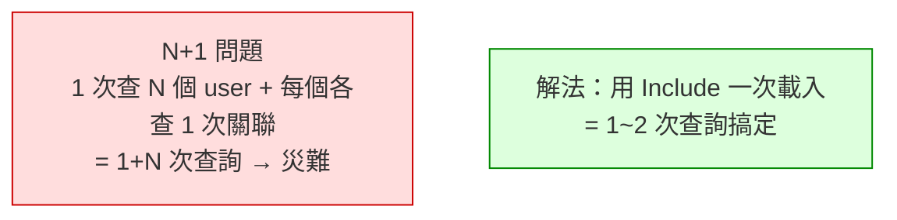

# [csharp-6-5] 關聯：一對多、多對多怎麼設計

> **本章目標**：學會在 EF Core 表達實體之間的關聯（一對多、多對多），並認識「N+1 查詢」這個 ORM 最常見的效能坑。

## 你會學到

- 一對多關聯怎麼設計
- 多對多關聯怎麼設計
- 載入關聯資料（Include）
- N+1 查詢問題與避免

## 概念說明

### 資料之間有關聯

真實資料很少是孤立的——它們**互相關聯**（呼應 [cs 課程 Part 7-3] 的關聯式模型）：

```
一對多（one-to-many）：
   一個「使用者」有多個「訂單」；一個訂單屬於一個使用者
   一個「部落格」有多篇「文章」
多對多（many-to-many）：
   一個「學生」修多門「課」；一門課有多個學生
   一篇「文章」有多個「標籤」；一個標籤用在多篇文章
```

EF Core 用「**導覽屬性（navigation property）**」——在實體裡放「指向關聯實體」的屬性——來表達這些關聯。

## 程式碼範例

### 一對多

一個 `User` 有多個 `Todo`，一個 `Todo` 屬於一個 `User`：

```csharp
public class User
{
    public int Id { get; set; }
    public string Name { get; set; } = "";

    // 導覽屬性：一個 User 有多個 Todo（一對多的「多」端）
    public List<TodoItem> Todos { get; set; } = new();
}

public class TodoItem
{
    public int Id { get; set; }
    public string Title { get; set; } = "";

    // 外鍵 + 導覽屬性：一個 Todo 屬於一個 User
    public int UserId { get; set; }          // 外鍵（指向 User.Id）
    public User User { get; set; } = null!;   // 導覽屬性
}
```

說明：

- `User.Todos`（`List<TodoItem>`）：表達「一個 User 有多個 Todo」。
- `TodoItem.UserId`：**外鍵**——記錄「這個 Todo 屬於哪個 User」（呼應 cs Part 7-3 的關聯）。
- `TodoItem.User`：導覽屬性，能直接從 Todo 拿到它的 User。
- EF Core 依「慣例」（`UserId` 對應 `User.Id`）自動建立關聯，Migration（[csharp-6-3]）會建好外鍵。

### 多對多

一個 `Student` 修多門 `Course`，反之亦然。現代 EF Core 很簡單——兩邊各放對方的 List：

```csharp
public class Student
{
    public int Id { get; set; }
    public string Name { get; set; } = "";
    public List<Course> Courses { get; set; } = new();   // 修多門課
}

public class Course
{
    public int Id { get; set; }
    public string Title { get; set; } = "";
    public List<Student> Students { get; set; } = new();  // 有多個學生
}
```

說明：兩邊各放對方的 `List`，EF Core 會**自動建立中間的「關聯表」**（students_courses）處理多對多。你不用手動建中間表（現代 EF Core 的便利）。

### 載入關聯：Include

預設查詢**不會自動載入關聯資料**（避免一次撈太多）。要載入關聯，用 `Include`：

```csharp
// 查使用者，並「一起載入」他的 Todos
var user = await _db.Users
    .Include(u => u.Todos)          // 明確要求載入關聯
    .FirstOrDefaultAsync(u => u.Id == id);

// 現在 user.Todos 有資料了
foreach (var todo in user.Todos)
{
    Console.WriteLine(todo.Title);
}
```

說明：`Include(u => u.Todos)` 告訴 EF Core「查 User 時，順便把他的 Todos 也載入」（EF Core 用 JOIN 一次查回）。沒有 `Include` 的話，`user.Todos` 會是空的（沒載入）。

### N+1 查詢問題：ORM 的頭號坑

這是 ORM **最常見、最容易不小心踩的效能坑**（呼應 [課外讀物 E-4-4](../../../課外讀物/E-4-database/E-4-4-n-plus-one.md)、E-11-4）：

```csharp
// ❌ N+1 災難
var users = await _db.Users.ToListAsync();        // 1 次查詢：查所有 user
foreach (var user in users)
{
    // 每個 user 都「各查一次」他的 Todos → N 次查詢！
    var todos = await _db.Todos.Where(t => t.UserId == user.Id).ToListAsync();
}
// 總共 1 + N 次查詢！100 個 user = 101 次查詢 → 超慢
```



這張圖在說 N+1 的成因與解法。**解法是用 `Include` 一次把關聯載入**：

```csharp
// ✅ 用 Include：一次（或兩次）查詢全部搞定
var users = await _db.Users
    .Include(u => u.Todos)          // 一起載入，避免 N+1
    .ToListAsync();
foreach (var user in users)
{
    // user.Todos 已經載好了，不會再各查一次
}
```

說明：N+1 很隱蔽（程式碼看起來正常，但背後產生大量查詢），是 ORM 新手最常犯的效能錯誤。**養成習慣**：迴圈裡存取關聯資料前，想想「我有沒有用 Include 預先載入？」，並偶爾看 EF Core 生成的 SQL 確認（[csharp-6-1]）。

## 小練習

1. 設計「一個部落格（Blog）有多篇文章（Post）」的一對多關聯（含外鍵與導覽屬性）。
2. 用 `Include` 查一個 Blog 並一起載入它的所有 Post，印出來。
3. 思考題：什麼是 N+1 查詢問題？為什麼它很隱蔽？怎麼用 Include 避免？

## 課外讀物

> N+1 問題深入 → [課外讀物 E-4-4：N+1 問題](../../../課外讀物/E-4-database/E-4-4-n-plus-one.md)、[課外讀物 E-11-4：資料庫效能](../../../課外讀物/E-11-performance/E-11-4-database-performance.md)

> 關聯式模型、外鍵 → **cs 課程 Part 7-3**、[課外讀物 E-4](../../../課外讀物/E-4-database/E-4-1-what-is-index.md)

> 下一步：把 CRUD API 接上真實資料庫 → [csharp-6-6]
