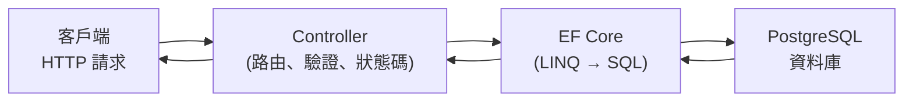

# [csharp-6-6] 🔧 動手做：把 CRUD API 接上真實資料庫

> **本章目標**：把 [csharp-5-6] 的記憶體版 CRUD API，改成「資料存進真實資料庫」——整合 Part 6 的 EF Core，讓資料真正持久化。

## 你會學到

- 把記憶體儲存換成 EF Core
- Controller 注入並使用 DbContext
- 完整的「API → EF Core → 資料庫」資料流
- 體驗「資料持久化」（重啟不消失）

## 概念說明

### 目標：讓資料活下來

[csharp-5-6] 的 Todo API 用 `static List` 存——程式一重啟資料就沒了（記憶體揮發，cs Part 3-5）。現在用 Part 6 學的 EF Core，把它改成「**存進真實資料庫**」，資料就能持久化。

要做的改動：

```
① 把 TodoItem 變成 EF Core 實體（csharp-6-2）—— 其實它已經很接近了
② 建 AppDbContext + 註冊 + 連線（csharp-6-2）
③ 建 Migration 建表（csharp-6-3）
④ Controller 改用「注入 DbContext + LINQ 查詢」取代 static List（csharp-6-4）
```

## 程式碼範例

### 準備（Part 6 前面已建好）

```csharp
// 實體（csharp-6-2）
public class TodoItem
{
    public int Id { get; set; }
    public string Title { get; set; } = "";
    public bool IsDone { get; set; }
    public DateTime CreatedAt { get; set; }
}

// DbContext（csharp-6-2）
public class AppDbContext : DbContext
{
    public AppDbContext(DbContextOptions<AppDbContext> options) : base(options) { }
    public DbSet<TodoItem> Todos => Set<TodoItem>();
}

// Program.cs 註冊（csharp-6-2）
builder.Services.AddDbContext<AppDbContext>(options =>
    options.UseNpgsql(builder.Configuration.GetConnectionString("DefaultConnection")));
```

```bash
# 建表（csharp-6-3）
dotnet ef migrations add InitialCreate
dotnet ef database update
```

### Controller 改用 DbContext

把 [csharp-5-6] 的 `static List` 版，改成注入 DbContext + EF Core 查詢：

```csharp
[ApiController]
[Route("api/todos")]
public class TodosController : ControllerBase
{
    private readonly AppDbContext _db;
    public TodosController(AppDbContext db)        // 注入 DbContext（csharp-4-4）
    {
        _db = db;
    }

    // R：列出全部（從資料庫查）
    [HttpGet]
    public async Task<IActionResult> GetAll()
    {
        var todos = await _db.Todos
            .OrderBy(t => t.Id)
            .Select(t => new TodoDto(t.Id, t.Title, t.IsDone))   // 映射成 DTO（csharp-5-4）
            .ToListAsync();
        return Ok(todos);
    }

    // R：查單一
    [HttpGet("{id}")]
    public async Task<IActionResult> GetById(int id)
    {
        var todo = await _db.Todos.FindAsync(id);
        if (todo == null) return NotFound();
        return Ok(new TodoDto(todo.Id, todo.Title, todo.IsDone));
    }

    // C：新增
    [HttpPost]
    public async Task<IActionResult> Create([FromBody] CreateTodoDto dto)
    {
        var todo = new TodoItem
        {
            Title = dto.Title,
            IsDone = false,
            CreatedAt = DateTime.UtcNow,
        };
        _db.Todos.Add(todo);
        await _db.SaveChangesAsync();              // 寫進資料庫
        var result = new TodoDto(todo.Id, todo.Title, todo.IsDone);
        return CreatedAtAction(nameof(GetById), new { id = todo.Id }, result);
    }

    // U：更新
    [HttpPut("{id}")]
    public async Task<IActionResult> Update(int id, [FromBody] UpdateTodoDto dto)
    {
        var todo = await _db.Todos.FindAsync(id);
        if (todo == null) return NotFound();
        todo.Title = dto.Title;
        todo.IsDone = dto.IsDone;
        await _db.SaveChangesAsync();              // 變更追蹤 → 自動 UPDATE
        return NoContent();
    }

    // D：刪除
    [HttpDelete("{id}")]
    public async Task<IActionResult> Delete(int id)
    {
        var todo = await _db.Todos.FindAsync(id);
        if (todo == null) return NotFound();
        _db.Todos.Remove(todo);
        await _db.SaveChangesAsync();
        return NoContent();
    }
}
```

說明：對比 [csharp-5-6] 的記憶體版——**Controller 結構幾乎一樣，只是把 `static List` 操作換成 `_db.Todos` 的 EF Core 操作**，且全部變成 `async`（資料庫是 I/O）。整合了 Part 4-6 的一切：DI 注入 DbContext（[csharp-4-4]）、LINQ 查詢（[csharp-6-4]）、DTO 映射（[csharp-5-4]）、狀態碼（[csharp-5-3]）。

### 資料流全貌



這張圖是你現在做出的完整後端資料流——請求進 Controller、Controller 透過 EF Core 操作資料庫、結果映射成 DTO 回傳。這就是真實後端 API 的樣貌！

### 驗證持久化

```bash
dotnet run
# POST 一筆待辦 → GET 看到它
# 然後 Ctrl+C 停掉、再 dotnet run
# GET → 待辦還在！（資料存在資料庫，不像 csharp-5-6 重啟就沒了）
```

成功——你的 API 資料現在**持久化**了。這和 **rust 課程 [rust-9-4]、[rust-9-6]**（sqlx + PostgreSQL）做的是同一件事，不同技術棧。

> 注意：實務上 Controller 直接操作 DbContext 還可以更好——把資料存取抽到 **Repository / Service 層**（[csharp-9-1]），讓 Controller 更乾淨、更好測試。Part 9 會重構成分層架構。

## 小練習

1. 把你的 Todo API 完整接上資料庫（實體 → DbContext → Migration → Controller），驗證重啟後資料還在。
2. 加一個 `GET /api/todos?done=true` 端點，用 EF Core 的 `Where` 在資料庫層篩選（而非撈出全部再篩）。
3. 思考題：對比 [csharp-5-6] 記憶體版，這版主要改了哪些地方？為什麼資料現在重啟不會消失？

## 課外讀物

> 整合的觀念 → 複習 Part 6 全部；對照 Rust 接資料庫 → **rust 課程 [rust-9-4]、[rust-9-6]**

> 把資料存取抽成 Repository 層 → [csharp-9-1]、[課外讀物 E-12-3：Repository 模式](../../../課外讀物/E-12-design-patterns/E-12-3-repository.md)

> 本 Part 完成！下一步：認證與授權 → [csharp-7-1]
