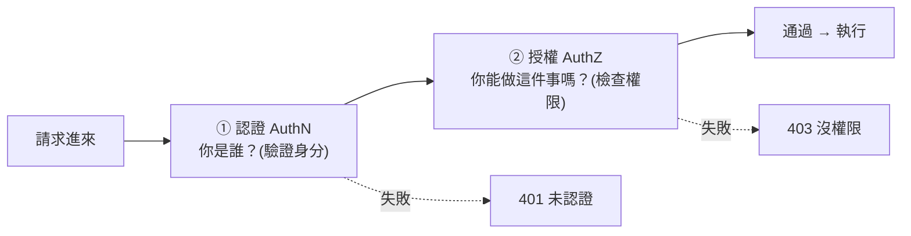

# [csharp-7-1] 認證 vs 授權：先分清楚

> **本章目標**：徹底分清「認證（你是誰）」和「授權（你能做什麼）」這兩個常被混用的概念——這是後端安全的基礎。

## 你會學到

- 認證（Authentication）vs 授權（Authorization）的差別
- 兩者的先後關係
- 常見的認證方式
- 為什麼這對後端安全至關重要

## 概念說明

### 兩個容易搞混的詞

「認證」和「授權」英文都是 Auth 開頭，常被混用，但它們是**兩件不同的事**（呼應 **basic 課程 Part 4-D**）：

```
認證（Authentication，AuthN）：「你是誰？」—— 確認身分
   例：輸入帳號密碼證明「我是 Amy」

授權（Authorization，AuthZ）：「你能做什麼？」—— 確認權限
   例：確認「Amy 是一般使用者，不能刪除別人的文章」
```

比喻最清楚（呼應 [csharp-4-3] 中介軟體順序）：

```
進公司大樓：
   認證 = 在門口刷員工證，證明「你是這家公司的人」（你是誰）
   授權 = 你的員工證能開「你的樓層」，但開不了「機房」（你能做什麼）
→ 先認證（確認身分），才能授權（依身分給權限）。
```

### 先認證，後授權

順序很重要——**一定是「先認證，後授權」**：



這張圖在說：先確認「你是誰」（認證），再判斷「你能不能做」（授權）。**邏輯上必須先知道你是誰，才能判斷你的權限**——這就是 [csharp-4-3]、[csharp-4-2] 裡 `UseAuthentication()` 一定在 `UseAuthorization()` 前面的原因。

對應兩個不同的 HTTP 狀態碼（[csharp-5-3]）：

```
認證失敗 → 401 Unauthorized（你還沒證明身分／沒登入）
授權失敗 → 403 Forbidden（你身分確認了，但沒這個權限）
→ 注意 401 和 403 是不同的：401 是「你誰啊？」、403 是「我知道你是誰，但你不能」。
```

### 常見的認證方式

```
Session-based（傳統）：登入後伺服器記住你的 session，發一個 cookie 給瀏覽器
Token-based（現代 API 常用）：登入後發一個「token」（如 JWT），
   之後每個請求帶著 token 證明身分（csharp-7-2 詳講）
OAuth / 第三方登入：用 Google/Facebook 等帳號登入（課外讀物 E-10-5）
```

現代 Web API 多用 **Token-based（尤其 JWT）**，因為它適合「無狀態、跨服務、前後端分離」的架構——這是 [csharp-7-2] 的主題。

### 為什麼這對後端安全至關重要

```
沒做好認證授權的後果：
   沒認證 → 任何人都能存取你的 API（包括敏感操作）
   沒授權 → 一般使用者能做管理員的事、能看/改別人的資料
→ 認證授權是後端安全的「門禁系統」，做錯就是大漏洞。
  這是每個後端工程師必須掌握的（呼應課外讀物 E-10 Web 安全）。
```

## 範例：一次請求的認證授權

```
情境：Amy（一般使用者）想刪除一篇文章

① 認證：請求帶著 Amy 登入時拿到的 token
   → 伺服器驗證 token → 確認「這是 Amy」✓（通過認證）
   （若沒帶 token 或 token 無效 → 401）

② 授權：檢查「Amy 能不能刪這篇文章？」
   → 規則：只能刪自己的文章，或管理員能刪任何文章
   → Amy 不是作者也不是管理員 → ✗（授權失敗 → 403）

→ 認證確認「她是 Amy」，授權判斷「Amy 沒這個權限」。
  兩道關卡，缺一不可。
```

## 小練習

1. 用「進公司大樓刷卡」的比喻，分別解釋認證和授權。
2. 「401 Unauthorized」和「403 Forbidden」各代表什麼？什麼情況回哪個？
3. 思考題：為什麼順序一定是「先認證、後授權」？能不能反過來？

## 課外讀物

> 認證 vs 授權、登入流程 → **basic 課程 Part 4-D**；Web 安全 → [課外讀物 E-10：Web Security](../../../課外讀物/E-10-security/E-10-1-web-security-overview.md)

> 第三方登入（OAuth）→ [課外讀物 E-10-5：OAuth](../../../課外讀物/E-10-security/E-10-5-oauth.md)

> 下一步：用 JWT 實作認證 → [csharp-7-2]
