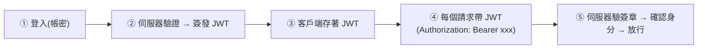

# [csharp-7-2] JWT 在 ASP.NET Core 的實作

> **本章目標**：理解 JWT（JSON Web Token）的運作原理，並學會在 ASP.NET Core 用它做認證——現代 API 最主流的認證方式。

## 你會學到

- JWT 是什麼、長什麼樣
- JWT 怎麼運作（登入 → 拿 token → 帶著用）
- 在 ASP.NET Core 設定 JWT 認證
- JWT 的安全注意事項

## 概念說明

### JWT：一張可驗證的「通行證」

**JWT（JSON Web Token）** 是現代 API 認證最常用的方式（[csharp-7-1]）。它是一個「**伺服器簽發、可驗證真偽、自帶資訊的通行證**」：

```
比喻：JWT 像「演唱會的電子票」
   登入成功 → 伺服器發給你一張「票（JWT）」
   票上印著你的資訊（你是誰、權限）+ 主辦方的「防偽簽章」
   之後你每次進場（請求）出示票 → 驗票員檢查「簽章真偽」→ 放行
   重點：驗票不用打電話回主辦方查（無狀態）—— 簽章本身就能驗真偽
```

### JWT 長什麼樣

JWT 是一個字串，由三部分用 `.` 隔開：

```
xxxxx.yyyyy.zzzzz
 ↑      ↑      ↑
Header  Payload  Signature
標頭    內容     簽章

Header（標頭）：用什麼演算法簽的
Payload（內容）：放「聲明（claims）」——你是誰、權限、過期時間等
   （注意：Payload 只是編碼、沒加密！任何人都能解開看內容）
Signature（簽章）：用「伺服器的祕密金鑰」簽出來的防偽章
   → 別人改了內容，簽章就對不上 → 驗證失敗 → 擋下
```



這張圖在說 JWT 的完整流程：登入拿 token → 之後每個請求帶著它 → 伺服器驗簽章確認身分。關鍵是 **⑤ 驗證只需檢查簽章**（用祕密金鑰），不用查資料庫/session——這就是 JWT「無狀態」的好處，適合分散式、可擴展的架構。

### 安全注意事項

JWT 強大但有坑，務必注意（呼應 [課外讀物 E-10](../../../課外讀物/E-10-security/E-10-1-web-security-overview.md)）：

```
⚠️ Payload 沒加密：別在裡面放敏感資料（密碼、信用卡）——任何人能解開看
⚠️ 祕密金鑰要保密：簽章的金鑰外洩 = 別人能偽造 token = 災難
   → 金鑰走環境變數/密鑰管理，絕不寫死進 Git（csharp-4-5、9-3）
⚠️ 設定過期時間：token 該有期限（exp），減少被盜用的風險
⚠️ 用 HTTPS 傳輸：避免 token 在傳輸中被攔截（cs 課程 Part 9-3 加密）
```

## 程式碼範例

### 設定 JWT 認證

在 `Program.cs` 註冊並設定 JWT 認證：

```csharp
// 安裝套件：dotnet add package Microsoft.AspNetCore.Authentication.JwtBearer

builder.Services.AddAuthentication("Bearer")
    .AddJwtBearer(options =>
    {
        options.TokenValidationParameters = new TokenValidationParameters
        {
            ValidateIssuer = true,
            ValidateAudience = true,
            ValidateLifetime = true,           // 檢查過期
            ValidateIssuerSigningKey = true,   // 檢查簽章
            ValidIssuer = builder.Configuration["Jwt:Issuer"],
            ValidAudience = builder.Configuration["Jwt:Audience"],
            IssuerSigningKey = new SymmetricSecurityKey(
                Encoding.UTF8.GetBytes(builder.Configuration["Jwt:Key"]!))  // 金鑰從設定讀
        };
    });

builder.Services.AddAuthorization();

var app = builder.Build();
app.UseAuthentication();    // 認證中介軟體（順序：先認證！csharp-4-3）
app.UseAuthorization();     // 後授權
app.MapControllers();
```

說明：`AddJwtBearer` 設定「怎麼驗證 JWT」——驗簽章、驗過期、驗發行者。**金鑰 `Jwt:Key` 從設定讀**（絕不寫死，[csharp-4-5]）。`UseAuthentication()` 在 `UseAuthorization()` 前面（[csharp-7-1] 的順序）。

### 簽發 JWT（登入端點）

登入成功後，簽發一個 JWT 給客戶端：

```csharp
[HttpPost("login")]
public IActionResult Login([FromBody] LoginDto dto)
{
    // 1. 驗證帳密（實際要查資料庫、比對密碼雜湊，csharp-9-3 / 課外讀物 E-10-6）
    var user = _userService.Validate(dto.Username, dto.Password);
    if (user == null)
        return Unauthorized("帳號或密碼錯誤");        // 401

    // 2. 簽發 JWT，放入聲明（claims）
    var claims = new[]
    {
        new Claim(ClaimTypes.Name, user.Username),
        new Claim(ClaimTypes.Role, user.Role),       // 放角色，授權時用（csharp-7-3）
    };
    var key = new SymmetricSecurityKey(
        Encoding.UTF8.GetBytes(_config["Jwt:Key"]!));
    var token = new JwtSecurityToken(
        issuer: _config["Jwt:Issuer"],
        claims: claims,
        expires: DateTime.UtcNow.AddHours(1),        // 1 小時後過期
        signingCredentials: new SigningCredentials(key, SecurityAlgorithms.HmacSha256)
    );
    var tokenString = new JwtSecurityTokenHandler().WriteToken(token);

    return Ok(new { token = tokenString });          // 回傳 token 給客戶端
}
```

說明：驗證帳密後（密碼要比對雜湊，[csharp-9-3]、cs Part 9-3），把使用者資訊放進 `claims`（聲明），用祕密金鑰簽出 JWT，設好過期時間，回傳給客戶端。客戶端之後每個請求帶著它。

### 保護端點：[Authorize]

在需要登入才能用的 Controller/Action 加 `[Authorize]`：

```csharp
[Authorize]                    // 需要有效 JWT 才能存取（沒帶/無效 → 401）
[HttpGet("profile")]
public IActionResult GetProfile()
{
    var username = User.Identity?.Name;    // 從 JWT 取出使用者資訊
    return Ok($"你好，{username}");
}

[AllowAnonymous]               // 明確允許不登入也能存取（如登入端點本身）
[HttpPost("login")]
public IActionResult Login(...) { ... }
```

說明：`[Authorize]` 標記「需要認證」——沒帶有效 JWT 的請求會被擋下回 401。`[AllowAnonymous]` 則允許匿名存取（登入端點當然要允許未登入的人存取）。認證通過後，能從 `User` 拿到 JWT 裡的資訊。

## 小練習

1. 用「演唱會電子票」的比喻，解釋 JWT 怎麼運作，以及為什麼驗票「不用打電話回主辦方」（無狀態）。
2. 說出 JWT 的三個部分，並解釋為什麼「Payload 不能放敏感資料」。
3. 為一個端點加 `[Authorize]`，不帶 token 呼叫看是否回 401，帶有效 token 看是否成功。

## 課外讀物

> JWT、密碼儲存、Web 安全 → [課外讀物 E-10：Web Security](../../../課外讀物/E-10-security/E-10-1-web-security-overview.md)、[課外讀物 E-10-6：密碼儲存](../../../課外讀物/E-10-security/E-10-6-password-storage.md)

> 加密與簽章原理 → **cs 課程 Part 9-3**；金鑰別寫死 → [csharp-4-5]、[csharp-9-3]

> 下一步：授權——用角色與政策控管權限 → [csharp-7-3]
