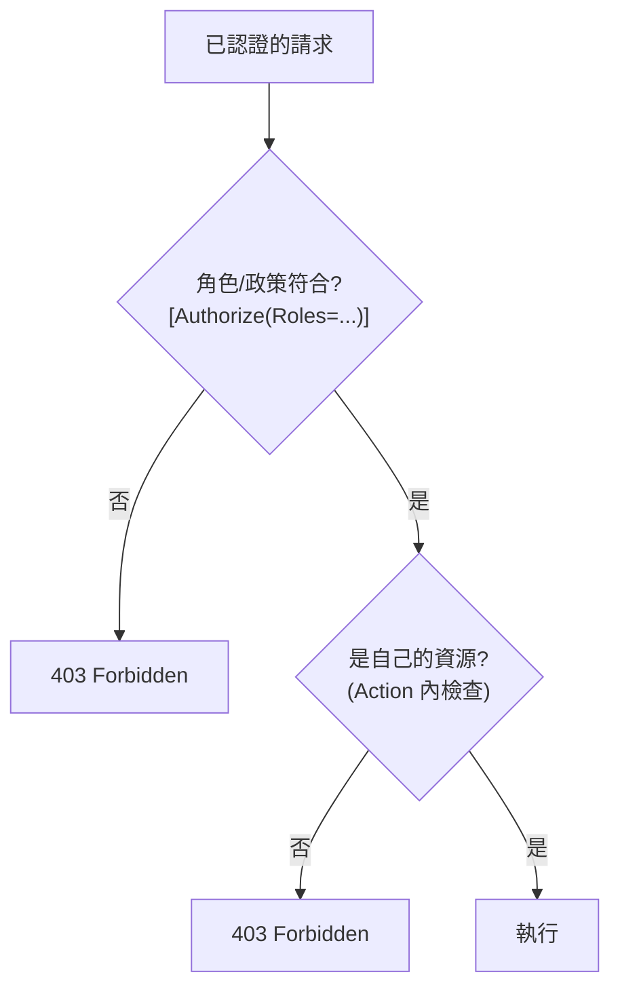

# [csharp-7-3] 授權：以角色（Role）與政策（Policy）控管權限

> **本章目標**：學會在 ASP.NET Core 做授權——用角色和政策控管「誰能做什麼」，確保使用者只能做被允許的操作。

## 你會學到

- 基於角色（Role）的授權
- 基於政策（Policy）的授權
- 怎麼在 Controller 套用授權規則
- 怎麼確保「只能存取自己的資源」

## 概念說明

### 授權：確認「能不能做」

[csharp-7-1] 分清了認證（你是誰）和授權（你能做什麼），[csharp-7-2] 做完了認證（JWT）。現在是**授權**——**確認「這個已認證的使用者，能不能做這個操作」**。

ASP.NET Core 有兩種主要的授權方式：

```
基於角色（Role-based）：依使用者的「角色」決定權限
   例：「管理員」能刪文章，「一般使用者」不行
基於政策（Policy-based）：更靈活，依「自訂規則」決定
   例：「年齡滿 18」「是文章作者本人」才能做某事
```

### 角色從哪來

還記得 [csharp-7-2] 簽發 JWT 時，把使用者的「角色」放進了 claims 嗎？

```csharp
new Claim(ClaimTypes.Role, user.Role),   // 例如 "Admin" 或 "User"
```

授權時，ASP.NET Core 從 JWT 的這個 claim 讀出角色，據此判斷權限——**所以認證（拿到含角色的 token）是授權的基礎**（呼應 [csharp-7-1] 先認證後授權）。

## 程式碼範例

### 基於角色的授權

用 `[Authorize(Roles = ...)]` 限制「只有特定角色能存取」：

```csharp
// 只有 Admin 角色能存取
[Authorize(Roles = "Admin")]
[HttpDelete("{id}")]
public async Task<IActionResult> Delete(int id)
{
    // 只有管理員能刪除
    // ...
    return NoContent();
}

// Admin 或 Editor 都能存取（逗號分隔 = 其中之一即可）
[Authorize(Roles = "Admin,Editor")]
[HttpPost]
public IActionResult Create(...) { ... }

// 只要登入即可（任何角色）
[Authorize]
[HttpGet]
public IActionResult GetAll() { ... }
```

說明：

- `[Authorize(Roles = "Admin")]`：只有「角色是 Admin」的使用者能存取——其他人即使登入了也會被擋下回 **403 Forbidden**（[csharp-5-3]、[csharp-7-1]：已認證但沒權限）。
- `Roles = "Admin,Editor"`：其中任一角色即可。
- 沒帶 token → 401（未認證）；有 token 但角色不符 → 403（沒權限）。兩者不同！

### 基於政策的授權

角色不夠細時，用**政策（Policy）**——自訂更複雜的規則。在 `Program.cs` 定義政策：

```csharp
builder.Services.AddAuthorization(options =>
{
    // 定義一個「必須年滿 18」的政策
    options.AddPolicy("Adult", policy =>
        policy.RequireClaim("Age", "18", "19", "20" /* ... */));

    // 定義「必須是 Admin 且來自特定部門」的複合政策
    options.AddPolicy("SeniorAdmin", policy =>
        policy.RequireRole("Admin").RequireClaim("Level", "Senior"));
});
```

套用政策：

```csharp
[Authorize(Policy = "Adult")]
[HttpGet("adult-content")]
public IActionResult GetAdultContent() { ... }
```

說明：政策讓你定義「比『單純角色』更複雜的規則」（多個條件組合、自訂邏輯）。`[Authorize(Policy = "Adult")]` 套用它。實務上更複雜的規則可以寫「自訂授權處理器」，這裡知道政策的概念即可。

### 確保「只能存取自己的資源」

一個常見且重要的授權需求——**使用者只能存取/修改「自己的」資料**（不能改別人的）。這通常在 Action 裡檢查：

```csharp
[Authorize]
[HttpPut("todos/{id}")]
public async Task<IActionResult> Update(int id, [FromBody] UpdateTodoDto dto)
{
    var todo = await _db.Todos.FindAsync(id);
    if (todo == null) return NotFound();

    // 授權檢查：這個 todo 是不是「當前使用者」的？
    var currentUserId = int.Parse(User.FindFirst(ClaimTypes.NameIdentifier)!.Value);
    if (todo.UserId != currentUserId)
        return Forbid();        // 403：不是你的，不准改！

    todo.Title = dto.Title;
    await _db.SaveChangesAsync();
    return NoContent();
}
```

說明：光有 `[Authorize]`（確認登入）不夠——還要檢查「**這筆資料是不是這個使用者的**」。從 JWT 取出當前使用者 ID（`User.FindFirst(...)`），比對資源的擁有者，不符就回 `Forbid()`（403）。**這個檢查很重要**——少了它，登入的使用者就能改別人的資料（這是常見的安全漏洞，呼應 [課外讀物 E-10](../../../課外讀物/E-10-security/E-10-1-web-security-overview.md)）。



這張圖在說授權常有兩層：**宣告式的角色/政策檢查（`[Authorize]`）+ 程式內的資源擁有權檢查**。兩層都做，授權才完整。

## 小練習

1. 為一個「刪除文章」的端點加 `[Authorize(Roles = "Admin")]`，用非 Admin 的 token 呼叫，確認回 403。
2. 定義一個政策（如「VIP」），套用到某端點。
3. 寫一個「更新使用者個人資料」的端點，加上「只能改自己的」檢查（從 JWT 取 userId 比對），不符回 Forbid()。

## 課外讀物

> 授權、權限控管、常見漏洞 → [課外讀物 E-10：Web Security](../../../課外讀物/E-10-security/E-10-1-web-security-overview.md)；認證 vs 授權 → [csharp-7-1]

> 最小權限原則 → **cs 課程 Part 5-1**、**aws 課程 IAM**

> 下一步：動手幫 API 加上完整的登入與權限 → [csharp-7-4]
