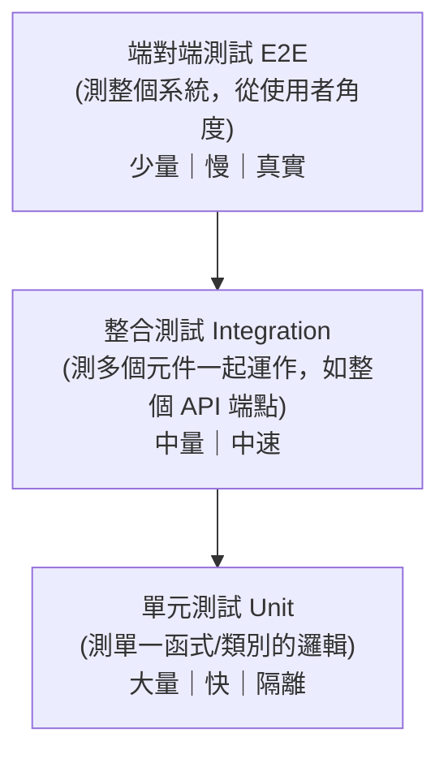

# [csharp-8-1] 為什麼要寫測試？測試的類型

> **本章目標**：理解為什麼測試對後端服務這麼重要，認識不同類型的測試，以及它們在 C#/.NET 的工具。

## 你會學到

- 測試為什麼是「敢改程式」的底氣
- 測試的主要類型（單元、整合、端對端）
- 測試金字塔
- .NET 的測試工具

## 概念說明

### 測試：敢改程式的安全網

你的 API 越來越大（Part 5-7），改一個地方會不會弄壞別處？手動每次都點 Swagger 一個個測，又累又會漏。**自動化測試**是解法——**寫程式去驗證程式的行為**，一個指令就能全部重跑（呼應 [課外讀物 E-9](../../../課外讀物/E-9-testing/E-9-1-why-test.md)、rust [rust-7-3]）：

```
測試像「安全網」：
   你改程式（重構、加功能）→ 跑測試 → 全綠 = 沒弄壞舊功能，安心
   → 沒測試 = 每次改都提心吊膽、怕踩到別處
有測試，你才「敢改程式」——這是測試最大的價值。
```

對後端服務尤其重要——它承載業務、要長期維護、不能上線才發現壞掉。測試是工程紀律的核心。

### 測試的類型

測試依「測多大範圍」分幾種（呼應 [課外讀物 E-9-2](../../../課外讀物/E-9-testing/E-9-2-test-types.md)）：



- **單元測試（Unit Test）**：測「**最小單位**」——一個方法、一個類別的邏輯，且**隔離**（不碰資料庫、網路）。快、多、精準（[csharp-8-2]）。
- **整合測試（Integration Test）**：測「**多個元件一起運作**」——例如「打一個 API 端點，看它經過 Controller → 服務 → 資料庫的完整結果」（[csharp-8-3]）。
- **端對端測試（E2E）**：測「**整個系統**」，從使用者角度（如自動化操作瀏覽器）。最真實但最慢。

### 測試金字塔

一個重要原則——**測試金字塔**：

```
應該寫「大量的單元測試（底層、快）+ 適量整合測試 + 少量 E2E（頂層、慢）」
   ▲ 少量 E2E（慢、脆弱、但最真實）
   ■ 適量 整合測試
   █████ 大量 單元測試（快、穩、精準）
→ 底寬頂窄。別倒過來（一堆慢測試、少單元測試 = 反模式）。
```

理由：單元測試快又穩，能大量寫、快速回饋；E2E 慢又脆弱，少量驗證關鍵流程即可。這個比例讓測試「跑得快、抓得準、好維護」。

### .NET 的測試工具

```
測試框架：xUnit（最流行）、NUnit、MSTest —— 提供「寫測試、跑測試」的能力
模擬工具：Moq —— 製造「假的依賴」來隔離單元測試（csharp-8-2）
整合測試：WebApplicationFactory —— 在記憶體裡跑整個 API 來測（csharp-8-3）
執行：dotnet test —— 一個指令跑所有測試
```

本課用 **xUnit + Moq**（業界最常見組合）。`dotnet test` 跑全部測試——這也能接進 CI/CD（[csharp-10-4]），每次推程式自動跑測試。

## 範例：測試的價值

```
情境：你重構了「計算訂單總價」的邏輯（想讓它更清楚）。

沒有測試：
   改完 → 手動點幾個情況測 → 看起來對 → 上線
   → 結果漏測了「有折扣 + 多件」的情況，算錯了 → 客訴、賠錢

有測試：
   改完 → dotnet test → 「折扣+多件」那個測試紅了！
   → 馬上發現重構出錯 → 修好 → 全綠才上線
→ 測試在「上線前」就抓到問題。這就是它的價值。
```

## 小練習

1. 用「安全網」的比喻，解釋為什麼「有測試才敢改程式」。
2. 說出單元、整合、端對端測試的差別（測多大範圍？快慢？）。
3. 用自己的話解釋「測試金字塔」——為什麼單元測試該最多、E2E 最少？

## 課外讀物

> 為什麼測試、測試類型、測試金字塔 → [課外讀物 E-9：測試](../../../課外讀物/E-9-testing/E-9-1-why-test.md)、[課外讀物 E-9-2：測試類型](../../../課外讀物/E-9-testing/E-9-2-test-types.md)

> 對照 Rust 的測試 → **rust 課程 [rust-7-3]**；測試讓你敢重構 → [課外讀物 E-9-5：TDD](../../../課外讀物/E-9-testing/E-9-5-tdd.md)

> 下一步：寫單元測試（xUnit + Moq）→ [csharp-8-2]
