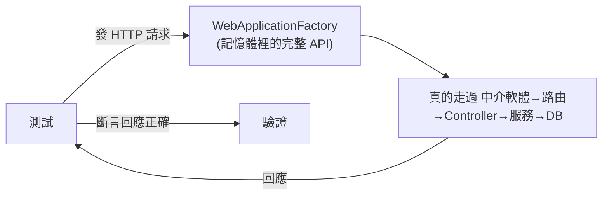

# [csharp-8-3] 整合測試：測試整個 API 端點

> **本章目標**：學會寫整合測試——把整個 API（Controller → 服務 → 資料庫）一起測，驗證「組起來也正確」。

## 你會學到

- 整合測試 vs 單元測試的差別
- 用 WebApplicationFactory 在記憶體跑整個 API
- 怎麼測一個完整的 HTTP 端點
- 整合測試的資料庫策略

## 概念說明

### 整合測試：測「組起來」

[csharp-8-2] 的單元測試測「單一元件、隔離」。但「**各元件組起來，整條路走得通嗎？**」需要**整合測試**（[csharp-8-1]）：

```
單元測試：測 PriceCalculator 的算法對不對（隔離）
整合測試：打一個真的 HTTP 請求到 /api/todos，看它經過
   中介軟體 → 路由 → Controller → 服務 → 資料庫 的「完整結果」對不對
→ 整合測試驗證「元件之間的接合」沒問題（單元測試各自過，但組起來可能有問題）。
```

比喻：單元測試像「檢查每個零件」，整合測試像「把車組起來試開」——兩者互補（呼應測試金字塔 [csharp-8-1]）。

### WebApplicationFactory：在記憶體跑整個 API

ASP.NET Core 提供 **`WebApplicationFactory`**——它能**在記憶體裡啟動你「整個 API」**，讓測試對它發真的 HTTP 請求，不用真的開伺服器：



這張圖在說：整合測試用 `WebApplicationFactory` 在記憶體跑起整個 API，發真請求、走完整條鏈、驗證回應。這比 E2E（要開瀏覽器、開伺服器）輕量，又比單元測試真實——測到了「組裝」。

## 程式碼範例

### 整合測試一個端點

```csharp
// 安裝：dotnet add package Microsoft.AspNetCore.Mvc.Testing

public class TodosApiTests : IClassFixture<WebApplicationFactory<Program>>
{
    private readonly HttpClient _client;

    public TodosApiTests(WebApplicationFactory<Program> factory)
    {
        // 取得一個能對「記憶體裡的 API」發請求的 HttpClient
        _client = factory.CreateClient();
    }

    [Fact]
    public async Task GetAll_ReturnsSuccessAndJson()
    {
        // Act：對 API 發真的 GET 請求
        var response = await _client.GetAsync("/api/todos");

        // Assert：驗證回應
        response.EnsureSuccessStatusCode();             // 200 系列
        var contentType = response.Content.Headers.ContentType?.MediaType;
        Assert.Equal("application/json", contentType);   // 確認回 JSON
    }

    [Fact]
    public async Task Create_ThenGet_ReturnsTheCreatedTodo()
    {
        // Arrange：準備要 POST 的資料
        var newTodo = new { title = "整合測試的待辦" };

        // Act：POST 新增
        var postResponse = await _client.PostAsJsonAsync("/api/todos", newTodo);

        // Assert：確認建立成功（201）
        Assert.Equal(HttpStatusCode.Created, postResponse.StatusCode);

        // 進一步：GET 回來確認真的存進去了
        var created = await postResponse.Content.ReadFromJsonAsync<TodoDto>();
        var getResponse = await _client.GetAsync($"/api/todos/{created!.Id}");
        getResponse.EnsureSuccessStatusCode();
    }
}
```

說明：

- `IClassFixture<WebApplicationFactory<Program>>`：讓測試類別取得「記憶體裡的 API」。
- `factory.CreateClient()`：拿一個 `HttpClient`，能對這個 API 發請求。
- 測試**發真的 HTTP 請求**（`GetAsync`、`PostAsJsonAsync`），驗證回應的狀態碼、內容——這走過了「中介軟體 → 路由 → Controller → 服務」整條鏈（[csharp-4-3] 起的全部）。
- 第二個測試還驗證「新增後查得回來」——測了完整的使用流程。

### 整合測試的資料庫策略

整合測試碰到資料庫時，有幾種策略避免污染真資料庫：

```
① 用記憶體資料庫（EF Core InMemory 或 SQLite in-memory）
   → 快、隔離，每次測試用乾淨的資料庫
② 用測試專用的資料庫（如 Docker 跑一個臨時的 PostgreSQL）
   → 更真實（和正式環境同款），但較慢
③ 每個測試前後「重置」資料（清空、用交易回滾）
→ 常見做法：在 WebApplicationFactory 裡「換掉」資料庫設定成測試用的
   （利用 DI 的可替換性——又是依賴注入的好處！csharp-4-4）
```

說明：關鍵是「**別讓測試污染真資料庫、且每次測試從乾淨狀態開始**」。能輕鬆「換掉資料庫設定」正是因為用了依賴注入（[csharp-4-4]）——測試時注入測試用的 DbContext。這再次體現「**好的架構讓測試容易**」。

## 小練習

1. 為你的 Todo API 寫一個整合測試：GET `/api/todos` 確認回 200 + JSON。
2. 寫一個整合測試：POST 新增一筆，再 GET 回來確認存在（測完整流程）。
3. 思考題：整合測試和單元測試各驗證什麼？為什麼兩者都需要（呼應測試金字塔）？

## 課外讀物

> 整合測試、測試金字塔 → [課外讀物 E-9-2：測試類型](../../../課外讀物/E-9-testing/E-9-2-test-types.md)、[csharp-8-1]

> 為什麼 DI 讓測試（含換資料庫）容易 → [csharp-4-4]

> 下一步：動手為你的服務寫一套測試 → [csharp-8-4]
