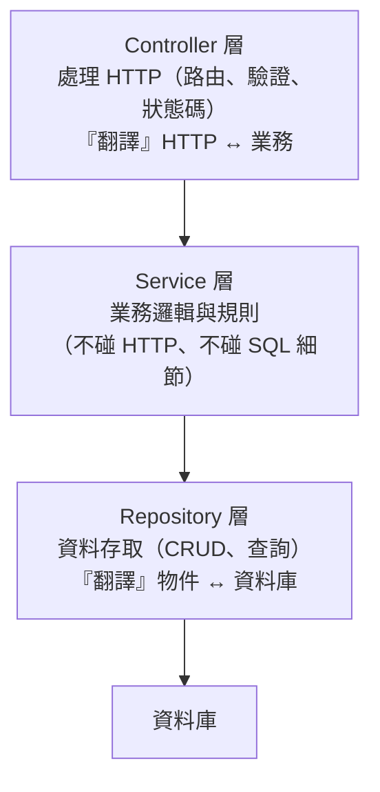

# [csharp-9-1] 分層架構：Controller / Service / Repository

> **本章目標**：學會用分層架構組織後端程式碼——把「處理請求、業務邏輯、資料存取」分開，讓程式好維護、好測試、好擴充。

## 你會學到

- 為什麼要分層
- Controller / Service / Repository 各層的職責
- Repository 模式：把資料存取抽象化
- 分層怎麼讓程式好測試

## 概念說明

### 問題：全擠在 Controller 的混亂

到目前（[csharp-6-6]）你的 Controller 同時做了：處理 HTTP、業務邏輯、操作資料庫。小專案還好，但**長大後會變成難維護的「肥 Controller」**（違反單一職責 [csharp-2-5]）：

```
肥 Controller 的問題：
   一個 Controller 又管 HTTP、又算業務、又存資料庫 → 職責混亂
   業務邏輯和 HTTP 綁死 → 難重用、難測試（測業務要連帶測 HTTP）
   改資料庫存取 → 動到 Controller
```

解法是**分層架構（layered architecture）**——**把不同職責分到不同層**（呼應 **basic 課程 Part 4-D**、cs Part 8-1 抽象）。

### 三層職責

最常見的後端分層：



這張圖在說三層各司其職（SRP [csharp-2-5]）：

```
Controller：只管「HTTP 的事」——接收請求、驗證、呼叫 Service、回傳狀態碼
   不放業務邏輯！它只是「HTTP 與業務之間的翻譯」
Service：放「業務邏輯與規則」——算錢、檢查權限、協調流程
   不碰 HTTP（不知道狀態碼）、不碰 SQL 細節（透過 Repository）
Repository：只管「資料存取」——封裝所有 EF Core/SQL 操作
   把「怎麼存取資料庫」藏起來，對上層提供乾淨的方法
```

每層只依賴「下一層的介面」（DIP [csharp-2-5]），層與層之間鬆耦合。

### Repository 模式

**Repository 模式**（[課外讀物 E-12-3](../../../課外讀物/E-12-design-patterns/E-12-3-repository.md)）是把「資料存取」抽象成一個介面——上層**依賴介面而非具體的 EF Core**：

```
好處：
   ① 業務邏輯（Service）不直接碰資料庫細節 → 關注點分離
   ② 想換資料存取方式（換 ORM、加快取）→ 只改 Repository，不動 Service
   ③ 測試 Service 時，注入「假的 Repository」（Mock）→ 不碰真資料庫（csharp-8-2）
```

## 程式碼範例

### 三層實作

```csharp
// === Repository 層：介面 + 實作 ===
public interface ITodoRepository                  // 介面（csharp-2-4）
{
    Task<List<TodoItem>> GetByUserAsync(int userId);
    Task<TodoItem?> FindByIdAsync(int id);
    Task AddAsync(TodoItem todo);
    Task DeleteAsync(TodoItem todo);
}

public class TodoRepository : ITodoRepository     // EF Core 實作
{
    private readonly AppDbContext _db;
    public TodoRepository(AppDbContext db) => _db = db;

    public Task<List<TodoItem>> GetByUserAsync(int userId)
        => _db.Todos.Where(t => t.UserId == userId).ToListAsync();
    public Task<TodoItem?> FindByIdAsync(int id)
        => _db.Todos.FindAsync(id).AsTask();
    public async Task AddAsync(TodoItem todo)
    {
        _db.Todos.Add(todo);
        await _db.SaveChangesAsync();
    }
    public async Task DeleteAsync(TodoItem todo)
    {
        _db.Todos.Remove(todo);
        await _db.SaveChangesAsync();
    }
}

// === Service 層：業務邏輯（依賴 Repository 介面）===
public class TodoService
{
    private readonly ITodoRepository _repo;        // 依賴「介面」（DIP）
    public TodoService(ITodoRepository repo) => _repo = repo;

    public Task<List<TodoItem>> GetUserTodosAsync(int userId)
        => _repo.GetByUserAsync(userId);

    // 業務規則放這層（不碰 HTTP）
    public async Task DeleteAsync(int todoId, int userId, bool isAdmin)
    {
        var todo = await _repo.FindByIdAsync(todoId)
            ?? throw new NotFoundException("待辦不存在");
        if (todo.UserId != userId && !isAdmin)
            throw new ForbiddenException("無權刪除");      // 業務規則
        await _repo.DeleteAsync(todo);
    }
}

// === Controller 層：只管 HTTP（依賴 Service）===
[Authorize]
[ApiController]
[Route("api/todos")]
public class TodosController : ControllerBase
{
    private readonly TodoService _service;          // 依賴 Service
    public TodosController(TodoService service) => _service = service;

    [HttpGet]
    public async Task<IActionResult> GetAll()
    {
        var userId = GetCurrentUserId();            // HTTP 相關（從 JWT 取）
        var todos = await _service.GetUserTodosAsync(userId);   // 呼叫業務層
        return Ok(todos.Select(t => new TodoDto(t.Id, t.Title, t.IsDone)));  // HTTP 回應
    }
}
```

說明：注意每層的純粹——**Controller 只碰 HTTP**（取 userId、回狀態碼）、**Service 只放業務**（權限規則、流程）、**Repository 只碰資料庫**（EF Core）。Service 依賴 `ITodoRepository` 介面（不依賴具體的 EF Core）——這就是 [csharp-2-5] DIP 的實踐。

### 註冊各層（DI）

```csharp
// Program.cs：註冊各層到 DI（csharp-4-4）
builder.Services.AddScoped<ITodoRepository, TodoRepository>();   // 介面 → 實作
builder.Services.AddScoped<TodoService>();
```

說明：DI 容器把各層串起來——Controller 要 Service、Service 要 Repository，容器自動注入。整條依賴鏈自動組裝（[csharp-4-4]）。

### 分層讓測試容易

```
測 Service 的業務邏輯時：
   注入「假的 ITodoRepository」（Mock，csharp-8-2）
   → 不碰真資料庫，純測業務規則，快又穩
→ 這就是 csharp-8-4 能那樣測 TodoService 的原因——因為分層 + 依賴介面。
  「好架構讓測試容易」再次印證。
```

### 別過度分層

```
分層是好東西，但別教條：
   小專案/原型 → 不一定要三層，Controller 直接用 DbContext 也行（csharp-6-6）
   專案長大、邏輯變複雜 → 再重構成分層
→ 呼應 dsa-0-3「夠好勝過最佳」、csharp-2-5「別過度設計」。
  分層要服務於「讓程式更好維護」，而非為分層而分層。
```

## 小練習

1. 把 [csharp-6-6] 的 Todo API 重構成三層（Controller / Service / Repository），各層只做自己的事。
2. 為 Repository 定義介面 `ITodoRepository`，讓 Service 依賴介面而非具體實作。
3. 思考題：分層架構怎麼讓「測試業務邏輯」變容易？（提示：Service 依賴介面 → 測試時能注入什麼？）

## 課外讀物

> 分層架構、Repository 模式 → **basic 課程 Part 4-D**、[課外讀物 E-12-3：Repository 模式](../../../課外讀物/E-12-design-patterns/E-12-3-repository.md)、[課外讀物 E-12-9：資料存取層](../../../課外讀物/E-12-design-patterns/E-12-9-dal-concept.md)

> 分層 = SRP + DIP → [csharp-2-5]、[課外讀物 E-7-2](../../../課外讀物/E-7-solid/E-7-2-srp.md)、[課外讀物 E-7-6](../../../課外讀物/E-7-solid/E-7-6-dip.md)

> 下一步：Logging 與健康檢查 → [csharp-9-2]
