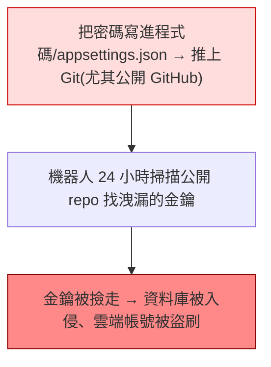

# [csharp-9-3] 設定管理與 Secrets（密鑰別寫死）

> **本章目標**：深入「機密管理」——資料庫密碼、API 金鑰、JWT 金鑰這些敏感設定，怎麼安全地管理而不外洩，這是後端安全的關鍵實務。

## 你會學到

- 為什麼機密絕不能進 Git
- 開發環境用 User Secrets
- 正式環境用環境變數 / 密鑰管理服務
- 機密外洩的處理

## 概念說明

### 機密：絕不寫死、絕不進 Git

[csharp-4-5] 提過，這章深入。你的應用有很多**機密（secrets）**——資料庫密碼、JWT 簽章金鑰（[csharp-7-2]）、第三方 API 金鑰、加密金鑰。鐵則只有一條（呼應 **rust 課程 [rust-9-5]**、[課外讀物 E-10](../../../課外讀物/E-10-security/E-10-1-web-security-overview.md)、E-8 Git）：

```
🔴 機密「絕對不能」寫死在程式碼、也不能寫進會進 Git 的設定檔！
```

為什麼這麼嚴格？



這張圖在說真實的威脅——**公開 GitHub 上洩漏的金鑰，幾分鐘內就會被自動掃描的機器人撿走**，造成資料庫入侵、雲端帳號被盜刷天價帳單。這不是危言聳聽，是天天在發生的事。

**而且——一旦機密進過 Git，就視為「已外洩」**，即使你之後刪掉，它還留在 Git 歷史裡。**唯一正確的處理是：立刻作廢那個金鑰、重新產生一個**。

### 機密該放哪

依環境用不同的安全管道：

```
開發環境：User Secrets
   dotnet user-secrets —— 存在「你電腦的本機、專案資料夾之外」
   → 不會進 Git，每個開發者自己管
正式環境：環境變數 或 雲端密鑰管理服務
   環境變數：機密設在伺服器的環境變數裡（不在程式碼）
   雲端密鑰管理：AWS Secrets Manager、Azure Key Vault 等（最推薦）
      → 集中管理、加密儲存、可輪替、有存取記錄
```

關鍵原則——**機密「注入」到應用，而非「寫死」在應用裡**。應用啟動時從環境/密鑰服務讀取（[csharp-4-5] 的設定系統會自動把環境變數併進來）。

## 程式碼範例

### 開發環境：User Secrets

```bash
# 在專案啟用 User Secrets（一次性）
dotnet user-secrets init

# 設定機密（存在本機，不在專案資料夾、不進 Git）
dotnet user-secrets set "ConnectionStrings:DefaultConnection" "Host=...;Password=真密碼"
dotnet user-secrets set "Jwt:Key" "你的JWT簽章金鑰"
```

讀取方式和一般設定一樣（[csharp-4-5]）——ASP.NET Core 自動把 User Secrets 併進設定：

```csharp
// 程式碼不用改！照樣從 Configuration 讀，它自動從 User Secrets 取（開發時）
var connStr = builder.Configuration.GetConnectionString("DefaultConnection");
var jwtKey = builder.Configuration["Jwt:Key"];
```

說明：User Secrets 存在你電腦的使用者目錄（不在專案資料夾），所以**永遠不會被 Git 追蹤**。程式碼讀取方式不變——設定系統自動處理來源。

### 正式環境：環境變數

```bash
# 在伺服器設環境變數（用雙底線 __ 代表設定的階層）
export ConnectionStrings__DefaultConnection="Host=...;Password=正式密碼"
export Jwt__Key="正式的JWT金鑰"
```

說明：環境變數的 `__`（雙底線）對應設定的 `:`（階層）。ASP.NET Core 自動把環境變數讀進設定——所以**同一份程式碼**，開發時從 User Secrets 讀、正式時從環境變數讀，**程式碼完全不用改**（[csharp-4-5] 的設定分層）。更進階用雲端密鑰服務（[aws 課程]）。

### appsettings.json 與 .gitignore

```json
// appsettings.json —— 只放「非機密」設定，且這檔案『可以』進 Git
{
  "Logging": { "LogLevel": { "Default": "Information" } },
  "AppSettings": { "SiteName": "我的 API" }
  // ⚠️ 連線字串的密碼、JWT 金鑰 → 不放這！放 User Secrets / 環境變數
}
```

```
確保 .gitignore 排除任何含機密的檔案（如 appsettings.Development.json 若放了機密）：
   appsettings.*.json   (視情況)
   *.env
→ 養成習慣：commit 前檢查「有沒有機密混進去」（課外讀物 E-8 Git）。
```

## 小練習

1. 用 `dotnet user-secrets` 把你專案的資料庫密碼、JWT 金鑰移出 appsettings.json，確認程式照樣能讀到。
2. 檢查你的 `.gitignore`，確認任何含機密的檔案都被排除。
3. 思考題：如果不小心把資料庫密碼 commit 進公開 GitHub 又 push 了，正確的處理是什麼？（提示：不只是刪掉。）

## 課外讀物

> 機密管理、別進 Git、Web 安全 → [課外讀物 E-10：Web Security](../../../課外讀物/E-10-security/E-10-1-web-security-overview.md)、[課外讀物 E-8：Git](../../../課外讀物/E-8-git/E-8-1-git-internals.md)

> 對照 Rust 的機密管理 → **rust 課程 [rust-9-5]**；雲端密鑰服務 → **aws 課程**；加密 → **cs 課程 Part 9-3**

> 下一步：效能與快取（接 Redis）→ [csharp-9-4]
