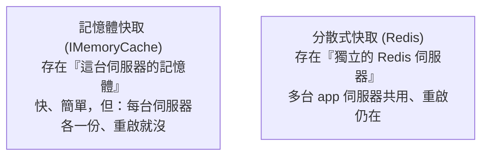

# [csharp-9-4] 效能與快取：接上 Redis

> **本章目標**：學會在 ASP.NET Core 用快取提升效能——從記憶體快取到 Redis 分散式快取，理解「用空間換時間」在後端的實踐。

## 你會學到

- 快取怎麼提升後端效能
- 記憶體快取 vs 分散式快取（Redis）
- 在 ASP.NET Core 用快取
- 快取的取捨與坑

## 概念說明

### 快取：別重複做昂貴的事

當你的 API 變慢，常見原因是「**重複做昂貴的操作**」——同樣的資料庫查詢一直跑、同樣的計算一直算。**快取（cache）** 的點子：**把結果存起來，下次直接拿，不重做**（呼應 **快取課程**、**dsa 課程 [dsa-1-3] 用空間換時間**、**cs 課程 Part 3-4 記憶體階層**）：

```
沒快取：每個請求都查資料庫「熱門商品清單」→ 資料庫累、回應慢
有快取：第一次查完存進快取 → 後續請求直接從快取拿（快幾十倍）
   → 減輕資料庫負擔、加快回應
→ 「用記憶體（空間）換取不重查（時間）」——就是快取的本質。
```

### 記憶體快取 vs 分散式快取

兩種主要的快取：



這張圖說明取捨：

```
記憶體快取：存在 app 自己的記憶體
   優點：最快、零額外設定
   缺點：① 多台伺服器時各存各的（不一致）② app 重啟就沒 ③ 佔 app 記憶體
   → 適合：單台伺服器、或快取「每台自己算也無妨」的東西

分散式快取（Redis）：存在獨立的 Redis 服務
   優點：多台 app 伺服器「共用同一份快取」、app 重啟快取還在
   缺點：多一個服務要維護、存取要走網路（仍比資料庫快很多）
   → 適合：多台伺服器的正式環境（呼應 aws ElastiCache、cs Part 3-4）
```

正式的、會水平擴展（多台伺服器）的後端，通常用 **Redis**——這也是 **快取課程 Part 5** 的主題。

## 程式碼範例

### 記憶體快取

```csharp
// Program.cs
builder.Services.AddMemoryCache();

// 在服務裡用
public class ProductService
{
    private readonly IMemoryCache _cache;
    private readonly IProductRepository _repo;

    public ProductService(IMemoryCache cache, IProductRepository repo)
    {
        _cache = cache;
        _repo = repo;
    }

    public async Task<List<Product>> GetPopularAsync()
    {
        // 先看快取有沒有；沒有才查資料庫，並存進快取
        return await _cache.GetOrCreateAsync("popular_products", async entry =>
        {
            entry.AbsoluteExpirationRelativeToNow = TimeSpan.FromMinutes(5);  // 5 分鐘後過期
            return await _repo.GetPopularAsync();      // 真正查資料庫（只在快取沒有時）
        });
    }
}
```

說明：`GetOrCreateAsync("key", ...)`——「**有快取就用、沒有才執行並存起來**」（這就是 cache-aside 模式，快取課程 Part 5）。設了 5 分鐘過期（TTL）。後續 5 分鐘內的請求直接從記憶體拿，不查資料庫。

### Redis 分散式快取

換成 Redis 很簡單——介面幾乎一樣（DI 的好處，[csharp-4-4]）：

```csharp
// Program.cs：改用 Redis（裝 StackExchange.Redis 套件）
builder.Services.AddStackExchangeRedisCache(options =>
{
    options.Configuration = builder.Configuration.GetConnectionString("Redis");  // Redis 連線
});

// 用 IDistributedCache（介面，可換實作）
public class ProductService
{
    private readonly IDistributedCache _cache;
    // ... GetString / SetString（Redis 存的是字串，物件要序列化成 JSON）
}
```

說明：用 `IDistributedCache` 介面，底層接 Redis。注意 Redis 存字串，所以物件要序列化成 JSON 再存（取回時反序列化）。多台 app 伺服器共用這個 Redis，快取一致。Redis 連線資訊也走設定/機密管理（[csharp-9-3]）。

### 快取的坑

快取很有用但有坑（**快取課程 Part 6** 專講這些）：

```
① 一致性：資料更新了，快取還是舊的 → 使用者看到過時資料
   → 解法：更新資料時「順便清掉/更新快取」（快取課程 Part 6-5）
② 雪崩：大量快取「同時過期」→ 瞬間全打到資料庫 → 資料庫被壓垮
   → 解法：過期時間加隨機（快取課程 Part 6-2）
③ 別亂快取：會頻繁變動、或每人不同的資料，不一定適合快取
→ 快取是強大的效能工具，但要懂它的坑。先別過早快取——
   先量測找出真正的瓶頸再加（呼應課外讀物 E-11-6、dsa-0-3）。
```

## 小練習

1. 用 `IMemoryCache` 為一個「查詢熱門資料」的方法加快取（GetOrCreate + 過期時間），觀察第二次請求變快。
2. 思考：如果你的服務跑在「3 台伺服器」後面，用記憶體快取會有什麼問題？為什麼該用 Redis？
3. 思考題：資料更新後，快取還是舊的——這是什麼問題？你會怎麼處理（提示：更新時清快取）？

## 課外讀物

> 快取完整深入（各層、策略、坑）→ **快取課程**；用空間換時間 → **dsa 課程 [dsa-1-3]**、**cs 課程 Part 3-4**

> 先量測再優化、別過早快取 → [課外讀物 E-11-6：後端效能分析](../../../課外讀物/E-11-performance/E-11-6-backend-profiling.md)；雲端 Redis → **aws 課程（ElastiCache）**

> 下一步：C# 慣例與 Clean Code → [csharp-9-5]
