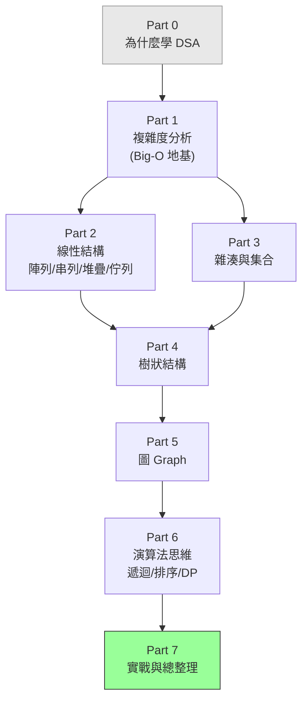

# 資料結構與演算法課程大綱

> **核心理念**：同一個問題，好的解法可能比爛的解法快上千百倍——差別不在「電腦多快」，而在「你選的資料結構與演算法」。
> 這門課把資料結構與演算法**合在一起、從零講透**：先建立「怎麼衡量好壞」的眼光（Big-O），再一個一個認識資料結構與演算法，最後學會「拿到問題該怎麼想」。所有範例用 **TypeScript**，和 basic 課程無縫銜接。

---

## 這門課的定位

| | 說明 |
|---|------|
| **適合對象** | 想把程式「寫得有效率」的人；準備技術面試 / 競賽的人；想補紮實 CS 基礎的人。**有基本程式概念即可。** |
| **目標** | 學完能：看懂並分析複雜度（Big-O）、熟悉常用資料結構（陣列到圖）、掌握經典演算法策略（排序、搜尋、遞迴、DP…），並在拿到新問題時**選對資料結構、想出有效率的解法**。 |
| **建議（非必須）** | 先有 **basic 課程**的程式基礎（變數、函式、迴圈、TypeScript）會學得最順。沒有的話，課程也會在用到時解釋。 |
| **計概 vs 這門課** | **計概（cs 課程）** 在 Part 7 給你「演算法/資料結構是什麼」的直覺；**這門課是完整深入版**——每個結構與演算法都講原理、複雜度、TypeScript 實作與適用時機。 |

> 範例語言：**TypeScript**（和 basic 一致）。但每個概念都先用**生活類比 + pseudo code + Mermaid 圖**講清楚，再給 TypeScript——不會一上來就丟程式碼。
> 通用知識（型別、測試、效能）在頂層 `課外讀物/`，本課會交叉引用。標 🏆 的是**整合專案**。

> **本課的深度設計**：Part 1 的 **Big-O 是貫穿全書的共同地基**——之後介紹每個資料結構與演算法，都會回頭分析它的複雜度。學完你不只「會用」，更「知道它快在哪、慢在哪、何時該用」。

---

## 學習路徑總覽

> 脈絡：**先學「怎麼衡量好壞」（Big-O）→ 再從簡單到複雜認識資料結構（線性 → 雜湊 → 樹 → 圖）→ 接著學經典演算法策略 → 最後整合，學會拿到題目怎麼想。**

---

## Part 0 — 開始之前：為什麼要學這個

### 章節列表

- `dsa-0-1` 為什麼要學資料結構與演算法（一個「找名字」的例子，快慢差千百倍）
- `dsa-0-2` 環境準備：用 TypeScript 練習 DSA（接 basic Part 0）
- `dsa-0-3` 怎麼判斷一個解法「好不好」：先有衡量的眼光

---

## Part 1 — 複雜度分析：全書的共同地基

> 在學任何資料結構與演算法之前，要先有「衡量效率」的工具。這個 Part 是整本書的地基。

### 章節列表

- `dsa-1-1` Big-O 是什麼：用「成長速度」而非「實際秒數」衡量效率
- `dsa-1-2` 常見複雜度排行：O(1)、O(log n)、O(n)、O(n log n)、O(n²)、O(2ⁿ)（一張圖看懂差距）
- `dsa-1-3` 時間複雜度 vs 空間複雜度：時間換空間的取捨
- `dsa-1-4` 最好/最壞/平均情況、攤銷分析（amortized）是什麼

---

## Part 2 — 線性資料結構

> 最基礎、最常用的一群：資料「排成一條線」。

### 章節列表

- `dsa-2-1` 陣列（Array）：記憶體連續、隨機存取為什麼是 O(1)
- `dsa-2-2` 動態陣列：自動擴容的祕密與「攤銷 O(1)」
- `dsa-2-3` 鏈結串列（Linked List）：單向、雙向、與陣列的本質差異
- `dsa-2-4` 陣列 vs 鏈結串列：什麼情境用哪個（一張對照表）
- `dsa-2-5` 堆疊（Stack）：後進先出，與「函式呼叫堆疊」的關係（呼應 cs-5-2）
- `dsa-2-6` 佇列（Queue）：先進先出、雙端佇列、環狀佇列

---

## Part 3 — 雜湊與集合

> 「O(1) 查找」的魔法來源，也是日常開發最常用的結構之一。

### 章節列表

- `dsa-3-1` 雜湊表（Hash Table）：把 key 變成位址，O(1) 查找的原理
- `dsa-3-2` 雜湊碰撞與解法：鏈結法、開放定址、為什麼要好的雜湊函式
- `dsa-3-3` TypeScript 的 `Map` 與 `Set`：內建雜湊結構怎麼用、何時用

---

## Part 4 — 樹狀結構

> 從「一條線」進化到「分岔的階層」，能表達更複雜的關係，也帶來更快的查找。

### 章節列表

- `dsa-4-1` 樹是什麼：根、節點、葉、深度——階層式結構與術語
- `dsa-4-2` 二元樹與走訪：前序 / 中序 / 後序 / 層序（BFS）
- `dsa-4-3` 二元搜尋樹（BST）：有序的樹，查找為什麼是 O(log n)
- `dsa-4-4` 為什麼樹要「平衡」：AVL / 紅黑樹的概念（不平衡會退化成串列）
- `dsa-4-5` 堆積（Heap）與優先佇列：總是能快速取出最大/最小
- `dsa-4-6` Trie（字典樹）：處理字串前綴的好朋友

---

## Part 5 — 圖（Graph）

> 表達「萬物之間的關係」——社交網路、地圖、相依關係都是圖。

### 章節列表

- `dsa-5-1` 圖是什麼：點與邊、有向/無向、加權、與樹的關係
- `dsa-5-2` 圖的表示：鄰接矩陣 vs 鄰接串列（取捨）
- `dsa-5-3` 圖的走訪：廣度優先（BFS）與深度優先（DFS）
- `dsa-5-4` 最短路徑：Dijkstra 演算法的直覺
- `dsa-5-5` 拓樸排序：有相依關係的工作怎麼排（呼應建置/部署相依）

---

## Part 6 — 演算法思維：遞迴與經典策略

> 資料結構是「資料怎麼放」，演算法是「怎麼處理」。這個 Part 講最核心的幾種解題策略。

### 章節列表

- `dsa-6-1` 遞迴（Recursion）：自己呼叫自己，與呼叫堆疊（呼應 cs-5-2）
- `dsa-6-2` 分治法（Divide and Conquer）：大問題拆成小問題
- `dsa-6-3` 排序（上）：氣泡、選擇、插入——O(n²) 家族與它們的意義
- `dsa-6-4` 排序（下）：合併排序、快速排序——O(n log n) 家族
- `dsa-6-5` 搜尋：線性搜尋 vs 二分搜尋（為什麼二分要先排序）
- `dsa-6-6` 貪婪法（Greedy）：每步都選當下最好，何時對、何時錯
- `dsa-6-7` 動態規劃（DP）：記住算過的子問題，別重複算（從費氏數列入門）
- `dsa-6-8` 回溯法（Backtracking）：走不通就退回（從走迷宮、排列組合入門）

---

## Part 7 — 實戰與總整理

> 把學到的東西串起來——拿到一個真實問題，怎麼選結構、怎麼想解法。

### 章節列表

- `dsa-7-1` 怎麼選對資料結構：一張決策圖（要快查？要排序？要關係？）
- `dsa-7-2` 解題框架：拿到題目怎麼拆解、怎麼一步步逼近（面試/競賽通用）
- `dsa-7-3` 🏆 整合專案：用學到的資料結構與演算法，解一個真實問題並分析複雜度

---

## 與其他課程 / 課外讀物的對照

| dsa 章節 | 對應的課程 / 課外讀物 | 關係 |
|---------|---------------------|------|
| 全書複雜度分析 | 課外讀物 E-11（效能） | DSA 是「演算法層」的效能，E-11 是系統層 |
| `dsa-0-2` 環境 | basic Part 0 | 共用 TypeScript 環境 |
| `dsa-2-5`/`6-1` 堆疊、遞迴 | **cs 課程** Part 5（呼叫堆疊） | 對照作業系統的呼叫堆疊 |
| `dsa-3-x` 雜湊表 | **快取課程** Part 5（雜湊、一致性雜湊） | 雜湊的另一個應用場景 |
| `dsa-5-5` 拓樸排序 | infra / aws（建置相依） | 相依關係排序的真實應用 |
| 整本書的測試 | 課外讀物 E-9（測試） | 寫演算法要會驗證正確性 |

> 想先建立「演算法/資料結構是什麼」的直覺 → 先讀 **cs 課程（計算機概論）** Part 7
> 想了解「系統層」的效能優化 → 參見 **課外讀物 E-11**
> 寫好演算法後想驗證正確性 → 參見 **課外讀物 E-9（測試）**

---

## 課程統計

| Part | 主題 | 章節數 | 標記 |
|------|------|--------|:---:|
| 0 | 為什麼學 DSA | 3 | |
| 1 | 複雜度分析（Big-O 地基） | 4 | |
| 2 | 線性資料結構 | 6 | |
| 3 | 雜湊與集合 | 3 | |
| 4 | 樹狀結構 | 6 | |
| 5 | 圖（Graph） | 5 | |
| 6 | 演算法思維 | 8 | |
| 7 | 實戰與總整理 | 3 | 🏆 |
| **合計** | | **38** | **1 🏆** |
