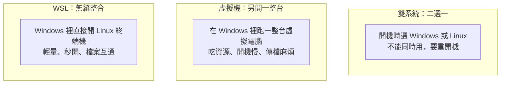
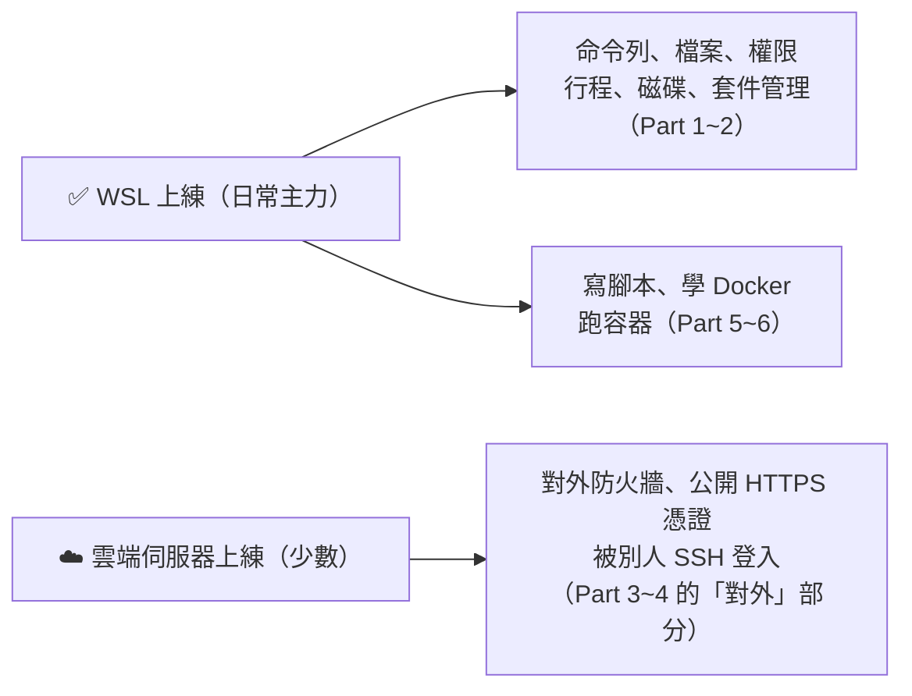

# [infra-0-1] WSL 是什麼？在 Windows 裡擁有一個真正的 Linux

> **本章目標**：理解 WSL 是什麼、它和雙系統/虛擬機的差別，以及為什麼它是在 Windows 上學 Linux 最舒服的方式。建立「我該在 WSL 練什麼、該在雲端伺服器練什麼」的清楚界線。

## 你會學到

- WSL（Windows Subsystem for Linux）是什麼
- WSL vs 雙系統（dual-boot）vs 虛擬機（VM）的差別
- 為什麼 WSL 很適合當這門課的練習環境
- 哪些練習在 WSL 做就好、哪些建議用雲端伺服器

## 概念說明

### 學 Linux 的人，卡在「我電腦是 Windows」

這門課的內容全是 Linux。但很多人用的是 Windows，於是卡在第一步：「我要去哪生一個 Linux 來練？」

以前的選項都有點麻煩：

- **裝雙系統（dual-boot）**：把硬碟切一塊裝 Linux，每次要用得「關機重開、切換系統」，跟 Windows 不能同時用，很不方便。
- **開虛擬機（VM）**：在 Windows 裡用 VirtualBox 之類的軟體跑一整台虛擬 Linux。可行，但吃資源、開機慢、和 Windows 之間傳檔案麻煩。

**WSL 把這些痛點幾乎全解決了。**

---

### WSL 是什麼？

**WSL（Windows Subsystem for Linux，Windows 的 Linux 子系統）** 是微軟官方做的功能，讓你**直接在 Windows 裡跑一個真正的 Linux**——不用重開機、不用切換系統，打開一個終端機視窗，你就在 Linux 裡了。

而且它跑的是**真正的 Linux**（目前的 WSL2 底層是一個真實的 Linux 核心），不是模擬、不是假裝。你在這門課學的 `apt`、`systemctl`、`chmod`……幾乎全部都能照跑。

用類比：WSL 就像在你的 Windows 桌面上，**開了一扇直通 Linux 世界的任意門**。門這邊是 Windows，推開門走進去就是完整的 Linux，兩邊還能互通有無，而且隨開隨用。

---

### 三種方式比一比



| | 雙系統 | 虛擬機 | **WSL** |
|---|--------|--------|---------|
| 能和 Windows 同時用 | ❌ 要重開機 | ✅ | ✅ |
| 啟動速度 | 慢（重開機） | 慢（開整台機） | **快（秒開）** |
| 吃資源 | — | 多 | **少** |
| 和 Windows 檔案互通 | 麻煩 | 麻煩 | **方便** |
| 是真正的 Linux | ✅ | ✅ | ✅（WSL2） |
| 安裝難度 | 高（要切硬碟） | 中 | **低（一行指令）** |

對「想學 Linux」的人來說，WSL 幾乎是全面勝出——這也是為什麼我們選它當這門課的主力練習環境。

> 你可能記得 Part 1-3（之後會學到）講過 VM 和容器。WSL2 的底層其實用了輕量虛擬化技術，但微軟把它包裝得非常無縫，你用起來完全不像在操作一台 VM。

---

### 重要：WSL 能練什麼、不能練什麼

WSL 很強，但它的定位是「**個人的 Linux 練習與開發環境**」，不是「對外服務的正式伺服器」。這條界線你要先清楚，後面學起來才不會困惑：



| 適合在 WSL 練 | 為什麼 |
|--------------|--------|
| Part 1~2 全部（命令列、檔案、權限、行程、磁碟、套件） | 這些是純 Linux 操作，WSL 上**零差異**，完美 |
| Part 5 Docker、Part 6 腳本與自動化 | WSL 完整支援，練起來很順 |

| 建議用雲端伺服器練 | 為什麼 |
|------------------|--------|
| 對外防火牆（Part 3-3 的「對外開放」） | WSL 在你電腦內部，沒有真的對外網路位址 |
| 公開 HTTPS 憑證（Part 4-4 certbot） | 需要一個指向你機器的公開網域，WSL 做不到 |
| 「被別人 SSH 登入」（Part 2-6 的 server 視角） | WSL 通常是你連出去，而不是被連進來 |

好消息是：你有 **AWS 帳號**。那少數需要「真實對外伺服器」的練習，正好開一台 AWS EC2 來做（這也順便預習了 AWS 課程）。**日常 90% 的 Linux 練習在 WSL，少數「對外」實作上雲——這是最理想的組合。**

> 別擔心要記這些。每個有 WSL 注意事項的章節，本課都會提醒你。現在只要建立「WSL 是主力、雲端補位」這個觀念就好。

## 程式碼範例

這一章是觀念建立，實際安裝在下一章（`infra-0-2`）。但你可以先用一個指令，確認你的 Windows 能不能跑 WSL。

打開 Windows 的 **PowerShell**（在開始選單搜尋 "PowerShell"），輸入：

```powershell
wsl --status
```

- 如果它回報了一些版本資訊，代表你的系統已經有 WSL（可能只是還沒裝 Linux 發行版）。
- 如果它說「找不到 wsl」或叫你先安裝，別緊張——下一章會帶你從零裝起。

也可以順便看看微軟提供哪些 Linux 版本可以裝：

```powershell
wsl --list --online
```

`--list --online` 會列出「線上可安裝」的發行版清單，你會看到 `Ubuntu`、`Debian` 等。這門課推薦用 **Ubuntu**（最主流、教學資源最多，本課指令也以它為準）。

## 小練習

### 練習 1：用「任意門」解釋 WSL

不看上面，用自己的話向朋友解釋：

1. WSL 跟「裝雙系統」最大的差別是什麼？
2. 為什麼對「想邊用 Windows 邊學 Linux」的人，WSL 比虛擬機方便？

---

### 練習 2：畫出你的「練習環境地圖」

用兩欄列出：哪些練習你打算在 **WSL** 做、哪些打算在 **AWS EC2** 做。（提示：純命令列的在 WSL，需要「對外」的上雲。）這份地圖會貫穿你整個 infra 學習。

---

### 練習 3：確認你的環境

在 Windows PowerShell 跑 `wsl --status` 和 `wsl --list --online`，看看：

1. 你的系統現在有沒有 WSL？
2. 可安裝的清單裡有沒有 `Ubuntu`？

記下結果——下一章就帶你把 Ubuntu 裝起來。

## 課外讀物

> 不管在 WSL 還是雲端伺服器，你都要常駐在終端機裡。想先打好終端機基礎 → [課外讀物 E-1-1：Terminal 是什麼？](../../../課外讀物/E-1-terminal/E-1-1-what-is-terminal.md)
