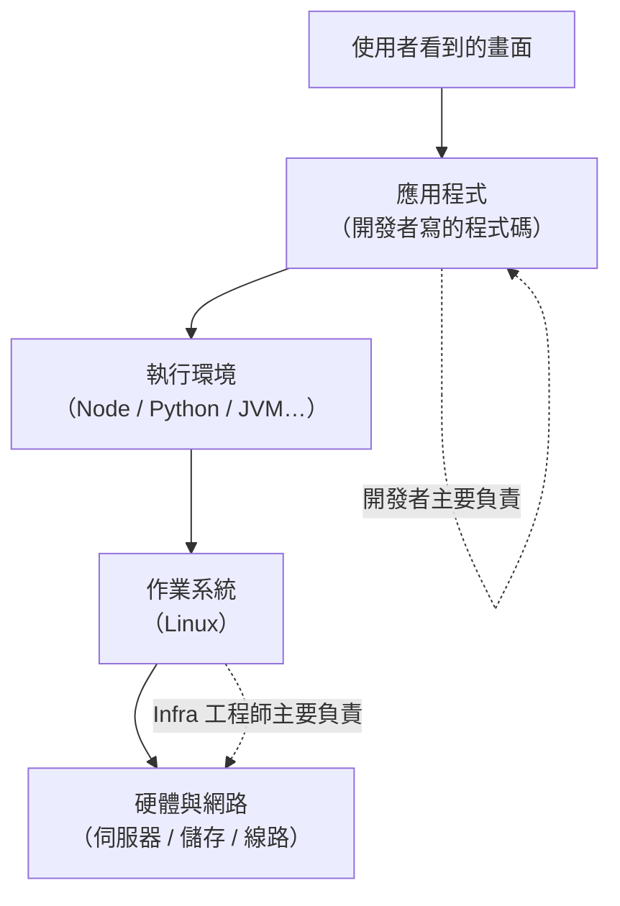

# [infra-1-1] Infra 工程師在做什麼？

> **本章目標**：搞懂「基礎建設工程師（Infrastructure Engineer）」這個角色到底在忙什麼，以及這門課要帶你變成什麼樣的人。

## 你會學到

- 「Infra」這個詞到底指什麼
- 用「蓋房子」的類比理解：開發者蓋的是哪一層、infra 顧的是哪一層
- Infra 工程師從以前到現在做的事有什麼改變
- 為什麼學會 infra，你看待整個系統的眼光會完全不一樣

## 概念說明

### 先說清楚：Infra 是什麼？

**Infra** 是 **Infrastructure（基礎建設）** 的簡稱。

在軟體的世界裡，它指的是「讓你的程式能真正跑起來、被全世界使用」所需要的**底層東西**——伺服器、作業系統、網路、儲存、那些把它們黏在一起的設定。

寫程式的人做出「應用程式」，而 infra 工程師負責**讓這個應用程式有地方住、有網路通、不會半夜掛掉、掛了能救回來**。

---

### 用蓋房子來理解

想像「一個線上服務」就是「一棟房子」。

```
你打開的網站 / App        ← 你看得到的：油漆、家具、裝潢
─────────────────────────
應用程式（你寫的程式碼）    ← 房間的格局、水龍頭怎麼接
─────────────────────────
執行環境（Node、Python…）  ← 室內的水電管線
─────────────────────────
作業系統（Linux）          ← 房子的結構、樑柱
─────────────────────────
硬體 + 網路（伺服器、線路） ← 地基、對外的水管電纜、馬路
```

寫程式的人通常專注在上面兩層（格局、裝潢）。

**Infra 工程師顧的是下面三層**：地基穩不穩、水電通不通、對外的馬路會不會塞車、房子失火了有沒有備援。

沒有地基和水電，再漂亮的裝潢也沒人住得進去。這就是 infra 的價值——它平常不顯眼，但少了它一切都垮。

---

### 視覺化：誰負責哪一層



這張圖在說：越往下越靠近「基礎建設」，那就是 infra 工程師的主戰場。開發者和 infra 工程師其實是上下接力，一起撐起整個服務。

---

### 從「機房管理員」到「基礎設施工程師」

Infra 這個角色，這二三十年變化很大：

| 年代 | 這個角色叫什麼 | 主要在做什麼 |
|------|--------------|------------|
| 以前 | 系統管理員（SysAdmin） | 在機房裡插線、裝伺服器、手動設定每一台機器 |
| 現在 | 基礎設施工程師 / DevOps | 用**程式碼**描述基礎建設、自動化部署、雲端管理 |

最大的差別是：**以前靠雙手，現在靠程式碼。**

以前要架 10 台一模一樣的伺服器，得一台一台手動裝、手動設定，又慢又容易出錯。現在我們把「這台機器該長什麼樣」寫成程式碼（這叫 **Infrastructure as Code，基礎設施即代碼**），一鍵就能複製出 10 台、100 台。

> 這就是為什麼這門課很多章節會教你「自動化」——這正是現代 infra 工程師和老派機房管理員最大的分水嶺。

---

### 一個稱職的 infra 工程師，平常在處理這些問題

- 「網站變超慢，是哪裡卡住了？」
- 「這台伺服器的硬碟快滿了，怎麼辦？」
- 「我要再多開 5 台一模一樣的機器，不要手動裝。」
- 「服務半夜掛了，能不能自動重啟、然後通知我？」
- 「資料庫的資料要怎麼定時備份，而且確定救得回來？」
- 「只開該開的網路門，別讓壞人連進來。」

這門課接下來，就是一個一個帶你動手解決這些問題——而且大多是在**你自己的那台 Linux 伺服器**上練習。

## 程式碼範例

對 infra 工程師來說，「程式碼」常常不是應用程式，而是**指令**和**設定檔**。

先給你嚐一口。下面這行指令是在問伺服器：「你已經連續開機跑多久了？」

```bash
uptime
```

它可能會回你這樣（先看個感覺，下一章和第 4 章會詳細解釋）：

```
 14:32:07 up 42 days,  3:11,  1 user,  load average: 0.08, 0.03, 0.01
```

這短短一行就藏了 infra 工程師關心的資訊：**這台機器穩穩跑了 42 天沒當機**（`up 42 days`）、**目前忙不忙**（`load average` 很低，代表很閒）。

你現在看不懂沒關係——學完這門課，這種「一眼就能讀懂機器狀態」的能力，就是你會獲得的東西。

## 小練習

### 練習 1：用「蓋房子」分析一個你常用的服務

挑一個你每天用的服務（YouTube、IG、線上銀行都行），試著回答：

1. 你「看得到」的部分（裝潢）是什麼？
2. 你「看不到」但一定存在的 infra（地基、水電、馬路）可能有哪些？（提示：影片存在哪裡？那麼多人同時看，伺服器要幾台？）

不用標準答案，重點是開始用「分層」的眼光看服務。

---

### 練習 2：分辨「開發問題」還是「Infra 問題」

下面幾個情境，你覺得比較像開發者該處理，還是 infra 工程師該處理？

1. 按鈕點下去顏色不對
2. 網站突然連不上，瀏覽器顯示「無法連線」
3. 計算購物車總金額時算錯了
4. 流量暴增時整個網站變超慢

> 提示：跟「程式邏輯」有關的偏開發；跟「機器、網路、容量」有關的偏 infra。但真實工作中兩邊常常要一起合作找答案。

## 課外讀物

> Infra 工程師幾乎所有操作都在終端機（Terminal）裡進行，如果你對終端機還不熟 → [課外讀物 E-1-1：Terminal 是什麼？](../../../課外讀物/E-1-terminal/E-1-1-what-is-terminal.md)
