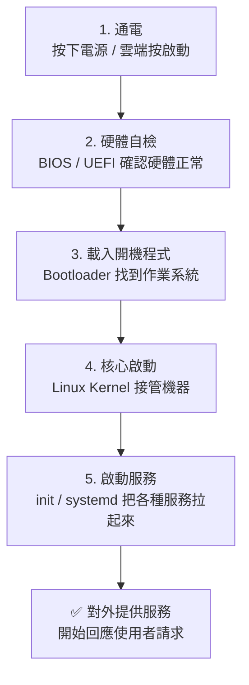

# [infra-1-2] 一台伺服器的一生：從通電到提供服務

> **本章目標**：理解一台伺服器從「通電」到「對外提供服務」中間發生了什麼事，建立一張「開機到服務」的心智地圖。

## 你會學到

- 伺服器（Server）和你的個人電腦差在哪
- 一台機器從按下電源到能服務使用者，中間經過哪些階段
- 「作業系統」「核心（Kernel）」「服務（Service）」在這條流程裡各自的角色
- 為什麼 infra 工程師要懂這條流程

## 概念說明

### 伺服器，其實就是一台「一直開著、專心做事」的電腦

很多人以為伺服器是什麼神祕高科技。其實**伺服器（Server）就是一台電腦**——只是它跟你桌上那台有幾個關鍵差別：

| | 你的個人電腦 | 伺服器 |
|---|------------|--------|
| 開機時間 | 用完就關 | **幾乎不關機**，一年 365 天待命 |
| 螢幕鍵盤 | 有，你直接操作 | 通常**沒有**，靠網路遠端登入 |
| 工作內容 | 陪你上網、打字、看影片 | **專心回應別人的請求**（網頁、API、檔案…） |
| 在哪裡 | 在你桌上 | 在機房 / 雲端的某個角落 |

「Server」這個字本身就是「伺候、服務」的意思——它存在的目的，就是**等著別人來請求，然後給出回應**。你打開網頁、傳訊息，背後都有一台伺服器在回應你。

---

### 用「早上起床」來理解開機流程

一台機器從通電到能做事，跟人類早上起床其實很像：

```
鬧鐘響（通電）
  → 睜開眼、確認自己還活著（硬體自我檢查）
  → 想起來「我是誰、今天要幹嘛」（載入作業系統）
  → 大腦開始運作（核心啟動）
  → 一個一個把該做的事準備好：刷牙、煮咖啡、開電腦（啟動各種服務）
  → 準備就緒，開始上班（對外提供服務）
```

伺服器也是一模一樣的順序，只是名詞換成技術術語。

---

### 開機流程的五個階段



這張圖是整台機器「醒來」的完整流程。我們一個一個看：

**1. 通電**：你按下實體電源鍵，或在雲端點「啟動執行個體」。電力進來，機器開始動。

**2. 硬體自檢（BIOS / UEFI）**：機器先檢查自己——記憶體在不在、硬碟接好沒。這套底層韌體叫 **BIOS**（Basic Input/Output System，基本輸入輸出系統）或它的現代版 **UEFI**。就像你睜眼後先確認手腳都還能動。

**3. 載入開機程式（Bootloader）**：硬體沒問題後，機器要去硬碟裡「找作業系統在哪」。負責這件事的小程式叫 **Bootloader**（開機載入器），Linux 上最常見的是 GRUB。

**4. 核心啟動（Kernel）**：Bootloader 把**作業系統的核心（Kernel）**叫醒。Kernel 是整個作業系統最核心的部分，它直接指揮硬體——管理記憶體、分配 CPU、控制硬碟和網路。可以把它想成機器的「大腦中樞」。

**5. 啟動服務（init / systemd）**：核心起來後，會交給一個「總管」程式，把所有該開的服務一個一個拉起來：網路、SSH（遠端登入）、網頁伺服器、資料庫……。現代 Linux 的這個總管叫 **systemd**（之後 Part 4 會專門教它）。

**6. 對外提供服務**：服務都起來後，機器準備就緒，開始回應外界的請求。它的「一天」正式開始，而且這一天可能會持續好幾百天不關機。

---

### 為什麼 infra 工程師要懂這條流程？

因為**故障可能發生在任何一個階段**。當伺服器「開不起來」或「連不上」，一個稱職的 infra 工程師腦中要能快速定位：

- 連電源訊號都沒有？→ 卡在第 1 階段（硬體 / 電力）
- 開機到一半停住？→ 可能是第 3、4 階段（開機程式或核心）
- 機器有開，但網站連不上？→ 多半是第 5 階段（某個服務沒起來）

懂這條流程，你就能像醫生問診一樣，一層一層往下排查，而不是瞎猜。

## 程式碼範例

機器跑起來後，有幾個指令可以「問」它現在的狀態。下面這些先看過就好，第 4 章你會在自己的伺服器上實際跑。

問它「開機多久了、現在幾點」：

```bash
uptime
```

問它「init 總管把哪些服務拉起來了、有沒有哪個掛掉」：

```bash
systemctl list-units --type=service --state=running
```

這行指令會列出所有「正在跑」的服務。`systemctl` 是用來跟 systemd（那個服務總管）溝通的指令——你叫它列出 `--state=running`（執行中）的 `--type=service`（服務）。

輸出大概像這樣（節錄）：

```
  ssh.service        OpenBSD Secure Shell server   ← 遠端登入服務
  nginx.service      A high performance web server ← 網頁伺服器
  cron.service       Regular background program... ← 排程任務
```

每一行就是一個「在這台機器上正在替你工作的服務」。infra 工程師很大一部分工作，就是在管理這些服務——讓該開的開著、該關的關掉、掛掉的自動重啟。

## 小練習

### 練習 1：把流程講給別人聽

不看上面的圖，試著用自己的話，把「伺服器從通電到提供服務」的五個階段講一遍。卡住的地方，就是你還沒真正理解的地方，回去再看一次。

---

### 練習 2：對應到「故障排查」

假設發生以下狀況，你覺得問題最可能卡在開機流程的哪個階段？

1. 雲端主機面板顯示「running」，但你的網站打開是「無法連線」
2. 機器完全沒反應，連面板都顯示「stopped」
3. 開機畫面停在一行錯誤訊息，進不了系統

> 提示：對照前面那張流程圖，從「電力 → 硬體 → 開機程式 → 核心 → 服務」一層層想。

---

### 練習 3：觀察你身邊「一直開著」的機器

想想看，你生活中還有哪些東西其實是「一台一直開著、等著回應請求的伺服器」？（提示：家裡的 Wi-Fi 分享器、智慧音箱……）它們也都有「開機 → 啟動服務 → 待命」的一生。

## 課外讀物

> 想了解使用者的請求是怎麼從瀏覽器「找到」這台伺服器的 → [課外讀物 E-3-1：網際網路是怎麼運作的？](../../../課外讀物/E-3-network/E-3-1-how-internet-works.md)
