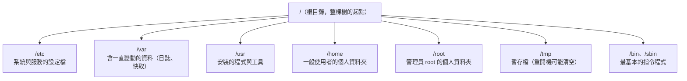

# [infra-2-1] 檔案系統與目錄結構：每個資料夾都有它的職責

> **本章目標**：看懂 Linux 的目錄結構，知道 `/etc`、`/var`、`/usr`、`/home` 這些資料夾各自放什麼，之後找檔案、改設定才不會迷路。

## 你會學到

- Linux 的檔案系統長得像一棵「從根長出來的樹」
- `/`（根目錄）底下幾個最重要的資料夾各自的職責
- 「設定檔放哪、日誌放哪、程式裝哪」的直覺
- Linux「一切皆檔案」的哲學

## 概念說明

### 整個系統，是一棵從「根」長出來的樹

在 Windows 你習慣有 `C:`、`D:` 這種「磁碟代號」。Linux 不一樣——**它只有一個起點，叫做「根目錄」，符號就是一條斜線 `/`**。所有東西，不管實際上存在哪顆硬碟，最後都掛在這棵樹的某個位置。

用一棟**有嚴格規矩的大樓**來想像：每一層樓、每個房間放什麼東西都有規定，不能亂塞。這樣任何人走進來，都知道「設定文件在 3 樓、雜物在地下室」。Linux 的目錄結構就是這套全世界通用的規矩。

---

### 視覺化：根目錄底下的主要房間



這張圖是你最常打交道的幾個資料夾。下面一個一個解釋它們的「職責」。

---

### 重點資料夾，記住它們的「人設」

| 資料夾 | 它的職責 | 你什麼時候會去這裡 |
|--------|---------|------------------|
| `/etc` | **設定檔大本營**（etc 唸 et-see） | 改 Nginx、SSH、各種服務的設定時 |
| `/var` | **會變動的資料**（variable 的縮寫） | 看日誌（`/var/log`）、找問題時 |
| `/usr` | **安裝的程式與工具** | 大部分軟體裝完後住這裡 |
| `/home` | **每個使用者的家** | 你登入後預設待的地方（`/home/你的帳號`） |
| `/root` | **管理員 root 的家** | 用 root 身分時的個人資料夾（注意它不在 /home 裡） |
| `/tmp` | **暫存區** | 放臨時檔案，別放重要東西（可能被清掉） |
| `/bin`、`/sbin` | **基本指令的本體** | 你打的 `ls`、`cd` 這些指令程式就放這 |

記憶口訣：**設定找 `/etc`、日誌找 `/var/log`、自己的東西在 `/home`。** 這三句話，能解決你 80% 的「東西到底在哪」的問題。

---

### 一個你馬上用得到的例子

假設你以後要改 SSH 的設定（Part 2-6 就會做），你會知道去這裡找：

```
/etc/ssh/sshd_config     ← SSH 服務的設定檔（在 /etc 設定大本營裡）
```

假設網站掛了要查日誌，你會知道去這裡看：

```
/var/log/nginx/error.log ← Nginx 的錯誤日誌（在 /var 變動資料裡）
```

看到沒？只要記得每個資料夾的「人設」，你不用死背路徑，也能猜到東西大概在哪。

---

### Linux 的哲學：一切皆檔案

Linux 有一個很特別、也很美的設計思想：**幾乎所有東西都被當成「檔案」來對待。**

不只是文件和照片——連「硬碟」「鍵盤」「正在跑的程式狀態」，在 Linux 眼裡都是某個路徑下的「檔案」。例如：

- 你的第一顆硬碟 → `/dev/sda`（dev 是 device 裝置）
- 系統正在跑的資訊 → `/proc` 底下的一堆「檔案」

這個設計的好處是：你只要學會「怎麼操作檔案」（讀、寫、複製），就能用同一套方法操作幾乎所有東西。這是 Linux 強大又一致的原因之一。

## 程式碼範例

下面這些指令幫你「逛」這棵目錄樹。建議登入你的伺服器邊看邊跑。

先跳到根目錄，看看最頂層有哪些資料夾：

```bash
cd /
ls
```

`cd` 是 change directory（切換目錄），`cd /` 就是「移動到根」。`ls` 列出當前位置的內容。

隨時想知道「我現在站在哪」，用：

```bash
pwd
```

`pwd` 是 print working directory（印出目前所在目錄），它會回你一條完整路徑，例如 `/home/ubuntu`。

進去設定大本營看看裡面有什麼：

```bash
ls /etc
```

你會看到一大堆設定檔和資料夾——這就是整台機器「怎麼被設定」的中樞。

如果你的系統裝了 `tree` 這個工具，可以用它把目錄結構畫成樹狀圖（只看兩層、避免太長）：

```bash
tree -L 2 /var
```

`-L 2` 代表「只展開 2 層」（Level 2）。你會清楚看到 `/var/log`、`/var/cache` 這些子資料夾的層次。

## 小練習

### 練習 1：猜猜看，再驗證

在登入伺服器**之前**，先猜：下面這些東西應該住在哪個資料夾？

1. 你登入後的個人檔案
2. SSH 服務的設定檔
3. 系統的日誌

猜完之後登入，用 `ls` 去對應的資料夾驗證你的直覺對不對。

---

### 練習 2：探索日誌資料夾

跑這個指令，看看你的伺服器記錄了哪些日誌：

```bash
ls /var/log
```

挑一個你看得懂名字的（例如 `auth.log`，記錄登入相關的事件），記下來——Part 8 處理安全時我們會回來看它。

---

### 練習 3：理解「一切皆檔案」

跑這個指令，看看你的 CPU 資訊（它其實是一個「假裝成檔案」的系統資訊）：

```bash
cat /proc/cpuinfo
```

`cat` 是把檔案內容印出來的指令。想想看：CPU 明明是硬體，為什麼能用「讀檔案」的方式看它的資訊？這就是「一切皆檔案」哲學的體現。

## 課外讀物

> 想更熟練地在目錄之間移動、用指令操作檔案 → [課外讀物 E-1-2：基本導航指令](../../../課外讀物/E-1-terminal/E-1-2-basic-navigation.md)
