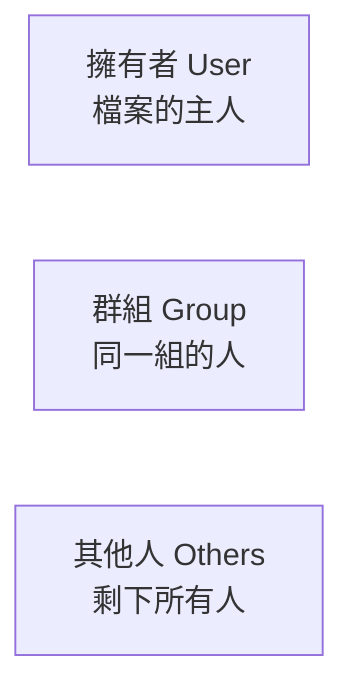

# [infra-2-2] 使用者、群組與權限：誰能對哪些檔案做什麼

> **本章目標**：看懂 Linux 的權限系統，能讀懂 `-rwxr-xr--` 這串符號，並用 `chmod`、`chown` 調整誰能讀、寫、執行一個檔案。

## 你會學到

- 使用者（User）、群組（Group）、其他人（Others）三種身分
- 讀（r）、寫（w）、執行（x）三種權限
- 怎麼讀懂 `ls -l` 列出來的那串權限符號
- 用 `chmod` 改權限、`chown` 改擁有者
- `root` 與 `sudo`：超級權限為什麼又強又危險

## 概念說明

### 為什麼需要權限？

伺服器常常是「很多人、很多服務」共用的。如果每個人都能改每個檔案、能讀每個人的資料，那一定天下大亂、也毫無安全可言。

所以 Linux 替每個檔案都標記了兩件事：

1. **這個檔案是「誰的」**（擁有者）
2. **誰能對它做什麼**（讀 / 寫 / 執行）

用**公司的檔案櫃**來類比：每個櫃子有主人，主人能決定「我自己能開、同部門同事能看、其他部門碰不得」。Linux 的權限就是這套規矩，只是更精準。

---

### 三種身分 × 三種權限

Linux 把「誰」分成三種身分：



把「能做什麼」分成三種權限：

| 符號 | 英文 | 對**檔案**的意思 | 對**資料夾**的意思 |
|------|------|----------------|------------------|
| `r` | read（讀） | 能看內容 | 能列出裡面有什麼 |
| `w` | write（寫） | 能修改內容 | 能新增 / 刪除裡面的檔案 |
| `x` | execute（執行） | 能當程式執行 | 能「進入」這個資料夾（`cd` 進去） |

「三種身分」各自有「三種權限」，組合起來就是 Linux 權限的全貌。

---

### 讀懂那串神祕符號：`-rwxr-xr--`

用 `ls -l` 列檔案時，最前面會出現一串像 `-rwxr-xr--` 的符號。它看起來像亂碼，其實有嚴格結構。把它切開看：

```
-  rwx  r-x  r--
│   │    │    │
│   │    │    └── 其他人（Others）的權限：r-- → 只能讀
│   │    └─────── 群組（Group）的權限：  r-x → 能讀、能執行
│   └──────────── 擁有者（User）的權限： rwx → 能讀、能寫、能執行
└──────────────── 檔案類型：- 是普通檔案，d 是資料夾（directory）
```

所以 `-rwxr-xr--` 翻成白話是：「這是一個普通檔案，**主人**能讀寫執行、**同群組的人**能讀和執行、**其他人**只能讀。」

有 `x` 的位置如果換成 `-`，代表「沒有這個權限」。學會切這三段，你就能一眼讀懂任何檔案的權限。

---

### 用數字表示權限：755 是什麼意思？

你常會看到別人說「把它設成 755」。這是權限的**數字寫法**，原理是把 r、w、x 當成數字相加：

| 權限 | 數字 |
|------|------|
| r（讀） | 4 |
| w（寫） | 2 |
| x（執行） | 1 |

每一組身分把它擁有的權限數字加起來：

```
rwx = 4 + 2 + 1 = 7
r-x = 4 + 0 + 1 = 5
r-- = 4 + 0 + 0 = 4
```

所以 `-rwxr-xr--` 用數字寫就是 **754**。而常見的 **755** = `rwxr-xr-x`（主人全開、其他人能讀能執行），常用在「程式」和「資料夾」；**644** = `rw-r--r--`（主人能讀寫、其他人只能讀），常用在「一般檔案」。

---

### root 與 sudo：那個能無視一切權限的人

上面的權限規則，對一個人是例外的——**`root`（超級使用者）**。root 是系統的最高管理員，**它無視所有權限限制**，能讀寫刪除任何檔案、能關掉任何服務。

這很強，但也極度危險：一個打錯的指令（例如不小心刪掉系統檔案），用 root 執行就真的會把整台機器毀掉，沒有人攔得住你。

所以現代的做法是：**平常別用 root**，而是用一般帳號，需要管理員權限時，在指令前面加上 `sudo`。

`sudo` 是 "superuser do"（以超級使用者身分執行），意思是「這一個指令，請暫時借我管理員權限」。這樣既能做該做的事，又不會整天暴露在 root 的高風險下。

> 「平常用一般帳號、必要時才 `sudo`」這個習慣，正是 Part 2-6 動手做要幫你的伺服器建立起來的安全基礎。

## 程式碼範例

列出檔案的詳細權限（`-l` 是 long，詳細格式）：

```bash
ls -l
```

輸出像這樣：

```
-rw-r--r-- 1 ubuntu ubuntu  220 Jun 21 10:00 notes.txt
drwxr-xr-x 2 ubuntu ubuntu 4096 Jun 21 10:01 myfolder
```

第一欄是權限符號，第三、四欄 `ubuntu ubuntu` 分別是「擁有者」和「擁有群組」。第一行是普通檔案（開頭 `-`），第二行是資料夾（開頭 `d`）。

改一個檔案的權限，用 `chmod`（change mode）。例如把腳本設成「主人可執行、其他人只能讀」的 755：

```bash
chmod 755 myscript.sh
```

也可以用符號寫法，例如「幫擁有者加上執行權限」：

```bash
chmod u+x myscript.sh
```

`u` 是 user（擁有者）、`+x` 是「加上執行權限」。同理 `g`（group）、`o`（others）、`a`（all）。

改一個檔案的擁有者，用 `chown`（change owner）。這通常需要管理員權限，所以前面加 `sudo`：

```bash
sudo chown ubuntu:ubuntu notes.txt
```

格式是 `chown 擁有者:群組 檔案`。這行把 `notes.txt` 的擁有者和群組都設成 `ubuntu`。

## 小練習

### 練習 1：當一次「權限翻譯機」

不查表，把下面三串權限翻成白話（誰能做什麼）：

1. `-rw-------`
2. `drwxr-xr-x`
3. `-rwxrwxrwx`

> 提示：第 3 個（777，所有人都能讀寫執行）在真實世界其實是個**安全警訊**——代表這個檔案門戶大開，任何人都能改。

---

### 練習 2：數字與符號互換

1. `rw-r--r--` 用數字寫是多少？
2. 數字 `700` 換成符號是什麼？它代表什麼意思？

---

### 練習 3：在伺服器上實驗

在你的伺服器上做一次完整流程：

```bash
echo "hello" > test.txt   # 建立一個檔案
ls -l test.txt            # 看它預設的權限
chmod 600 test.txt        # 改成只有主人能讀寫
ls -l test.txt            # 再看一次，有什麼變化？
```

觀察 `chmod 600` 前後，權限符號的變化，對照前面的「數字表」確認你算的對不對。
