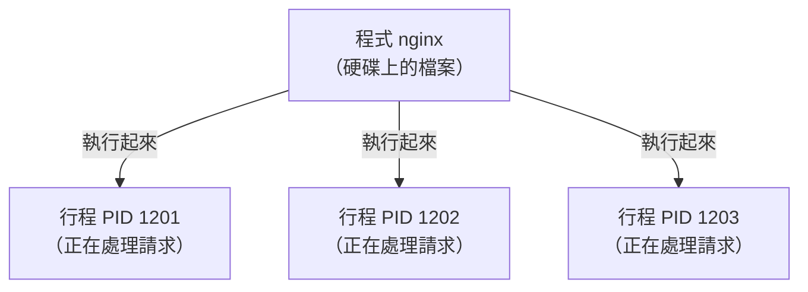

# [infra-2-3] 行程與資源：誰在吃你的 CPU 和記憶體

> **本章目標**：理解「行程（Process）」是什麼，學會用 `ps`、`top`、`htop` 看機器上正在跑什麼、誰最吃資源，並在必要時把失控的行程關掉。

## 你會學到

- 「程式」和「行程（Process）」的差別
- 每個行程的身分證號碼：PID
- 用 `ps`、`top`、`htop` 觀察行程與資源使用
- CPU、記憶體、Load Average 怎麼看
- 怎麼安全地結束一個卡死的行程

## 概念說明

### 程式 vs 行程：食譜與正在煮的那鍋

這兩個詞很容易混，先用類比講清楚：

- **程式（Program）**：躺在硬碟上、還沒跑起來的檔案。就像一張**食譜**，靜靜放在那。
- **行程（Process）**：程式被執行起來、正在運作的「那個實例」。就像你**照著食譜，正在爐子上煮的那一鍋湯**。

同一張食譜（程式）可以同時煮很多鍋（多個行程）。例如 Nginx 這一個程式，跑起來後可能同時有好幾個行程在處理不同使用者的請求。

**Infra 工程師關心的幾乎都是「行程」**——因為正在跑的東西才會吃 CPU、吃記憶體、才會出問題。

---

### 每個行程都有一個身分證：PID

機器上同時有幾十、幾百個行程在跑。為了區分它們，系統給每個行程一個獨一無二的號碼，叫 **PID（Process ID，行程識別碼）**。

之後你要對某個行程做事（例如把它關掉），就是靠這個 PID 來指定「我要操作的是哪一個」。



這張圖在說：一個程式可以開出多個行程，每個行程有自己的 PID。

---

### 三個關鍵指標：CPU、記憶體、Load Average

觀察行程時，你會一直看到這三個數字，先搞懂它們：

| 指標 | 白話 | 太高代表 |
|------|------|---------|
| **CPU %** | 這個行程佔用了多少運算力 | 機器在「忙著算東西」，可能算不過來 |
| **記憶體（MEM）** | 這個行程佔了多少 RAM | RAM 快用光，機器會開始變慢甚至當掉 |
| **Load Average** | 整台機器的「平均排隊長度」 | 工作多到 CPU 來不及處理，大家在排隊 |

**Load Average** 特別要解釋一下。它通常顯示三個數字，例如 `0.50, 0.30, 0.10`，分別代表「過去 1 分鐘、5 分鐘、15 分鐘」的平均負載。

一個直覺的判讀法：把它跟你的 **CPU 核心數**比。如果你的機器有 2 顆核心，load average 在 2 以下大致還算健康（每顆核心剛好有事做）；遠超過核心數，代表工作正在大排長龍——機器過載了。

---

### 怎麼知道你有幾顆核心？

```bash
nproc
```

`nproc` 會回你一個數字，例如 `2`，代表這台機器有 2 顆 CPU 核心。記住這個數字，看 load average 時就有了判斷基準。

## 程式碼範例

### 用 `ps` 拍一張「此刻的快照」

`ps`（process status）列出當下正在跑的行程。最常用的組合是：

```bash
ps aux
```

`aux` 是三個選項的組合：`a`（所有使用者的行程）、`u`（顯示是誰跑的、吃多少資源）、`x`（連背景行程也列出來）。輸出像這樣（節錄）：

```
USER   PID  %CPU %MEM    VSZ   RSS COMMAND
root     1   0.0  0.4 168000 12000 /sbin/init
ubuntu 1201 12.3  5.1 720000 98000 nginx
```

你能讀到：`nginx` 這個行程 PID 是 1201、正在吃 12.3% 的 CPU 和 5.1% 的記憶體。

通常會搭配 `grep` 過濾出你想找的，例如只看 nginx 相關的行程：

```bash
ps aux | grep nginx
```

`|`（管道符號）把 `ps aux` 的輸出「倒」給 `grep nginx` 去過濾，只留下含有 "nginx" 的那幾行。這是終端機裡超常用的組合技。

---

### 用 `top` / `htop` 看「即時動態」

`ps` 是拍快照，`top` 則是**即時、會自動更新**的儀表板：

```bash
top
```

畫面最上方是整體狀態（load average、記憶體用量），下方是行程列表，預設**按 CPU 用量由高到低排序**——所以最吃資源的「兇手」會排在最上面。看完按 `q`（quit）離開。

如果你的系統有裝 `htop`，它是 `top` 的彩色加強版，更好讀、能用方向鍵選行程：

```bash
htop
```

沒裝的話可以自己裝（下一章 2-5 會教套件管理）：

```bash
sudo apt install htop
```

---

### 關掉一個失控的行程：`kill`

假設某個行程卡死、狂吃 CPU，你要把它關掉。先用前面的方法找到它的 PID，然後：

```bash
kill 1201
```

這會「禮貌地」請 PID 1201 的行程自己收尾結束。如果它賴著不走（真的卡死了），才用強制手段：

```bash
kill -9 1201
```

`-9` 是「強制終止」訊號，直接把它砍掉、不給它收尾機會。

> ⚠️ `kill -9` 是最後手段。它不給程式存檔、清理的機會，可能造成資料沒寫完。永遠先試普通的 `kill`，逼不得已才用 `-9`。

## 小練習

### 練習 1：找出最吃資源的行程

在你的伺服器上跑 `top`，觀察 30 秒。記下：

1. 排在最上面（最吃 CPU）的是哪個行程？
2. 目前的 load average 是多少？對照你的核心數（`nproc`），機器算忙還是閒？

---

### 練習 2：精準找出某個服務

用管道組合，找出你伺服器上 `ssh` 服務的行程與 PID：

```bash
ps aux | grep ssh
```

想想看：為什麼結果裡可能會出現一行 `grep ssh` 自己？（提示：`grep` 自己也是一個正在跑的行程。）

---

### 練習 3：安全地建立並結束一個行程

做一次完整的「製造行程 → 觀察 → 結束」流程：

```bash
sleep 300 &        # 在背景跑一個「睡 300 秒」的行程
```

`&` 讓它在背景跑。系統會回你一個 PID。用 `ps aux | grep sleep` 確認它在跑，然後用 `kill PID`（換成剛剛的號碼）把它關掉。這就是一次最小的行程管理實戰。
