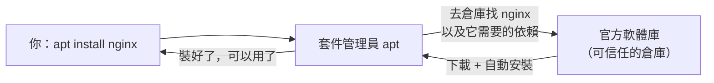

# [infra-2-5] 套件管理：用一行指令安裝、更新軟體

> **本章目標**：理解 Linux 的「套件管理員」是什麼，學會用 `apt`（或 `dnf`）安裝、更新、移除軟體，並知道為什麼不該到處亂下載安裝。

## 你會學到

- 什麼是套件（Package）和套件管理員（Package Manager）
- 軟體庫（Repository）與依賴（Dependency）的概念
- `apt` 的四大日常指令：update / upgrade / install / remove
- 為什麼用套件管理員比「自己下載安裝」安全又省事

## 概念說明

### 在 Linux 安裝軟體，跟你想的不一樣

在 Windows / Mac，你裝軟體通常是「上網找官網 → 下載安裝檔 → 一直按下一步」。

Linux 不是這樣。它有一個內建的「**套件管理員（Package Manager）**」，你只要打一行指令，它就會自動幫你**下載、安裝、設定好**。這比手動下載安全也方便太多了。

如果你學過前端的 `npm`，會覺得超眼熟——**`apt` 之於 Linux，就像 `npm` 之於 Node.js**。都是「打一行指令，自動把軟體和它需要的東西裝好」。

---

### 三個關鍵詞：套件、軟體庫、依賴

**套件（Package）**：把一個軟體「打包」好的檔案，裡面包含程式本體、設定、以及安裝說明。你不用自己編譯，拿到就能裝。

**軟體庫（Repository，常簡稱 repo）**：一個由官方維護的「**可信任的軟體倉庫**」。套件管理員只從這些官方倉庫下載，而不是網路上隨便一個來路不明的網站。這就是它「安全」的關鍵——東西都經過審核。

**依賴（Dependency）**：很多軟體要靠別的軟體才能跑。例如你裝 A，但 A 需要 B 和 C 才能運作，B、C 就是 A 的「依賴」。套件管理員最棒的地方就是：**它會自動幫你把依賴一起裝好**，你不用自己一個個去找。



這張圖在說：你只下一個指令，套件管理員就跑完「找倉庫 → 處理依賴 → 下載 → 安裝」整套流程。

---

### 不同 Linux 用不同的套件管理員

你不用全部記，知道「看到哪個用哪個」就好：

| 套件管理員 | 常見於哪些系統 | 套件格式 |
|-----------|--------------|---------|
| `apt` | Ubuntu、Debian（最常見，本課以此為主） | `.deb` |
| `dnf` / `yum` | Fedora、CentOS、RHEL、Amazon Linux | `.rpm` |

指令邏輯都很像，學會一個，換另一個查一下對照表就會了。下面以 `apt` 為主。

> 你的雲主機如果是 Ubuntu，用 `apt`；如果是 Amazon Linux，用 `dnf`。不確定的話，前一章學過的方式可以幫你判斷系統類型。

## 程式碼範例

### apt 的四大日常指令

**1. 更新「軟體清單」（不是更新軟體本身）**

```bash
sudo apt update
```

這一步常被誤會。它**不是**升級你的軟體，而是去問各個軟體庫：「你們現在有哪些套件、各是什麼最新版本？」——更新的是「目錄清單」。**裝任何東西之前，習慣先跑這個**，確保你拿到的是最新資訊。

**2. 升級已安裝的軟體**

```bash
sudo apt upgrade
```

這才是真正把你已經裝好的軟體，升級到軟體庫裡的最新版。通常 `update` 和 `upgrade` 會連著用：先更新清單，再依清單升級。

**3. 安裝新軟體**

```bash
sudo apt install htop
```

這行就會把上一章提到的 `htop` 裝好（連同它的依賴）。要裝別的，把 `htop` 換掉即可。

**4. 移除軟體**

```bash
sudo apt remove htop
```

把不要的軟體移除。如果想連它留下的設定檔也一起清掉，用 `sudo apt purge htop`。

---

### 為什麼這些都要 `sudo`？

注意上面每個指令前面都有 `sudo`。因為安裝、移除軟體會更動到**整台機器的系統檔案**（還記得 2-2 學的嗎？這需要管理員權限）。而 `apt update` 只是讀清單寫到系統目錄，同樣需要權限。

這也呼應了「平常用一般帳號、需要時才 `sudo`」的安全習慣。

---

### 為什麼不要「自己上網下載安裝」？

你也許會想：我直接去某個網站下載一個安裝檔來跑不行嗎？可以，但有三個風險，能避則避：

1. **安全**：來路不明的安裝檔可能藏惡意程式。官方軟體庫的套件經過審核與簽章驗證。
2. **依賴地獄**：手動裝你得自己找齊所有依賴，少一個就跑不起來，非常痛苦。
3. **難以維護**：手動裝的軟體，之後要升級、移除都得自己處理。套件管理員會幫你統一管理。

**結論：能用 `apt install` 就別手動下載。** 這是 infra 的良好習慣。

## 小練習

### 練習 1：跑一次標準更新流程

在你的伺服器上，跑一次最常見的維護組合（兩個指令連著跑）：

```bash
sudo apt update
sudo apt upgrade
```

觀察 `apt update` 列出有多少套件「可以升級」，再決定要不要 `upgrade`。

---

### 練習 2：安裝一個好用工具

裝上一章提過的 `htop`，然後實際跑跑看：

```bash
sudo apt install htop
htop
```

感受一下它比 `top` 好讀在哪。看完按 `q` 離開。

---

### 練習 3：理解 update 與 upgrade 的差別

用自己的話回答：

1. `apt update` 到底更新了什麼？
2. 如果跳過 `apt update` 直接 `apt upgrade`，可能會發生什麼問題？

> 提示：想想「目錄清單」如果是舊的，會怎麼影響升級。

## 課外讀物

> `apt` 和前端的 `npm` 是同一種概念，想對照理解「套件管理員」「依賴」這些詞 → [課外讀物 E-2-1：npm 是什麼？package.json 解析](../../../課外讀物/E-2-npm/E-2-1-npm-intro.md)
