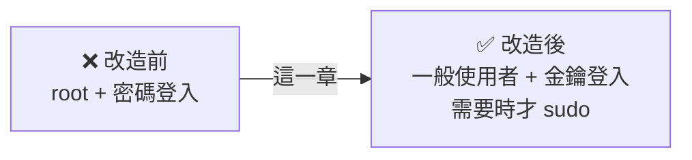

# [infra-2-6] 🔧 動手做：建立安全的登入——非 root 使用者、sudo、SSH 金鑰

> **本章目標**：把前面學的權限與帳號觀念，實際套用到你的伺服器：建立一個有 `sudo` 權限的一般使用者、改用 SSH 金鑰登入、並關掉風險最高的「密碼登入」與「root 直接登入」。

## 你會學到

- 為什麼「平常別用 root、別用密碼登入」是伺服器的第一道安全防線
- 建立新使用者並賦予 `sudo` 權限
- SSH 金鑰（公鑰 / 私鑰）的原理與設定
- 安全地關閉密碼登入與 root 登入（含「不要把自己鎖在門外」的保命步驟）

## 概念說明

### 為什麼預設的登入方式不夠安全？

很多人租到雲主機，就一直用 `root` + 密碼登入。這有兩個大問題：

1. **直接用 root 太危險**：root 無視所有權限（還記得 2-2 嗎？），一個手滑就能毀掉整台機器，而且如果被入侵，對方直接拿到最高權限。
2. **密碼會被「暴力破解」**：你的伺服器一上線，全世界的攻擊程式就會不斷嘗試 `root` + 各種常見密碼猛敲你的 SSH 大門。密碼再強，也是在跟機器人比運氣。

這一章就是要把這兩個漏洞補起來，建立伺服器的**第一道安全防線**。

---

### 解法：一般使用者 + sudo + SSH 金鑰

我們要把登入方式改造成這樣：



三個改造重點：

1. **建立一般使用者**：平常用它，把 root 收起來。
2. **賦予 sudo 權限**：需要管理員權限時，加 `sudo` 就好，不必登入 root。
3. **改用 SSH 金鑰**：用一對「鑰匙」代替密碼，安全性高得多。

---

### SSH 金鑰：一把「無法用猜的」的鑰匙

密碼可以被猜、被暴力破解；SSH 金鑰不行。它的原理是一對成對的鑰匙：

- **私鑰（Private Key）**：留在**你自己電腦**，像你家鑰匙，**絕對不能外流**。
- **公鑰（Public Key）**：放到**伺服器**上，像一個只認得你那把私鑰的鎖。

登入時，伺服器用公鑰出一道「只有對應私鑰才解得開」的數學題。你的電腦用私鑰解開，證明「我就是我」，門就開了——**全程不需要傳密碼**。

用類比：公鑰是一個特製的鎖、私鑰是唯一能開它的鑰匙。你把鎖（公鑰）裝到伺服器門上，鑰匙（私鑰）自己收好。別人就算複製了那個鎖，也打不開——因為他沒有你的鑰匙，而鑰匙又無法用猜的。

## 程式碼範例

> ⚠️ **全程最重要的安全原則**：做到「關閉密碼登入」那一步**之前**，務必先確認「金鑰登入」真的成功了，而且**保留一個還連著的 SSH 視窗別關**。否則一旦設定出錯，你會把自己鎖在伺服器門外。

### 第一步：建立一般使用者（在伺服器上）

用 root（或現有帳號）登入伺服器後，建立一個新使用者，例如叫 `deploy`：

```bash
sudo adduser deploy
```

它會請你設定密碼、填一些可跳過的資料（直接按 Enter）。這就建立了一個全新的一般使用者，以及它的家目錄 `/home/deploy`。

---

### 第二步：給它 sudo 權限

把 `deploy` 加進 `sudo` 群組（還記得 2-2 的「群組」嗎？這個群組的成員就能用 sudo）：

```bash
sudo usermod -aG sudo deploy
```

`usermod` 是修改使用者，`-aG sudo` 是「append（附加）到 Group `sudo`」。`-a` 很重要，代表「附加」而不是「取代」，避免把使用者原本的群組洗掉。

> Ubuntu/Debian 的管理員群組叫 `sudo`；某些系統（如 Amazon Linux、CentOS）叫 `wheel`，那就把指令裡的 `sudo` 換成 `wheel`。

---

### 第三步：在「你自己的電腦」產生金鑰

切回**你自己電腦**的終端機（不是伺服器），檢查是否已有金鑰：

```bash
ls ~/.ssh/id_ed25519.pub
```

如果顯示「找不到」，就產生一把新的：

```bash
ssh-keygen -t ed25519 -C "你的email或註記"
```

`-t ed25519` 指定一種現代又安全的金鑰類型。過程會問你存放位置（按 Enter 用預設）和「通關密語（passphrase）」——建議設一個，這樣連私鑰檔案被偷了也多一層保護。完成後你會得到一對檔案：`id_ed25519`（私鑰，留著）和 `id_ed25519.pub`（公鑰，要送上伺服器）。

---

### 第四步：把公鑰送上伺服器

最簡單的方式是用 `ssh-copy-id`（在你自己電腦執行，換成你的帳號和 IP）：

```bash
ssh-copy-id deploy@伺服器IP位址
```

它會請你輸入一次 `deploy` 的密碼，然後自動把你的**公鑰**安裝到伺服器上 `deploy` 的 `~/.ssh/authorized_keys` 裡。這個檔案就是「這台機器認得的鎖清單」。

---

### 第五步：測試金鑰登入（關鍵驗證！）

**先別關任何視窗**，開一個新的終端機，試著用金鑰登入：

```bash
ssh deploy@伺服器IP位址
```

如果它**沒問你密碼**（或只問你私鑰的 passphrase）就讓你進去了——成功！金鑰登入正常運作。**確認這一步成功，是下一步的前提。**

---

### 第六步：關閉密碼登入與 root 登入

現在，用 `deploy` 登入後，編輯 SSH 服務的設定檔（位置還記得嗎？在 `/etc` 設定大本營，2-1 學過）：

```bash
sudo vi /etc/ssh/sshd_config
```

找到並修改（或新增）這兩行，把值改成 `no`：

```
PermitRootLogin no
PasswordAuthentication no
```

`PermitRootLogin no` = 不准 root 直接 SSH 登入；`PasswordAuthentication no` = 不准用密碼登入，只認金鑰。存檔離開（vi 的操作：按 `i` 進入編輯模式、改完按 `Esc` 退出編輯、再輸入 `:wq` 存檔離開）。

讓設定生效，重啟 SSH 服務：

```bash
sudo systemctl restart ssh
```

> ⚠️ **保命步驟**：重啟後，**不要關掉你目前這個還連著的視窗**。另開一個新終端機測試 `ssh deploy@IP` 還能不能進去。確認新連線正常，才能安心關掉舊視窗。萬一進不去，舊視窗還連著，你還能改回設定救自己。

完成後，你的伺服器登入方式就從「root + 密碼」升級成「一般使用者 + 金鑰」——擋掉了絕大多數自動化攻擊。

## 小練習

### 練習 1：完成整套改造

在你的伺服器上，從第一步做到第六步，建立一個有 sudo 權限的使用者並切換到金鑰登入。做的時候，每一步都對照「這在解決前面說的哪個安全問題」。

---

### 練習 2：驗證防線生效

改造完成後，故意測試看看防線有沒有生效：

```bash
ssh root@伺服器IP位址
```

如果它**拒絕你**（或不接受密碼），代表 `PermitRootLogin no` 真的生效了。這是個好消息——你親手擋掉了攻擊者最愛的入口。

---

### 練習 3：理解「為什麼要保留一個視窗」

用自己的話解釋：為什麼修改 `sshd_config` 並重啟服務時，一定要保留一個已連線的視窗、並用新視窗測試？如果不這樣做，最糟會發生什麼事？

> 提示：想想「設定打錯字 + 把自己踢出去 + 又進不來」這個組合。這也是 infra 工作中「為自己留退路」的重要思維。

## 課外讀物

> 想更完整理解 SSH 的運作原理與金鑰管理 → [課外讀物 E-1-7：SSH 基礎](../../../課外讀物/E-1-terminal/E-1-7-ssh-basics.md)
