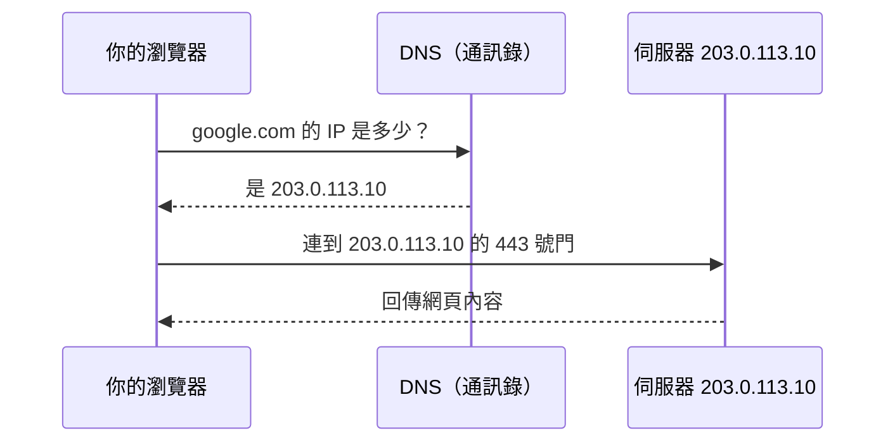

# [infra-3-1] IP、Port、DNS：封包怎麼找到你的伺服器

> **本章目標**：搞懂 IP、Port、DNS 三個網路最基本的概念，理解「一個請求從瀏覽器到你伺服器」中間是怎麼找到路的。

## 你會學到

- IP 位址、Port（埠）、DNS 分別在做什麼
- 用「寄一封信」的類比把三者串起來
- 公開 IP vs 私有 IP、`localhost` 是什麼
- 怎麼查出你伺服器自己的 IP

## 概念說明

### 用「寄一封信」理解整套網路

你要寄信給朋友，需要三樣東西：**地址**（房子在哪）、**收件人**（家裡的哪個人）、有時還需要一本**電話簿/通訊錄**（把「朋友的名字」查成「實際地址」）。

網路上找到一台伺服器，需要的東西幾乎一模一樣：

| 寄信 | 網路 | 作用 |
|------|------|------|
| 房子的地址 | **IP 位址** | 定位「是哪一台機器」 |
| 家裡的哪個人 | **Port（埠）** | 定位「是這台機器上的哪個服務」 |
| 通訊錄（名字→地址） | **DNS** | 把好記的網域名稱，查成 IP 位址 |

下面一個一個看。

---

### IP 位址：機器在網路上的「地址」

**IP（Internet Protocol，網際網路協定）位址**是每一台連網裝置的「門牌號碼」。最常見的長這樣（IPv4）：

```
203.0.113.10
```

四組數字、用點隔開。網路上的封包，就是靠這個位址找到「要送到哪一台機器」。

有兩種你要分清楚：

- **公開 IP（Public IP）**：全世界都連得到的位址，像你家對外的正式地址。你的雲主機有一個公開 IP，別人才連得進來。
- **私有 IP（Private IP）**：只在內部網路有效，像「社區內部的 3 棟 5 樓」，出了社區就沒意義。常見的私有範圍是 `10.x.x.x`、`192.168.x.x`（這個你家 Wi-Fi 就在用）。

還有一個特別的：**`127.0.0.1`，叫 `localhost`**——它永遠指「我自己這台機器」。當你在伺服器上測試「服務有沒有起來」，常會連 `localhost`，意思是「連我自己」。

---

### Port：同一台機器上的「哪個服務」

一台伺服器通常**同時跑很多服務**：網頁、SSH、資料庫……。光有 IP 只能找到「這台機器」，還不夠——要再指定「**這台機器上的哪個服務**」。這就是 **Port（埠）** 的作用，像「這棟房子裡的哪個房間 / 哪個部門」。

Port 是 0 到 65535 的數字，有些是大家約定俗成的「標準門牌」：

| Port | 服務 | 你在哪學過 |
|------|------|-----------|
| `22` | SSH（遠端登入） | Part 1、Part 2-6 |
| `80` | HTTP（網頁，未加密） | basic Part 4 |
| `443` | HTTPS（網頁，加密） | Part 4 會教 |
| `5432` | PostgreSQL（資料庫） | basic Part 5 |

所以「`203.0.113.10:443`」這種寫法的意思就是：**203.0.113.10 這台機器，的 443 號門（HTTPS 網頁服務）**。`:` 後面接的就是 port。

---

### DNS：把「名字」翻成「地址」的電話簿

沒有人想背 `203.0.113.10` 這種數字。我們習慣打 `google.com` 這種好記的名字。但網路底層只認得 IP——所以需要一個「翻譯層」。

**DNS（Domain Name System，網域名稱系統）** 就是網路世界的通訊錄：你給它一個名字（`google.com`），它回你對應的 IP 位址。



這張圖在說：瀏覽器其實是「先查通訊錄（DNS）拿到地址（IP），再帶著門牌號（Port）去敲門」。你平常輸入一個網址，背後就跑完了這整套。

---

### 串起來：一個請求的完整旅程

當你打開 `https://myapp.com`：

1. 瀏覽器問 **DNS**：`myapp.com` 的 IP 是多少？→ 拿到 `203.0.113.10`
2. 因為是 `https`，瀏覽器知道要走 **443 號 Port**
3. 封包帶著「**IP 203.0.113.10 + Port 443**」出發，找到你的伺服器與上面的網頁服務
4. 伺服器處理後，把網頁送回來

這就是 IP、Port、DNS 三者合作的全貌。身為 infra 工程師，當「連不上」發生時，你要能判斷是這三層的哪一層出了問題（Part 3-4 的工具就是幹這個的）。

## 程式碼範例

查你伺服器自己的 IP 位址：

```bash
ip addr
```

`ip addr` 列出所有網路介面與它們的位址。輸出有點多，你會看到類似 `inet 10.0.1.23/24` 的行——那就是這台機器的（通常是私有）IP。

想快速只看 IP，可以用：

```bash
hostname -I
```

它直接吐出這台機器的 IP 位址（`-I` 大寫，代表所有 IP）。

驗證「DNS 能不能把名字翻成 IP」，用 `dig`（Part 3-4 會深入）：

```bash
dig +short google.com
```

`+short` 讓它只回最精簡的答案——一串 IP 位址。如果這個指令有回 IP，代表你的伺服器 DNS 查詢是正常的。

看你機器上「哪些 Port 正在被服務監聽」（也就是「開了哪些門」）：

```bash
ss -tlnp
```

`ss` 是查 socket（連線端點）的工具。`-tlnp` 大致是：`t`（TCP）、`l`（正在聆聽 listening 的）、`n`（用數字顯示 port）、`p`（顯示是哪個程式）。你會看到例如 `:22`（SSH 在聽）、`:80`（網頁在聽）——這些就是這台機器目前對外開的門。

## 小練習

### 練習 1：用「寄信」解釋給朋友聽

不看上面的表，用「地址、收件人、通訊錄」的類比，向朋友解釋 IP、Port、DNS 各是什麼。能講清楚就代表你懂了。

---

### 練習 2：讀懂一個位址

看到 `203.0.113.10:22`，回答：

1. `203.0.113.10` 是什麼？
2. `:22` 是什麼？對應哪個服務？
3. 如果有人想連你伺服器的「網頁（HTTPS）」，他要連的 port 是幾號？

---

### 練習 3：盤點你伺服器開的門

在你的伺服器上跑 `ss -tlnp`，列出目前正在「聽」的 port。

1. 有沒有看到 `22`（SSH）？（應該要有，不然你怎麼連進去的）
2. 還有哪些 port 開著？它們對應什麼服務？

> 提示：記住這份「開門清單」——下一節防火牆（3-3）就是要決定「這些門，哪些該對外開、哪些該關起來」。

## 課外讀物

> 想更完整理解「從輸入網址到看到網頁，網路中間到底發生什麼事」 → [課外讀物 E-3-1：網際網路是怎麼運作的？](../../../課外讀物/E-3-network/E-3-1-how-internet-works.md)
