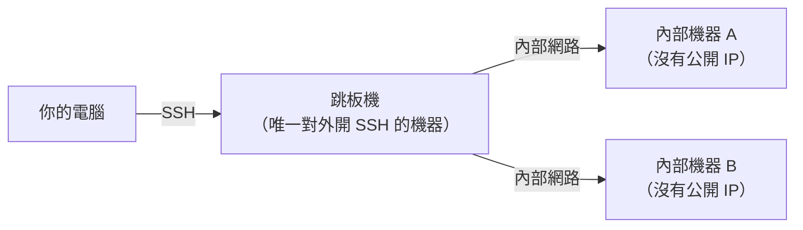

# [infra-3-2] SSH 深入：config、跳板機與 Port Forwarding

> **本章目標**：把 Part 2-6 學的 SSH 登入往上提升——用設定檔簡化連線、透過跳板機連進私有機器、用 port forwarding 把遠端服務「拉」到本機來用。

## 你會學到

- 用 `~/.ssh/config` 替伺服器設定別名，告別每次打一長串
- 跳板機（Bastion / Jump Host）：怎麼連進「沒有公開 IP」的內部機器
- Port Forwarding（埠轉發）：把遠端的服務安全地映射到你本機
- 這些技巧在真實維運中的使用場景

## 概念說明

### 痛點：每次連線都要打一長串

Part 2-6 之後，你連伺服器大概都這樣打：

```bash
ssh -i ~/.ssh/id_ed25519 deploy@203.0.113.10
```

機器一多，IP 又難記，每次都要查、都要打一長串，很煩。SSH 提供一個設定檔幫你把這些「存起來」。

---

### `~/.ssh/config`：給伺服器取別名

在**你自己電腦**的 `~/.ssh/config` 檔案裡，可以替每台伺服器寫一段設定，之後只要打別名就能連。

概念像手機通訊錄：你不會每次都背號碼，而是存成「媽媽」「公司」，要打給誰點名字就好。`~/.ssh/config` 就是 SSH 的通訊錄。

設定一段之後，原本那串落落長的指令，就縮短成：

```bash
ssh myserver
```

SSH 會自動去 config 查「`myserver` 是哪台、用哪個帳號、哪把金鑰」。乾淨多了。

---

### 跳板機（Bastion）：連進「躲起來」的機器

還記得 Part 1-3 說的「私有子網路」嗎？基於安全，公司很多伺服器**沒有公開 IP**，外面根本連不到。但你又得管理它們，怎麼辦？

答案是**跳板機（Bastion Host，也叫 Jump Host）**：一台「**唯一**對外開放 SSH」的機器，當作進入內部網路的單一入口。你先 SSH 到跳板機，再從跳板機跳進內部機器。

用類比：跳板機就像**社區的警衛室大門**——外人只能先到警衛室，通過後才由內部通道進到各棟住戶。把唯一入口集中管理，安全性大幅提升。



這張圖在說：所有外部存取都必須先經過跳板機這個「單一大門」，內部機器則對外隱形。

好消息是，現代 SSH 用 `ProxyJump` 一行就能搞定「跳兩段」，你甚至感覺不到中間多了一跳（程式碼範例會示範）。

---

### Port Forwarding：把遠端服務「拉」到本機

這是 SSH 最實用的隱藏技能之一。

想像一個常見場景：你伺服器上跑了一個**資料庫**或**監控後台**，基於安全它**只聽 `localhost`**（只接受機器自己的連線，不對外開放）。你人在自己電腦，想用瀏覽器或工具連它——但它不對外開，怎麼連？

**Port Forwarding（埠轉發）** 解決這件事：它透過你已經建立的、加密的 SSH 連線，開一條「隧道」，把**遠端機器上的某個 port**，映射到**你本機的某個 port**。

用類比：就像在你家和伺服器之間接了一條**專用、加密的水管**。你打開家裡的水龍頭（本機 port），流出來的其實是伺服器那頭的水（遠端服務）。

設定好之後，你在自己瀏覽器打開 `http://localhost:8080`，看到的其實是**伺服器上那個原本不對外開放的後台**——而且全程走 SSH 加密，安全又方便。

## 程式碼範例

### 設定 `~/.ssh/config`

在你自己電腦編輯（沒有這個檔就新建）：

```bash
vi ~/.ssh/config
```

寫入一段（用你自己的值）：

```
Host myserver
    HostName 203.0.113.10
    User deploy
    IdentityFile ~/.ssh/id_ed25519
    Port 22
```

逐行解釋：`Host` 是你取的別名；`HostName` 是真實 IP；`User` 是登入帳號；`IdentityFile` 是要用的私鑰；`Port` 是 SSH 的 port。存檔後，原本一長串就變成：

```bash
ssh myserver
```

---

### 用 ProxyJump 穿過跳板機

假設跳板機別名是 `bastion`、內部機器是 `10.0.1.50`，在 config 裡這樣寫：

```
Host bastion
    HostName 203.0.113.10
    User deploy

Host internal-a
    HostName 10.0.1.50
    User deploy
    ProxyJump bastion
```

`ProxyJump bastion` 是關鍵——它告訴 SSH「要連 `internal-a`，請先自動跳過 `bastion`」。之後你只要：

```bash
ssh internal-a
```

SSH 就自動「先到跳板機、再跳進內部機器」，兩段一氣呵成，你完全不用手動跳兩次。

---

### 設定 Port Forwarding

假設伺服器上有個監控後台，只在它自己的 `localhost:3000` 跑。把它映射到你本機的 `8080`：

```bash
ssh -L 8080:localhost:3000 myserver
```

`-L` 是 local forwarding（本地轉發）。讀法是 `-L 本機port:目標位址:目標port`：把「本機的 8080」接到「（從伺服器角度看的）localhost:3000」。

指令跑起來、SSH 連著的期間，你在自己電腦的瀏覽器打開：

```
http://localhost:8080
```

看到的就是伺服器上那個原本連不到的後台。關掉 SSH 連線，隧道就跟著關閉。

## 小練習

### 練習 1：建立你的 SSH 通訊錄

在自己電腦的 `~/.ssh/config` 替你的伺服器設一個好記的別名，然後用 `ssh 別名` 連進去。比較一下，跟之前打一長串有多省事。

---

### 練習 2：想清楚跳板機的價值

用自己的話回答：

1. 為什麼公司要讓大部分伺服器「沒有公開 IP」？
2. 跳板機把「唯一入口」集中管理，對安全有什麼好處？（提示：要防守的大門變幾個？）

---

### 練習 3：用 Port Forwarding 連一個本機服務

在伺服器上開一個只聽 localhost 的簡單服務來練習。例如用 Python 起一個小網頁伺服器：

```bash
# 在伺服器上執行
python3 -m http.server 3000 --bind 127.0.0.1
```

`--bind 127.0.0.1` 讓它只聽 localhost（外面連不到）。然後在你自己電腦：

```bash
ssh -L 8080:localhost:3000 myserver
```

接著用本機瀏覽器開 `http://localhost:8080`——你應該能看到伺服器上的檔案列表。成功的話，你就親手打通了一條 SSH 加密隧道。

## 課外讀物

> 想從頭完整理解 SSH 的金鑰原理與安全模型 → [課外讀物 E-1-7：SSH 基礎](../../../課外讀物/E-1-terminal/E-1-7-ssh-basics.md)
