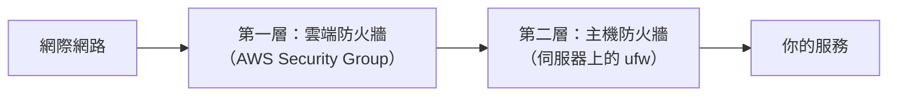

# [infra-3-3] 防火牆：只開該開的門

> **本章目標**：理解防火牆在做什麼，學會用 `ufw` 設定「預設拒絕、只放行必要的 port」，並搞懂雲端 Security Group 與主機防火牆這兩層的關係。

## 你會學到

- 防火牆（Firewall）的核心思想：預設拒絕（default deny）
- 用 `ufw` 開放、關閉特定 port
- 「雲端防火牆（Security Group）」與「主機防火牆」是兩層、各做什麼
- 一個能避免你「把自己鎖在門外」的設定順序

## 概念說明

### 防火牆就是你伺服器的「大樓警衛」

Part 3-1 我們看到，伺服器上每個服務都聽著某個 port（門）。問題是：**不是每扇門都該對全世界開**。

例如資料庫的 port，只該讓你的應用程式連，**絕對不該**讓全世界都連得到——否則攻擊者直接來敲資料庫的門。但只要服務在聽，門就是開的。

**防火牆（Firewall）** 就是站在所有門前的警衛，它根據你訂的規則，決定「**哪些連線放行、哪些直接擋掉**」。

---

### 核心思想：預設拒絕，白名單放行

好的防火牆策略只有一句話：

> **預設把所有進來的連線都擋掉，只「明確放行」你確定需要的那幾個 port。**

這叫 **default deny（預設拒絕）+ 白名單**。用警衛來類比：不是「除了黑名單上的人都能進」，而是「**除非你在許可名單上，否則一律擋下**」。這樣安全得多——因為你永遠想不全所有壞人，但你很清楚自己需要開哪幾扇門。

對一台典型的網頁伺服器，要放行的通常就三扇門：

| Port | 服務 | 為什麼要開 |
|------|------|-----------|
| `22` | SSH | 你要能遠端登入管理（**最重要，別擋到它**） |
| `80` | HTTP | 讓使用者連網站（通常會轉址到 443） |
| `443` | HTTPS | 讓使用者連加密的網站 |

其他全部關起來。資料庫、監控後台這些，要嘛只聽 localhost、要嘛只透過 Part 3-2 的 SSH 隧道存取。

---

### 重要觀念：常常有「兩層」防火牆

如果你用雲主機，你的伺服器前面其實常常有**兩道**防火牆，要分清楚：



- **第一層・雲端防火牆**：由雲端商提供（AWS 叫 **Security Group**），在「進到你機器之前」就先擋一層。在雲端管理後台設定。
- **第二層・主機防火牆**：跑在你伺服器作業系統裡（Ubuntu 上常用 `ufw`），是機器自己的最後一道關卡。

兩層是「**疊加**」的：一個連線要進到服務，**兩層都得放行**。這叫「縱深防禦」——多一道關卡，多一層保障。AWS 課程會深入第一層；這一章我們專注在你伺服器內的 `ufw`。

> `ufw` 是 "Uncomplicated Firewall"（不複雜的防火牆）的縮寫，是 Linux 底層 `iptables` 的友善包裝。`iptables` 很強但設定複雜，日常用 `ufw` 就夠了。

## 程式碼範例

> ⚠️ **保命警告**：設定防火牆**最容易犯的致命錯誤**，就是「先開啟防火牆、卻忘了放行 SSH（22）」——一旦這樣，你的 SSH 連線會被自己的防火牆切斷，而且**再也連不進去**。所以下面的順序是刻意安排的：**先放行 SSH，最後才啟用防火牆**。

### 第一步：先放行 SSH（務必第一個做）

```bash
sudo ufw allow 22
```

這條規則告訴防火牆「22 號門（SSH）放行」。**在啟用防火牆之前先下這條**，確保你不會把自己鎖在外面。

也可以用服務名稱（ufw 認得常見服務名）：

```bash
sudo ufw allow ssh
```

---

### 第二步：放行網頁服務

```bash
sudo ufw allow 80
sudo ufw allow 443
```

或一次用 ufw 內建的應用設定檔（如果裝了 Nginx）：

```bash
sudo ufw allow 'Nginx Full'
```

`Nginx Full` 是一個方便的組合，等於同時開 80 和 443。

---

### 第三步：設定「預設拒絕」

明確告訴防火牆：沒被放行的，一律擋掉。

```bash
sudo ufw default deny incoming
sudo ufw default allow outgoing
```

`deny incoming` = 預設擋掉所有「進來」的連線（只有前面 allow 的例外）；`allow outgoing` = 允許機器「主動出去」的連線（例如它要去下載更新）。

---

### 第四步：最後才啟用防火牆

確認 SSH 已經放行了，再啟用：

```bash
sudo ufw enable
```

它會警告你「這可能中斷現有連線」，確認你已放行 22 後，輸入 `y`。

---

### 隨時檢查規則

```bash
sudo ufw status verbose
```

會列出目前所有規則，例如：

```
Default: deny (incoming), allow (outgoing)
To       Action   From
22       ALLOW    Anywhere
80       ALLOW    Anywhere
443      ALLOW    Anywhere
```

這就是健康的狀態：預設拒絕，只放行 22 / 80 / 443 三扇門。

要刪掉某條規則（例如不再需要開 80）：

```bash
sudo ufw delete allow 80
```

## 小練習

### 練習 1：規劃你的「開門清單」

回想 Part 3-1 練習 3 你盤點的「機器開了哪些 port」。現在決定：

1. 哪些 port **該對外開**？（提示：使用者和你需要連的）
2. 哪些 port **該關起來或只聽 localhost**？（提示：資料庫、內部後台）

把清單寫下來——這就是你 `ufw` 規則的設計藍圖。

---

### 練習 2：理解「兩層防火牆」

用自己的話回答：

1. 雲端 Security Group 和主機 `ufw` 分別在哪裡運作？
2. 如果 Security Group 開了 443，但 `ufw` 沒開 443，使用者連得到你的網站嗎？為什麼？

> 提示：兩層是「都要過」的關係。

---

### 練習 3：為什麼順序這麼重要

用自己的話解釋：為什麼設定防火牆時，一定要「**先 `allow 22`，最後才 `enable`**」？如果反過來先 `enable` 會發生什麼事？

> 提示：這跟 Part 2-6 改 SSH 設定要「保留視窗」是同一種思維——**永遠別把自己鎖在門外**。

## 課外讀物

> 防火牆是 Web 安全的一環，想建立更完整的安全攻防全貌 → [課外讀物 E-10-1：Web 安全總覽 — OWASP Top 10](../../../課外讀物/E-10-security/E-10-1-web-security-overview.md)
