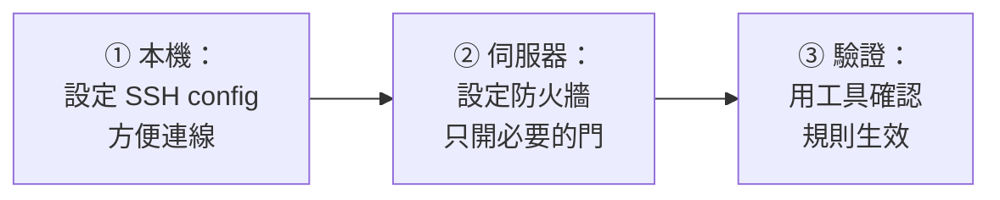

# [infra-3-5] 🔧 動手做：用 SSH config 管理多台機器 + 設好防火牆

> **本章目標**：把整個 Part 3 學的東西實際做一遍——用 `~/.ssh/config` 管理你的伺服器、用 `ufw` 設定「只放行必要 port」的防火牆，並驗證它真的生效。

## 你會學到

- 寫一份能管理多台機器的 `~/.ssh/config`
- 在伺服器上設好一套「預設拒絕、只開 22/80/443」的防火牆
- 用 Part 3-4 的工具驗證防火牆規則真的有效
- 把「連線管理」和「網路安全」整合成你的標準起手式

## 概念說明

### 這一章在做什麼

前面四章分別學了 IP/Port/DNS（3-1）、SSH 進階（3-2）、防火牆（3-3）、除錯工具（3-4）。這一章把它們**串成一套你每次拿到新伺服器都會做的標準流程**：



做完這套，你的伺服器就有了「好管理 + 基本安全」的底子。

> ⚠️ 這章會動到 SSH 連線和防火牆，請全程記住前幾章的保命原則：**先確保自己進得來，再做會切斷連線的操作**。

## 程式碼範例

### Part A：設定 SSH config（在你自己電腦）

編輯設定檔：

```bash
vi ~/.ssh/config
```

假設你有兩台機器：一台對外的網頁伺服器、一台只能透過它進去的內部資料庫機。寫成這樣：

```
# 對外的網頁伺服器
Host web
    HostName 203.0.113.10
    User deploy
    IdentityFile ~/.ssh/id_ed25519

# 內部資料庫機（透過 web 當跳板進去）
Host db
    HostName 10.0.1.50
    User deploy
    IdentityFile ~/.ssh/id_ed25519
    ProxyJump web
```

存檔後測試別名連線：

```bash
ssh web
```

如果順利進到網頁伺服器，第一段就成功了。`db` 那台則會自動透過 `web` 跳進去（ProxyJump，3-2 學過）。

---

### Part B：在伺服器上設定防火牆

SSH 進入 `web` 之後，依 3-3 的「保命順序」設定 `ufw`。**先放行 SSH，最後才啟用**：

```bash
# 1. 先放行 SSH（最重要，第一個做）
sudo ufw allow 22

# 2. 放行網頁服務
sudo ufw allow 80
sudo ufw allow 443

# 3. 設定預設策略：進來的擋掉、出去的放行
sudo ufw default deny incoming
sudo ufw default allow outgoing

# 4. 確認 22 已放行後，才啟用防火牆
sudo ufw enable
```

`ufw enable` 會警告可能中斷連線，確認 22 已在規則裡，輸入 `y`。

---

### Part C：驗證規則生效

先看防火牆目前的規則：

```bash
sudo ufw status verbose
```

應該看到「預設拒絕進入、只放行 22/80/443」的狀態。

接著用 3-4 的工具驗證。**最關鍵的驗證**：開一個**新的終端機**，確認 SSH 還連得進去（如果連不進去，代表 22 沒放行成功——但你舊視窗還在，可以救）：

```bash
ssh web
```

新視窗能進去 → SSH 規則正確，你沒把自己鎖在外面。✅

最後，從你自己電腦測試「該開的開、該關的關」。例如測網頁 port（443）通不通：

```bash
curl -I https://203.0.113.10 --insecure
```

再試一個**你沒有放行**的 port（例如資料庫的 5432），它應該會**連線逾時**（被防火牆擋下）——這代表你的「預設拒絕」真的在保護機器。

---

### 你完成了什麼

做完這三部分，你建立了：

- 一份能用別名、自動跳板的 SSH 連線設定
- 一套「預設拒絕、白名單放行」的主機防火牆
- 用工具驗證過「該開的能連、該關的被擋」

這就是一個 infra 工程師拿到新機器後的標準起手式。

## 小練習

### 練習 1：完成整套流程

在你的伺服器上，從 Part A 做到 Part C。如果你只有一台機器，`db` 那段可以先略過，專注把 `web` 的連線與防火牆設好。

---

### 練習 2：驗證「門關起來了」

從你自己電腦，試著連一個你**沒有放行**的 port，確認它被擋下：

```bash
curl -m 5 http://203.0.113.10:5432
```

`-m 5` 是最多等 5 秒。如果它逾時失敗，恭喜——你的防火牆正在做它該做的事。

---

### 練習 3：寫下你的「標準起手式」

用條列把「拿到一台新伺服器後，我會依序做哪些事」整理成一份自己的清單。把 Part 2-6（建立安全使用者）和這一章（SSH config + 防火牆）整合進去。

> 提示：這份清單之後在 Part 6（自動化）會超有用——因為你會把這些手動步驟，變成「一鍵自動完成」的 Ansible playbook。

## 課外讀物

> 想把這套「安全起手式」背後的攻防思維補齊 → [課外讀物 E-10-1：Web 安全總覽 — OWASP Top 10](../../../課外讀物/E-10-security/E-10-1-web-security-overview.md)
