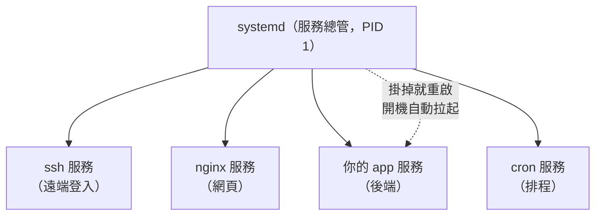

# [infra-4-1] systemd：讓程式變成「永遠待命」的服務

> **本章目標**：理解 systemd 在做什麼，搞懂「直接跑一個程式」和「把它變成系統服務」的差別，學會用 `systemctl` 啟動、停止、查看服務狀態。

## 你會學到

- 為什麼「直接在終端機跑程式」不適合當正式服務
- systemd 是什麼、它在開機流程裡扮演什麼角色
- 「服務（service / unit）」與 `systemctl` 的基本操作
- enable 與 start 的差別（開機自動啟動 vs 現在啟動）

## 概念說明

### 問題：直接跑的程式，撐不起一個正式服務

假設你寫了一個網頁後端，在伺服器上這樣跑起來：

```bash
node server.js
```

它確實會動。但拿來當「正式服務」有三個致命問題：

1. **你一登出，它就死了**——這個程式綁在你的終端機連線上，SSH 一斷，它就跟著結束。
2. **掛了不會自己回來**——程式如果當掉，就真的停在那，沒人重啟它，服務就掛了。
3. **重開機要手動再跑一次**——伺服器重啟後，它不會自己起來，你得記得手動再 `node server.js`。

一個正式服務需要的是：**背景常駐、掛掉自動重啟、開機自動啟動**。這正是 systemd 要幫你做的事。

---

### systemd 是誰？開機流程的「總管」

還記得 Part 1-2「一台伺服器的一生」嗎？開機最後一步是「**init / systemd 把各種服務拉起來**」。

**systemd 就是現代 Linux 的「服務總管」**——它是核心啟動後接手的第一個程式（PID 1，編號就是 1，代表它是所有行程的祖先），負責**管理整台機器上所有的服務**：該開的開、掛掉的重啟、彼此有先後順序的安排好。

用類比：systemd 就像一間飯店的**值班總管**，它手上有一份名單，記著「哪些服務該營業、哪個壞了要立刻找人補位、開門營業的順序是什麼」。你不用盯著每個服務，交給總管就好。



這張圖在說：systemd 統一管理所有服務，包括你之後要建立的「你的 app」。

---

### 「服務」在 systemd 裡叫 unit

systemd 管理的每個東西叫一個 **unit（單元）**，最常見的類型就是 **service（服務）**。每個服務有一個名字，例如 `ssh.service`、`nginx.service`。

你跟 systemd 溝通的指令叫 **`systemctl`**（systemd control，控制 systemd）。你不用自己去「盯著」服務，而是**下命令給總管**：「幫我啟動這個」「告訴我那個現在狀態如何」。

---

### 關鍵觀念：`start` 與 `enable` 不一樣

這是新手最常搞混的地方，務必分清楚：

| 指令 | 意思 | 類比 |
|------|------|------|
| `systemctl start` | **現在**立刻啟動它（這次開機有效） | 「現在去開門營業」 |
| `systemctl enable` | 設定**開機時自動啟動**（每次重開機都生效） | 「以後每天自動開門」 |

兩者獨立：你可以「現在啟動但沒設開機自動」（重開機就沒了），也可以「設了開機自動但現在還沒啟動」。正式服務通常**兩個都要做**——所以有個方便的合併指令 `systemctl enable --now`，一次「現在啟動 + 以後開機也自動啟動」。

## 程式碼範例

下面用系統本來就有的 `ssh` 服務來示範（先別亂改，純粹觀察）。

查看一個服務的狀態：

```bash
systemctl status ssh
```

輸出會告訴你很多事：

```
● ssh.service - OpenBSD Secure Shell server
     Loaded: loaded (...; enabled; ...)      ← enabled 代表開機會自動啟動
     Active: active (running) since ...       ← active (running) 代表正在跑
```

兩個關鍵字：`active (running)` 代表「現在活著」；`enabled` 代表「開機會自動啟動」。學會看這兩個，你就能判斷一個服務健不健康。

啟動 / 停止 / 重啟一個服務（這些會改動狀態，需要 sudo）：

```bash
sudo systemctl start  服務名
sudo systemctl stop   服務名
sudo systemctl restart 服務名
```

（Part 2-6 你已經用過 `sudo systemctl restart ssh` 了，現在你知道它的完整意義了。）

設定 / 取消「開機自動啟動」：

```bash
sudo systemctl enable  服務名     # 以後開機自動啟動
sudo systemctl disable 服務名     # 取消開機自動啟動
```

一次搞定「現在啟動 + 開機自動」：

```bash
sudo systemctl enable --now 服務名
```

看看開機時有哪些服務會自動啟動：

```bash
systemctl list-unit-files --type=service --state=enabled
```

## 小練習

### 練習 1：判讀服務健康狀態

在你的伺服器上跑 `systemctl status ssh`，找出兩件事：

1. 它現在是不是 `active (running)`？
2. 它是不是 `enabled`（開機自動啟動）？

如果 ssh 不是 enabled，你重開機後會發生什麼事？（提示：想想你還連不連得進來。）

---

### 練習 2：分清 start 與 enable

用自己的話回答這三個情境，重開機後服務會不會自己起來：

1. 只有 `systemctl start`，沒有 `enable`
2. 只有 `systemctl enable`，沒有 `start`
3. `systemctl enable --now`

---

### 練習 3：觀察你的服務總管

跑 `systemctl list-unit-files --type=service --state=enabled`，看看你的伺服器開機時會自動拉起哪些服務。挑兩個你認得的，想想它們各自負責什麼。

> 提示：下一章你就要親手「新增一個」屬於你自己的服務到這份名單裡。

## 課外讀物

> systemd 管理的服務裡，很多是在處理網路請求。想複習「請求如何抵達伺服器」 → [課外讀物 E-3-1：網際網路是怎麼運作的？](../../../課外讀物/E-3-network/E-3-1-how-internet-works.md)
